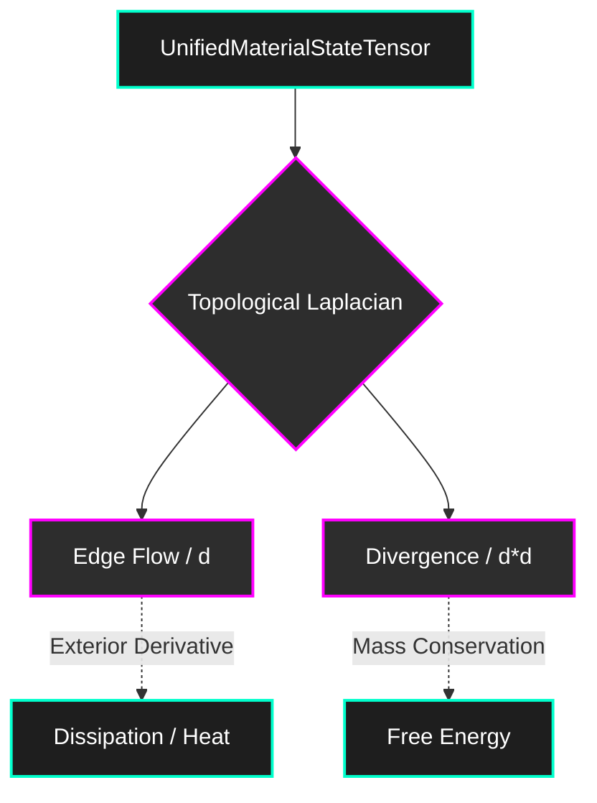

<!--
SPDX-License-Identifier: MIT
Copyright (c) 2026 Santhosh Shyamsundar, Santosh Prabhu Shenbagamoorthy — Studio TYTO
-->

<div align="center">

# UMST Manifold

### A Differentiable Spatiotemporal Manifold for Thermodynamic Material Evolution

[](https://doi.org/10.5281/zenodo.18768547)
[](https://github.com/tytolabs/umst-manifold/actions/workflows/rust.yml)
[](LICENSE)

**Formally structured in pure Rust + Burn&ensp;·&ensp;O(1) memory Neural ODE backpropagation&ensp;·&ensp;Topological Discrete Exterior Calculus (DEC) enforcement&ensp;·&ensp;Continuous-time thermodynamic gating**

*The Unified Material-State Tensor (UMST) Manifold is a pure physics compiler. It represents materials not as static arrays, but as a mathematically rigorous Cellular Sheaf, allowing differential equations to strictly govern structural, thermodynamic, and physical evolution.*

</div>

<br>

| | |
|:---:|:---:|
| **Burn-Native Tensors** | Hardware-agnostic (WGPU, NDArray) functional logic |
| **Proof-Carrying States** | `VerifiedUMST` enforces the Second Law at compile time |
| **O(1) Adjoint Integration** | Continuous-time optimization bypassing BPTT GPU exhaustion |
| **Topological Fracture** | Edge-based DEC modeling resolves the fracture paradox |

---

## Core Result

### The Cellular Sheaf Architecture

Traditional grid-based convolutions fail to represent fractures, boundaries, or complex phase transitions effectively. The UMST Manifold operates entirely on the 1-skeleton of a graph using **Discrete Exterior Calculus (DEC)**. This ensures that physical flows (heat, mass, stress) are absolutely conserved across topological mutations.



### Key Innovations

1. **Proof-Carrying States**: All physical tensors are wrapped in a Phantom Type (`VerifiedUMST<ClausiusDuhemProof>`), guaranteeing at compile-time that no downstream operation can execute on a state that violates the 2nd Law of Thermodynamics or Landauer's limit of erasure.
2. **O(1) Memory Neural ODEs**: The internal `LiquidPPOAgent` utilizes the **Adjoint State Method** to integrate gradients backward in time, completely bypassing Backpropagation Through Time (BPTT).
3. **The Fracture Paradox Resolved**: Topology changes (fractures) are modeled via a continuous `Damage Scalar Field` (d ∈ [0,1]) across the edges, allowing topological severing without crashing Autograd dimension boundaries.

---

## What This Repository Enforces

A structurally verified bridge from formal thermodynamic bounds to differentiable software engineering:

| # | Construct | Statement |
|:-:|---------|-----------|
| 1 | **Thermodynamic Control Barrier** | Ensures Landauer's erasure limit bounds mutual information gain |
| 2 | **Discrete Exterior Calculus** | Mass and heat flux strictly obey the Topological Laplacian |
| 3 | **Time Dilation Coupling** | Agent optimization velocity is structurally taxed by global energy |
| 4 | **Phantom Type Proofs** | `VerifiedUMST` guarantees invalid states cannot propagate |

---

## Usage

This framework is completely independent of any commercial orchestrator. It acts as the mathematical backbone. It expects a generic `IScienceCartridge` to define the physical constitutive equations.

```rust
use umst_manifold::core::tensors::UnifiedMaterialStateTensor;
use umst_manifold::ai::ppo::ManifoldGateway;

// 1. Mount your chosen thermodynamic science cartridge
let gateway = ManifoldGateway::new(my_custom_cartridge, 298.15, 1_000_000.0);

// 2. Evaluate the manifold topology
let (verified_state, spatial_reward) = gateway.evaluate_topology_step(sheaf, info_gain)?;
```

---

## Connection to the UMST Programme

This repository is part of the **Foundations of Constitutional Physics (FCP)** series by [Studio TYTO](https://zenodo.org/communities/unified-material-state-tensors/). 

| Repository | Role |
|------------|------|
| [`umst-formal`](https://github.com/tytolabs/umst-formal) | Classical UMST formal proofs (Lean 4, Coq, Agda) |
| **`umst-manifold`** (here) | The pure Rust implementation of the mathematical framework |
| [`umst-concrete-cartridge`](https://github.com/tytolabs/umst-concrete-cartridge) | The specialized constitutive engine for cementitious materials |

---

## Authors

**Santhosh Shyamsundar** — Studio TYTO; IAAC Barcelona · [santhoshshyamsundar@tyto.studio](mailto:santhoshshyamsundar@tyto.studio)

**Santosh Prabhu Shenbagamoorthy** — Studio TYTO; IAAC Barcelona · [santosh@tyto.studio](mailto:santosh@tyto.studio)

---

<div align="center">
<sub>MIT License · © 2026 Studio TYTO · <a href="https://github.com/tytolabs">github.com/tytolabs</a></sub>
</div>
