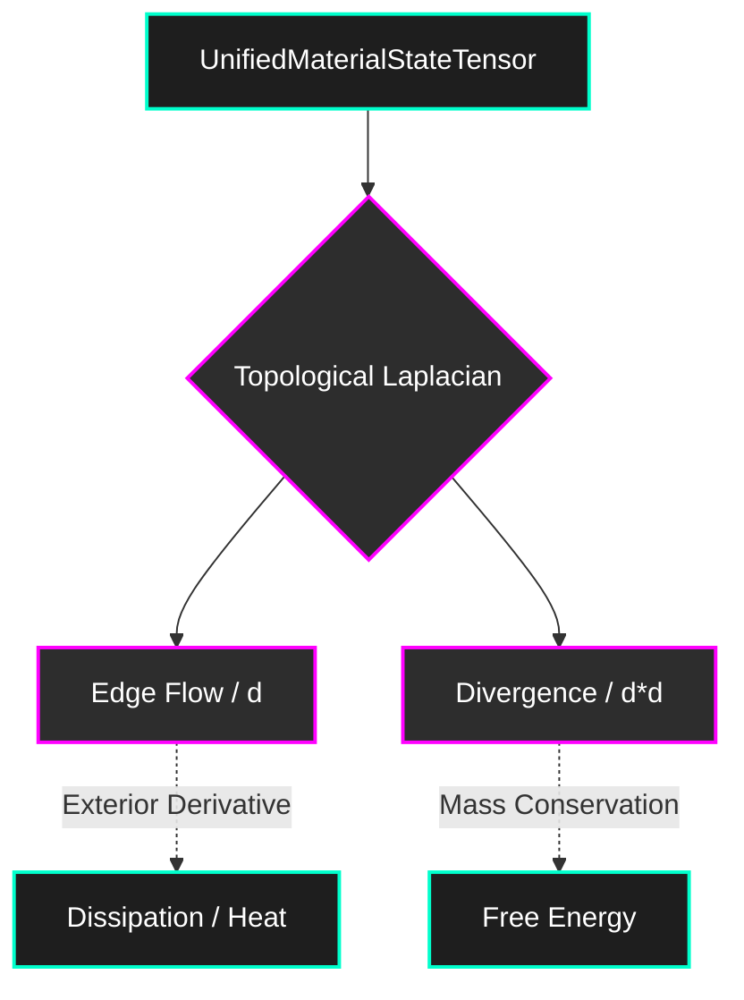

# UMST Manifold

> A Differentiable Spatiotemporal Manifold for Thermodynamic Material Evolution.

The **Unified Material-State Tensor (UMST)** Manifold is a pure physics compiler and continuous-time Neural ODE framework. It represents materials not as static arrays, but as a mathematically rigorous **Cellular Sheaf**, allowing differential equations to govern structural, thermodynamic, and material evolution.

## The Cellular Sheaf Architecture

Traditional grid-based convolutions fail to represent fractures or complex topological boundaries. The UMST Manifold operates entirely on the 1-skeleton of a graph using **Discrete Exterior Calculus (DEC)**.



### Key Innovations

1. **Proof-Carrying States**: All physical tensors are wrapped in a Phantom Type (`VerifiedUMST<ClausiusDuhemProof>`), guaranteeing at compile-time that no downstream operation can execute on a state that violates the 2nd Law of Thermodynamics.
2. **O(1) Memory Neural ODEs**: The internal `LiquidPPOAgent` utilizes the **Adjoint State Method** to integrate gradients backward in time, completely bypassing Backpropagation Through Time (BPTT) GPU memory exhaustion.
3. **The Fracture Paradox Resolved**: Topology changes (fractures) are modeled via a continuous `Damage Scalar Field` ($d \in [0,1]$) across the edges, allowing topological severing without crashing Autograd dimension boundaries.

## Usage

This framework is completely independent of any commercial orchestrator. It expects a generic `IScienceCartridge` to define the physical constitutive equations.

```rust
use umst_manifold::core::tensors::UnifiedMaterialStateTensor;
use umst_manifold::ai::ppo::ManifoldGateway;
// ...
let gateway = ManifoldGateway::new(my_custom_cartridge, 298.15, 1_000_000.0);
let (verified_state, spatial_reward) = gateway.evaluate_topology_step(sheaf, info_gain)?;
```

## License

Apache License 2.0. Copyright Studio Tyto.
