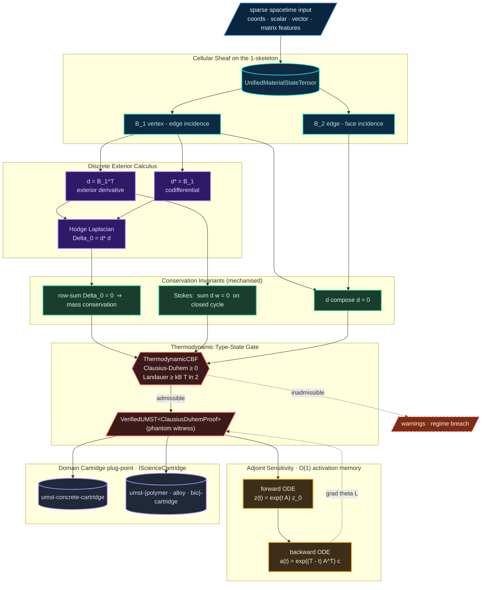

<!--
SPDX-License-Identifier: MIT
Copyright (c) 2026 Santhosh Shyamsundar, Santosh Prabhu Shenbagamoorthy — Studio TYTO
-->

<div align="center">

# UMST Manifold

### A differentiable spatiotemporal manifold for thermodynamic material evolution

[](https://github.com/tytolabs/umst-manifold/actions/workflows/rust.yml)

[](LICENSE)
[](https://www.rust-lang.org)

**Pure Rust on the burn tensor framework  ·  Discrete exterior calculus on the 1-skeleton  ·  Adjoint-method ODE training  ·  Type-state thermodynamic admissibility**

*The Unified Material-State Tensor (UMST) Manifold is a substrate for differentiable physics. Material configurations are represented as cellular sheaves over a graph, so flows of mass, heat, and stress are governed by topological operators rather than ad-hoc grid kernels.*

</div>

<br>

| | |
|:---:|:---|
| **Burn-native tensors** | Hardware-agnostic backends via WGPU and NDArray |
| **Type-state admissibility** | `VerifiedUMST<P>` carries a compile-time witness that a constructed state has passed an admissibility check |
| **Adjoint sensitivity** | Constant *activation* memory for ODE training via the adjoint method (Pontryagin / Chen et al. 2018) |
| **Topology-aware fracture** | Damage as a continuous edge field; topology change without autograd discontinuity |

---

## Architecture

The manifold operates on the 1-skeleton of a graph using **Discrete Exterior Calculus (DEC)**. Physical flows are conserved by construction because they are expressed through the discrete exterior derivative `d` and its adjoint `d*`, satisfying the discrete Stokes identity.



The diagram tells the substrate's whole story in one frame: sparse spacetime input lifts onto a cellular sheaf; the boundary matrices `B_1`, `B_2` give you the discrete exterior calculus; three conservation invariants (Stokes, `d ∘ d = 0`, mass-conservation row-sum) feed the thermodynamic gate; only states that pass become `VerifiedUMST<P>`; gradients are recovered through the adjoint ODE in O(1) activation memory; and the verified state plugs into any domain cartridge that implements `IScienceCartridge`.

See [`docs/Mathematical-Foundations.md`](docs/Mathematical-Foundations.md) for the full operator algebra and proofs of conservation.

---

## Design principles

1. **Type-state admissibility.** Physical states are wrapped in `VerifiedUMST<P>` where `P` is a phantom witness type (e.g. `ClausiusDuhemProof`). A `VerifiedUMST` value can only be obtained through a constructor that runs the admissibility check; downstream APIs accept `VerifiedUMST` and therefore cannot be called on an unchecked state. This is a *type-state pattern*, not a proof of the Second Law — the law itself is enforced numerically inside the constructor.
2. **Constant-memory ODE training.** Continuous-time models are integrated using the adjoint sensitivity method, which solves a backwards ODE to recover gradients without storing the forward trajectory. Activation memory is O(1) in the number of integration steps.
3. **Topology change as a continuous field.** Fracture and damage are represented as a scalar field `d ∈ [0,1]` over edges of the manifold. Severing connectivity is a smooth limit, so reverse-mode autograd remains well-defined across topology change.

---

## What this crate provides

| Layer | Construct | Role |
|:-:|---------|-----------|
| 1 | `core::tensors::UnifiedMaterialStateTensor` | Sheaf-valued state on the 1-skeleton |
| 2 | `physics::laplacian` | Discrete `d`, `d*`, and the Hodge Laplacian `Δ = d*d + dd*` |
| 3 | `ai::adjoint` | Adjoint sensitivity for Neural ODE training on the manifold |
| 4 | `ai::cbf` | Control barrier function enforcing the Clausius–Duhem inequality |
| 5 | `core::traits::IScienceCartridge` | The trait domain cartridges implement to plug constitutive equations into the manifold |

---

## Quickstart

```toml
[dependencies]
umst-manifold = "0.1"
```

```rust
use umst_manifold::core::tensors::UnifiedMaterialStateTensor;
use umst_manifold::ai::ppo::ManifoldGateway;

// 1. Mount a domain cartridge that implements IScienceCartridge.
let gateway = ManifoldGateway::new(my_cartridge, /* T_K = */ 298.15, /* budget_J = */ 1.0e6);

// 2. Take one verified topology step.
let (verified_state, reward) = gateway.evaluate_topology_step(sheaf, info_gain)?;
```

A worked end-to-end example is in [`examples/basic_topology.rs`](examples/basic_topology.rs).

---

## Cartridge ecosystem

`umst-manifold` is a substrate. Constitutive physics live in *cartridges* that implement `IScienceCartridge`:

| Repository | Domain |
|------------|--------|
| [`umst-concrete-cartridge`](https://github.com/tytolabs/umst-concrete-cartridge) | Cementitious materials — hydration, rheology, fracture, durability |
| [`umst-formal`](https://github.com/tytolabs/umst-formal) | Companion formal proofs in Lean 4, Coq, and Agda |

Adding a new domain is a matter of implementing one trait — see [`docs/Mathematical-Foundations.md`](docs/Mathematical-Foundations.md#cartridge-interface).

---

## Citing this work

A formal Zenodo deposit will accompany the v0.1.0 release; the DOI below is reserved for that record. Until the deposit is live, please cite using the GitHub URL or the [CITATION.cff](CITATION.cff) file.

```bibtex
@software{umst_manifold_2026,
  author       = {Shyamsundar, Santhosh and Shenbagamoorthy, Santosh Prabhu},
  title        = {UMST Manifold: a differentiable spatiotemporal manifold
                  for thermodynamic material evolution},
  year         = 2026,
  publisher    = {Zenodo},
  doi          = {10.5281/zenodo.18768547},
  url          = {https://github.com/tytolabs/umst-manifold}
}
```

---

## Authors

**Santhosh Shyamsundar** — Studio TYTO; IAAC Barcelona · [santhoshshyamsundar@tyto.studio](mailto:santhoshshyamsundar@tyto.studio)
**Santosh Prabhu Shenbagamoorthy** — Studio TYTO; IAAC Barcelona · [santosh@tyto.studio](mailto:santosh@tyto.studio)

## Contributing

Issues and pull requests are welcome. Please read [CONTRIBUTING.md](CONTRIBUTING.md) and the [Code of Conduct](CODE_OF_CONDUCT.md) before submitting.

## Security

To report a security issue, see [SECURITY.md](SECURITY.md). Do **not** open public issues for vulnerabilities.

## License

Released under the [MIT License](LICENSE) · © 2026 Santhosh Shyamsundar, Santosh Prabhu Shenbagamoorthy — Studio TYTO.

---

<div align="center">
<sub><a href="https://github.com/tytolabs">github.com/tytolabs</a></sub>
</div>
