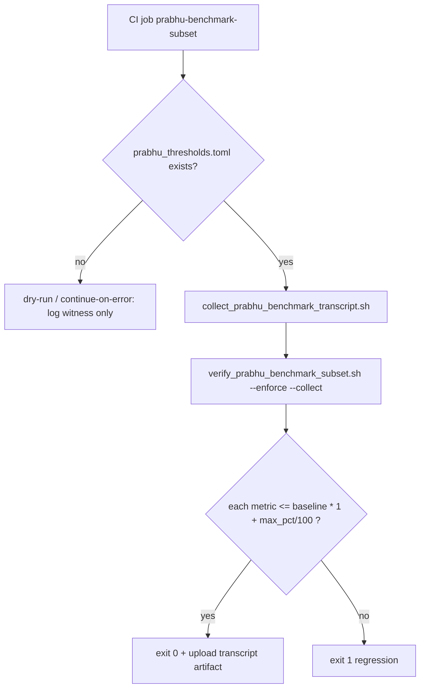

# PRABHU CI probe design (PB-S6 prep)

| Field | Value |
|-------|-------|
| **Step** | PB-S6 prep — design + dry-run stub only |
| **Workload id** | `prabhu_benchmark_subset` |
| **Baseline artifact** | `prabhu_runtime_subset.json` (PB-S4 lock) |
| **Threshold artifact** | `prabhu_thresholds.toml` (PB-S5 operator — **not shipped by agent**) |
| **Probe script** | `scripts/verify_prabhu_benchmark_subset.sh` |
| **Collector** | `scripts/collect_prabhu_benchmark_transcript.sh` (PB-S3) |
| **SSOT schedule** | `outputs/.tmp/fp_prabhu_benchmark_schedule.md` |

---

## 1. What CI consumes

| Input | Role |
|-------|------|
| `artifacts/benchmarks/prabhu_runtime_subset.json` | **Committed baseline** — PB-S4 reference hardware capture (`git_sha`, `metrics`, `parity`) |
| `artifacts/benchmarks/prabhu_thresholds.toml` | **Operator acceptance** — `max_regression_pct` per `[pb1_gate_route]`, `[pb2_thmc_step]`, `[pb3_arena_alloc]` |
| Fresh run via collector | **Current witness** — same JSON schema, overwritten locally when `--collect` |

The baseline JSON `thresholds_ref` field must remain `artifacts/benchmarks/prabhu_thresholds.toml` (pointer only; file may be absent until PB-S5).

---

## 2. Probe flow (post-S5 enforce)



**Comparison rule (all three keys — higher is worse):**

```
current <= baseline * (1 + max_regression_pct / 100)
```

Sections map 1:1 to transcript keys:

| Transcript key | TOML section |
|----------------|--------------|
| `gate_route_us_per_call` | `[pb1_gate_route]` |
| `thmc_step_ms_per_node` | `[pb2_thmc_step]` |
| `arena_100_loads_sec` | `[pb3_arena_alloc]` |

Parity guard: `gate_parity_sha256` must stay `149081fa…` (collector already runs phase0d + fixture).

---

## 3. Dry-run today (pre-S5)

```bash
cd umst-manifold
bash scripts/verify_prabhu_benchmark_subset.sh
# or explicit:
bash scripts/verify_prabhu_benchmark_subset.sh --dry-run
```

Expected while `prabhu_thresholds.toml` is absent:

- Validates committed baseline JSON schema + parity digest
- Prints `BLOCKED-OPERATOR: missing …/prabhu_thresholds.toml (PB-S5)`
- Exit **0** (non-blocking CI signal)

Optional fresh witness without enforce:

```bash
bash scripts/verify_prabhu_benchmark_subset.sh --dry-run --collect
```

---

## 4. Planned `rust.yml` job (not wired in PB-S6 prep)

Add after PB-S5 operator sign-off. Pattern mirrors `arena-vs-mcp` job.

```yaml
  prabhu-benchmark-subset:
    name: prabhu benchmark subset (PB-1..3)
    runs-on: ubuntu-latest
    continue-on-error: true   # flip to false after PB-S5 thresholds land
    steps:
      - uses: actions/checkout@34e114876b0b11c390a56381ad16ebd13914f8d5
      - uses: ./.github/actions/setup-ci
      - name: verify_prabhu_benchmark_subset (dry-run until PB-S5)
        run: |
          set -euo pipefail
          bash scripts/verify_prabhu_benchmark_subset.sh --dry-run --collect
      - name: Upload prabhu transcript artifact
        if: always()
        uses: actions/upload-artifact@ea165f8d65b6e75b540449e92b4886f43607fa02
        with:
          name: prabhu-runtime-subset
          path: artifacts/benchmarks/prabhu_runtime_subset.json
          if-no-files-found: ignore
```

**Post-S5 flip:** set `continue-on-error: false` and run `--enforce --collect`.

---

## 5. Operator handoff (PB-S5)

Prabhu adds `artifacts/benchmarks/prabhu_thresholds.toml` with **operator-chosen** `max_regression_pct` values only. Agent does not invent numerics.

Required shape (values are placeholders in schedule doc — operator sets):

```toml
[pb1_gate_route]
max_regression_pct = <operator>

[pb2_thmc_step]
max_regression_pct = <operator>

[pb3_arena_alloc]
max_regression_pct = <operator>
```

Tick schedule §8 operator row + enable enforce mode in CI.

---

## 6. Out of scope (this prep card)

- No `prabhu_thresholds.toml` committed
- No `rust.yml` edit (full PB-S6 lands after S5)
- No push
