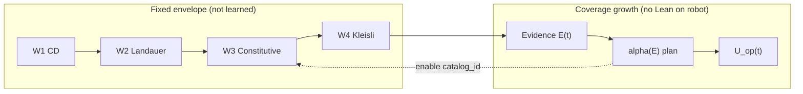

# Adaptive witness coverage

**As of:** 2026-05-29  
**Audience:** Operators and agents extending UMST witnesses without inflating completion metrics.

**Plain English:** The Lean catalog has **119** proof modules, but the robot only runs a **small fixed law** (CD → Landauer → constitutive → Kleisli). **Effective coverage** \(U(t)\) measures how much of the *catalog* you have *operationally exercised* over time—via trace rejects, cartridge domain, and epistemic MI signals—so engineering can **prioritize which `catalog_id` to wire next**. That growth happens **on-robot and in Rust** (registry + telemetry); it does **not** mean running Lean or claiming a higher “% complete” on the god-grade checklist.

**Companions:** [`GOD_GRADE_WITNESS_LADDER.md`](GOD_GRADE_WITNESS_LADDER.md) (fixed \(W_1\)–\(W_4\)), [`CATALOG_COVERAGE_AUDIT.md`](CATALOG_COVERAGE_AUDIT.md) (static semantic classes), [`CATALOG_TRACEABILITY.md`](CATALOG_TRACEABILITY.md) (CI partition), [`PENDING_GAPS_PLAIN.md`](PENDING_GAPS_PLAIN.md) (layer stack).

---

## 1. What this document is (and is not)

| Concept | This doc | [`CATALOG_COVERAGE_AUDIT.md`](CATALOG_COVERAGE_AUDIT.md) |
|---------|----------|----------------------------------------------------------|
| **Question** | Which catalog modules should we activate *next* given rollout evidence? | Which modules are wired / digest-only / catalog-only *today*? |
| **Time** | Dynamic \(U(t)\) grows with deployment | Snapshot audit |
| **Lean on robot** | **Never** — library pin is build-time (R0) | N/A |
| **% claims** | **Do not** map \(U(t)\) to god-grade automation **16/16** or org W8 closure | Counts **13 used / 47 unused** — semantic inventory, not “project %” |
| **Org W8 / patch-green** | **Orthogonal** to \(U_{\mathrm{op}}\) | **G-01**/**G-02** closed @ **fe22437** (remote concrete without `[patch]`); MaOS `[patch]` is dev Evidence only — [`PENDING_GAPS_PLAIN.md`](PENDING_GAPS_PLAIN.md) §3 |

**Honest status (2026-05-29):** Full \(\pi(c)\) scheduling on-robot is **not** shipped. **Shipped (tests / manifest only):** [`WitnessPriorityQueue`](../src/runtime/catalog/witness_priority.rs) (`record_reject`, `apply_learning_signals`, `ordered_modules`; TCB `physicalSecondLaw` only), optional field on [`UmstManifest`](../src/manifest/umst_manifest.rs), fixed \(W_1\)–\(W_4\) order, `catalog_id` on `FormalReject`, trace schema G.1 serde, CI partition **25 wired + 94 allowlist = 119** in `traceability.rs`.

---

## 2. Plain English summary

1. **Hard envelope (law):** Every step still passes \(W_1 \to W_2 \to W_3 \to W_4\) in that order; first reject wins. This order is **not** learned and **not** relaxed for coverage.
2. **Soft coverage (telemetry + planning):** As the robot runs, we collect **evidence** (rejects, MI aggregates, cartridge/manifest context). From that we rank **which extra `catalog_id` or Lean module** deserves the next hand-aligned Rust witness or registry slot.
3. **\(U(t)\) grows without Lean:** New run-time behavior = enable an existing hand-aligned evaluator or emit richer trace fields—after the catalog lock already pins the proof library at build/CI. No `lake build` on the hot path.
4. **Category theory:** Evidence accumulates in one category; activation choices live in another; a functor (implemented as a prioritization map) connects them while preserving the fixed gate envelope.

---

## 3. Fixed witness envelope \(W_1\)–\(W_4\)

Aligns with [`GOD_GRADE_WITNESS_LADDER.md`](GOD_GRADE_WITNESS_LADDER.md) § Gates as law.

| Witness | Rung | `catalog_id` (representative) | Rust anchor |
|---------|------|-------------------------------|-------------|
| \(W_1\) | R1 CD / 2nd law | `umst.gate.cd_transition` | `ThermodynamicTransitionEvaluator`, host orchestrator |
| \(W_2\) | R2 Landauer / MI budget | `umst.gate.landauer_cbf` | `ThermodynamicCBF`, `ManifoldGateway` |
| \(W_3\) | R3 Constitutive | `thermodynamic_mix`, `umst.cartridge.concrete.policy` | `ThermodynamicMixEvaluator`, mix registry |
| \(W_4\) | R4 Probe / Kleisli | `umst.gate.kleisli_unit` | `KleisliUnitEvaluator`, `gate_kleisli` tests |

**Composition (mandatory, lazy):**

\[
W_{\mathrm{step}} = W_4 \circ W_3 \circ W_2 \circ W_1
\]

Evaluation stops at the first arrow to the **reject** object. Surrogate `info_gain` is admissible only as input **inside** \(W_2\), not as a standalone certificate ([§ MI inside the envelope](GOD_GRADE_WITNESS_LADDER.md#mi-inside-the-envelope)).

**Invariant:** Adaptive coverage **must not** alter \(W_i\) ordering, thresholds on the hot path without a Lean + lock bump, or the TCB (`physicalSecondLaw` only in Lean — [`TCB.md`](TCB.md)).

---

## 4. Catalog universe and activation state

Let \(\mathcal{C}\) be the finite set of Lean modules in the pinned export (\(|\mathcal{C}| = 119\) at time of writing, unified lock in `artifacts/catalog.lock.json`).

Each module \(m \in \mathcal{C}\) may map to zero or more stable slugs \(\mathrm{id}(m) \subseteq \mathcal{I}\) (`catalog_id` strings).

**Activation state** at time \(t\):

\[
A(t) \subseteq \mathcal{I}
\]

\(A(t)\) = slugs that are **runtime-active** (registered `GateEvaluator`, embodied host route, or CBF path that emitted `catalog_id` on reject in the trace window).

**Static wiring** (CI): `CATALOG_MODULE_WIRED` vs `ALLOW_UNUSED_CATALOG_IDS` in [`traceability.rs`](../src/runtime/catalog/traceability.rs) — partition only, not \(U(t)\).

---

## 5. Effective coverage \(U(t)\)

### 5.1 Definition

For each module \(m \in \mathcal{C}\), define a **coverage weight** \(w_m \in [0,1]\) (default \(w_m = 1\); optional domain weights below). Module \(m\) is **effectively covered** at \(t\) if any of:

1. **Law exercised:** Some \(i \in \mathrm{id}(m) \cap A(t)\) fired (accept or reject) on a step in \((t - T, t]\).
2. **Reject attributed:** Trace records `FormalReject` or gate reject telemetry with `catalog_id` \(\in \mathrm{id}(m)\).
3. **Digest attested (static only):** \(m\) is pinned only via R0 lock — counts as **pin coverage**, not **operational coverage** (see § 5.3).

\[
U_{\mathrm{op}}(t) = \frac{\sum_{m \in \mathcal{C}} w_m \cdot \mathbf{1}[\text{operational cover}(m,t)]}{\sum_{m \in \mathcal{C}} w_m}
\]

\[
U_{\mathrm{pin}} = \frac{|\{ m : \text{in lock digest} \}|}{|\mathcal{C}|} = 1
\quad\text{(by construction after export + CI drift)}
\]

**Report both** when communicating coverage; never equate \(U_{\mathrm{op}}\) with plan/god-grade checklist percentages.

### 5.2 What “grows without Lean on-robot” means

| Allowed at runtime | Requires Lean + export + lock bump |
|--------------------|-------------------------------------|
| Enable next hand-aligned `GateEvaluator` from pinned library | New theorem/lemma in formal repos |
| Emit `catalog_id` on more reject paths | Change to \(W_2\) inequality family |
| Fit \(\eta\), \(\varepsilon\) from `EmittedTraceSchema` (G.2/G.3 target) | New axiom in Rust |
| Move module from allowlist to wired in **offline** PR + CI | `catalog.json` regen on robot |

\(U_{\mathrm{op}}(t)\) increases when **evidence** justifies turning on the next slug already justified by the pinned fiber—not when the prover runs on-robot.

### 5.3 Anti-inflation rules

- Do **not** set \(U(t) := U_{\mathrm{pin}}\) in product copy (“100% catalog covered”).
- Do **not** multiply \(U_{\mathrm{op}}\) by god-grade automation weights (**16/16**, weighted R0–R6, org W8 — see [`GOD_GRADE_PROGRESS_VERIFIED.md`](GOD_GRADE_PROGRESS_VERIFIED.md)).
- **Used (Y) = 13** in [`CATALOG_COVERAGE_AUDIT.md`](CATALOG_COVERAGE_AUDIT.md) is a **manual audit count**, not \(U_{\mathrm{op}}\).
- CI partition **25 wired / 94 allowlist** (119 total in `traceability.rs`) is **completeness of registration**, not operational coverage.

---

## 6. Evidence category \(\mathbf{Ev}\)

Objects: finite multisets of observations accumulated over a sliding window \((t - T, t]\).

| Evidence sort | Source (today) | Role in prioritization |
|---------------|----------------|------------------------|
| **Reject trace** | `FormalReject::catalog_id()`, gate tests, ROS/gateway errors | Demand signal: which law fired |
| **Cartridge domain** | `IScienceCartridge`, manifest `GroundingContract`, concrete policy slug | Domain filter: which modules are relevant |
| **Epistemic MI** | `info_gain` / `d_int` sums inside CBF only; `epsMIAgg` in v2 traces (schema G.1) | Stress signal: MI envelope tight vs loose |

**Reject functor (telemetry):**  
\(\rho: \text{Step} \to \mathcal{I} \cup \{\top\}\)  
maps a failed step to `catalog_id` or “unlabeled” \(\top\). God-grade requires labeled rejects on CBF path (`umst.gate.landauer_cbf` today).

**Cartridge domain** \(D\):  
subset of \(\mathcal{C}\) induced by manifest cartridge family (e.g. concrete policy → `GateCompat`, `Powers`, mix modules). Prioritize \(\pi(c)\) only for \(c\) in the active domain fiber.

**Epistemic MI evidence** \(E_{\mathrm{MI}}\):  
not quantum \(I(A:B)\) at runtime; use trace aggregates aligned to `EpistemicMI` / `EpistemicTrajectoryMI` **after** \(W_2\):

\[
E_{\mathrm{MI}} = \bigl( \overline{\texttt{info\_gain}},\; \overline{\texttt{d\_int}},\; \texttt{epsMIAgg},\; \texttt{epsCostAgg} \bigr)
\]

High reject rate at \(W_2\) with high surrogate MI → prioritize tightening calibration witnesses (`EpistemicTraceDrivenCalibrationWitness`), not bypassing CBF.

---

## 7. Witness activation category \(\mathbf{Act}\)

Objects: **activation plans**—finite sets of decisions:

- \(\mathrm{enable}(i)\): add \(i \in \mathcal{I}\) to `GateEvaluatorRegistry` / orchestrator route (runtime).
- \(\mathrm{wire}(m)\): add \((m, \mathrm{id}(m))\) to `CATALOG_MODULE_WIRED` + spec row (offline CI).
- \(\mathrm{tracefield}(f)\): emit schema field \(f\) in `EmittedStepRecord` (v2).

Morphisms: refinement of plan \(P \subseteq P'\) (monotone activation—no deactivation of \(W_1\)–\(W_4\) on hot path).

**Reject object** \(\bot\): illegal plans that reorder witnesses or add Rust axioms.

---

## 8. Prioritization functor \(\alpha : \mathbf{Ev} \to \mathbf{Act}\)

### 8.1 Categorical statement

Define categories:

- \(\mathbf{Ev}\): objects = evidence windows; morphisms = refinement (accumulation) of observations.
- \(\mathbf{Act}\): objects = activation plans; morphisms = subplan inclusion.

**Prioritization functor** \(\alpha\):

\[
\alpha : \mathbf{Ev} \to \mathbf{Act}
\]

\[
\alpha(E) = \operatorname{arg\,sort}_{c \in \mathcal{I} \setminus A(t)} \pi(c; E)
\]

**Envelope preservation:** For any morphism \(f : E \hookrightarrow E'\), the induced plan must satisfy

\[
\mathrm{enforce}(W_1,\ldots,W_4) \circ \alpha(E) = \mathrm{enforce}(W_1,\ldots,W_4)
\]

i.e. \(\alpha\) only schedules **additional** checkpoints inside the fixed composite \(W_4 \circ \cdots \circ W_1\), never replaces it.

**Natural transformation (calibration):** \(\eta : S \Rightarrow T\) from surrogate sensing \(S\) to trace-consistent utility \(T\) is valid only post-\(W_2\) ([GOD_GRADE_WITNESS_LADDER § decision 2](GOD_GRADE_WITNESS_LADDER.md#2-mi-surrogate-safe-iff-gated-post-composition-calibration-η-from-traces)). \(\alpha\) may schedule \(\eta\) fitting from traces; it may not schedule “MI-only” gates.

### 8.2 Score \(\pi(c; E)\) (design)

For candidate slug \(c\) with Lean modules \(\mathrm{mods}(c) = \{ m : c \in \mathrm{id}(m) \}\):

\[
\pi(c; E) =
\lambda_{\mathrm{rej}} \cdot \#\rho^{-1}(c)
+ \lambda_{\mathrm{dom}} \cdot \mathbf{1}[ \mathrm{mods}(c) \cap D \neq \emptyset ]
+ \lambda_{\mathrm{MI}} \cdot \widehat{I}(E_{\mathrm{MI}}; c)
\]

where \(\widehat{I}\) is a **surrogate** mutual-information priority (e.g. correlation of reject rate with MI aggregate bins)—**not** a claim of proved epistemic MI.

**Tie-break:** Prefer slugs already in `GATE_REGISTRY_CATALOG_IDS` with failing parity tests; then modules in `ALLOW_UNUSED` touching active cartridge imports (see [`CATALOG_COVERAGE_AUDIT.md`](CATALOG_COVERAGE_AUDIT.md) gap column).

### 8.3 Implementation map

| \(\alpha\) output | Current hook |
|-------------------|--------------|
| **Rank modules from rejects + MI hints** | [`WitnessPriorityQueue`](../src/runtime/catalog/witness_priority.rs) — `REJECT_BUMP=10`, `LEARNING_UNIT=3`, `LandauerLaw` TCB extra +5; **disabled** on hot path by default |
| `enable(umst.gate.*)` | `src/gate/evaluator.rs`, `mix_eval_registry.rs` (human/agent after `ordered_modules()`) |
| `wire(m)` | `traceability.rs`, `tests/catalog_all_ids_registered.rs` |
| `tracefield(epsMIAgg)` | `src/ros/epistemic_trace.rs` (G.1 ✅; G.2 bounds open) |
| Reject evidence | `FormalReject::catalog_id()`, `WitnessPriorityQueue::record_formal_reject` (`formal-witness`), `gate_reject_catalog_id` tests |

```bash
cargo test --test witness_priority_queue
cargo test --lib witness_priority
cargo test --test formal_witness --features formal-witness
```

---

## 9. Learning loop (offline + on-robot)



1. **Rollout** under fixed \(W_{\mathrm{step}}\).
2. **Collect** \(E(t)\): rejects, domain tags, MI aggregates inside envelope.
3. **Rank** \(\pi(c; E)\); human/agent approves top \(k\) slugs.
4. **Activate** in Rust + CI; **bump** lock only if Lean export changed.
5. **Measure** \(U_{\mathrm{op}}(t+\Delta t)\); repeat.

---

## 10. Examples (numeric illustration only)

Suppose \(|\mathcal{C}| = 119\), \(|A(0)| = 7\) hot slugs, and after a week of concrete pours:

- 40 steps reject at `umst.gate.landauer_cbf` with high `epsMIAgg` (trace v2).
- 0 rejects at `umst.gate.kleisli_unit` (never routed on host).

Then \(\alpha\) might rank:

1. `EpistemicTraceDrivenCalibrationWitness` / trace η wiring (MI stress, domain concrete).
2. `EpistemicPerStepNumerics` (G.2 bounds CI—not a % bump).
3. `umst.gate.kleisli_unit` on embodied host (low reject count → lower priority unless policy composition expands).

If only (1) ships as trace fields, \(U_{\mathrm{op}}\) rises by a **small** \(\Delta U\) (few modules), while \(U_{\mathrm{pin}}\) stays 1. **Do not** report “catalog 100%” or “god-grade +5%”.

---

## 11. Cross-links and audit

| Document | Use |
|----------|-----|
| [`GOD_GRADE_WITNESS_LADDER.md`](GOD_GRADE_WITNESS_LADDER.md) | \(W_1\)–\(W_4\) order, MI envelope |
| [`CATALOG_COVERAGE_AUDIT.md`](CATALOG_COVERAGE_AUDIT.md) | Static Y/N/partial table |
| [`claims-vs-proofs.md`](claims-vs-proofs.md) | Lean ↔ `catalog_id` ledger |
| [`GateUnificationSpec.md`](GateUnificationSpec.md) | Registry SSOT |
| [`PENDING_GAPS_PLAIN.md`](PENDING_GAPS_PLAIN.md) | Where \(W_2\) runs in gateway |
| [`PENDING_GAPS_PLAIN.md`](PENDING_GAPS_PLAIN.md) | What checklist % means (orthogonal to \(U_{\mathrm{op}}\)) |

**Verification commands** (unchanged by this doc):

```bash
cd umst-manifold
cargo test --test catalog_all_ids_registered
cargo test --test gate_reject_catalog_id
UMST_REQUIRE_FORMAL_EXPORT=1 ./scripts/verify_umst_stack.sh
```

---

## 12. Summary

| Quantity | Meaning |
|----------|---------|
| \(W_1\)–\(W_4\) | Fixed law; lazy composition |
| \(U_{\mathrm{pin}}\) | Lock/digest attests library (CI) |
| \(U_{\mathrm{op}}(t)\) | Operational exercise of catalog modules |
| \(\mathbf{Ev}\) | Rejects + domain + MI **inside** \(W_2\) |
| \(\alpha\) | Functor Evidence → WitnessActivation (prioritization) |
| Lean on robot | **Forbidden** on hot path |

Adaptive witness coverage is how the **operational** footprint of a **pinned** proof library expands safely—not how completion percentages inflate.
