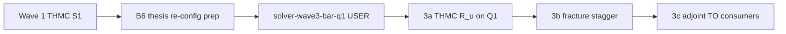

# Bar → Q1 migration scope (Wave 3 / Track S3)

**Date:** 2026-06-24 (Track C prep — design doc only)  
**Status:** **Queued** — USER gate [`solver-wave3-bar-q1`](../../docs/USER_GATES.md#5-solver-wave3-bar-q1) after Wave 1 (THMC S1) + B6 thesis re-config path chosen.  
**Wave plan:** [`outputs/.plans/archive/waves/solver-quality-wave-plan.md`](../../outputs/.plans/archive/waves/solver-quality-wave-plan.md) Wave 3.  
**Connectivity audit:** [`outputs/CONNECTIVITY_AUDIT_MECHANICS.md`](../../outputs/CONNECTIVITY_AUDIT_MECHANICS.md).

---

## Problem statement (P0 #1 / #2)

| Finding | Symptom | Current discretization | Risk |
| --- | --- | --- | --- |
| **P0 #1** | Coupled THMC / fracture paths call **bar-network** equilibrium on graphs that need continuum operators | `BarNetworkMechanicsSolvePort` exists; **no production consumer** | Wrong physics on roof / shell load paths |
| **P0 #2** | 9×8×2 roof bar PCG stall (`rel_res≈0.94` @ 2000 iters) | `bar_network_operator_step_a` **`#[ignore]`** | B6 / H4 roof traction masked by preconditioner on small probes |

Cartridge **shell_topology_rib_pattern** already uses **`AdjointComplianceQ1Hex`** (2026-06-10 retirement of bar ground structure on Striatus grid). Migration scope is **kernel consumers still on bar**, not the cartridge harness.

---

## In scope (Wave 3 — when USER gate opens)

### Phase 3a — THMC `R_u` first (highest consumer priority)

| Item | Path | Deliverable |
| --- | --- | --- |
| Port wiring | `src/physics/solvers/thmc.rs` inner equilibrium | Route through `MechanicsSolvePort`; fail-closed on `!SolveReport.converged()` |
| Q1 operator | `Q1HexMechanicsSolvePort` + `HexPcgReport` | New impl beside `BarNetworkMechanicsSolvePort` in `mechanics_solve_port.rs` |
| Fixtures | `tests/verification/thmc_*` + small brick | Parity vs bar on **≤ 64 DOF** graphs; stacked residual unchanged |
| Verification | `phase4-verification-pr` extension | One new row in [`Solver-Status.md`](Solver-Status.md) THMC § |

### Phase 3b — Fracture stagger

| Item | Path | Deliverable |
| --- | --- | --- |
| Stagger loop | `fracture_field.rs` ↔ mechanics | Same port boundary; no direct `packed_bar_network_equilibrium` |
| Tests | `staggered_fracture_mechanics_chain.rs` | Bar vs Q1 parity on milestone graphs |

### Phase 3c — Adjoint TO (by consumer priority)

| Item | Path | Deliverable |
| --- | --- | --- |
| Forward pass | `adjoint.rs` call sites | Port + witness; keep `adjoint_q1_hex` as SSOT for shell |
| Limit checks | `adjoint_q1_hex_matches_bar_in_limit.rs` | Un-ignore skeleton bar limit when rel_err contract met |

---

## Out of scope (honest parking)

- Full **Γ-convergence** fracture certification  
- Production **photonics** DEC / adjoint TO  
- **Herschel–Bulkley** rheology  
- Cartridge **200-outer B6 acceptance** (Goal D — separate USER gate)  
- Auto-migration of **all** `#[ignore]` envelopes — see [`SOLVER_NEVER_RUN_LEDGER.md`](SOLVER_NEVER_RUN_LEDGER.md)

---

## Preconditions (must be green before migration commits)

1. **Wave 1 (S1):** THMC `tol` on stacked-\|R\|₂ exit + post-Newton diagnostic (`thmc_post_newton_oracle_fixture` un-ignored).  
2. **B6 harness:** thesis re-config load model (`policy_editable_mask`, solid-skin roof load) wired — see `outputs/B6_HARNESS_STATUS.md`.  
3. **`mechanics-adjoint` compile:** `ElementConversion` import path green for port unit test.  
4. **USER sign-off:** `solver-wave3-bar-q1` in [`docs/USER_GATES.md`](../../docs/USER_GATES.md).

---

## Verification ladder (B6-style)

| Step | Outer budget | Gate |
| --- | --- | --- |
| Operator fixtures | 0 (analytic) | Symmetry, PSD, manufactured solution |
| Small-graph parity | 1 equilibrium | bar vs Q1 compliance rel_err ≤ agreed tolerance |
| THMC coupled smoke | 10 outers | `eq_rel`, `SolveReport.converged` |
| Consumer acceptance | 60-outer class | Same §9 metrics as B6 schedule-regime row |

**Do not** treat 20-outer smoke PASS as Wave 3 closure — see [`Solver-Status.md`](Solver-Status.md) § Smoke vs acceptance.

---

## Files touched (expected)

| Repo | Files |
| --- | --- |
| umst-manifold | `mechanics_solve_port.rs`, `thmc.rs`, `fracture_field.rs`, `adjoint.rs`, `Solver-Status.md`, `MANIFEST.toml` |
| umst-concrete-cartridge | Read-only parity hooks only unless THMC cartridge path added |

---

## Dependency graph

