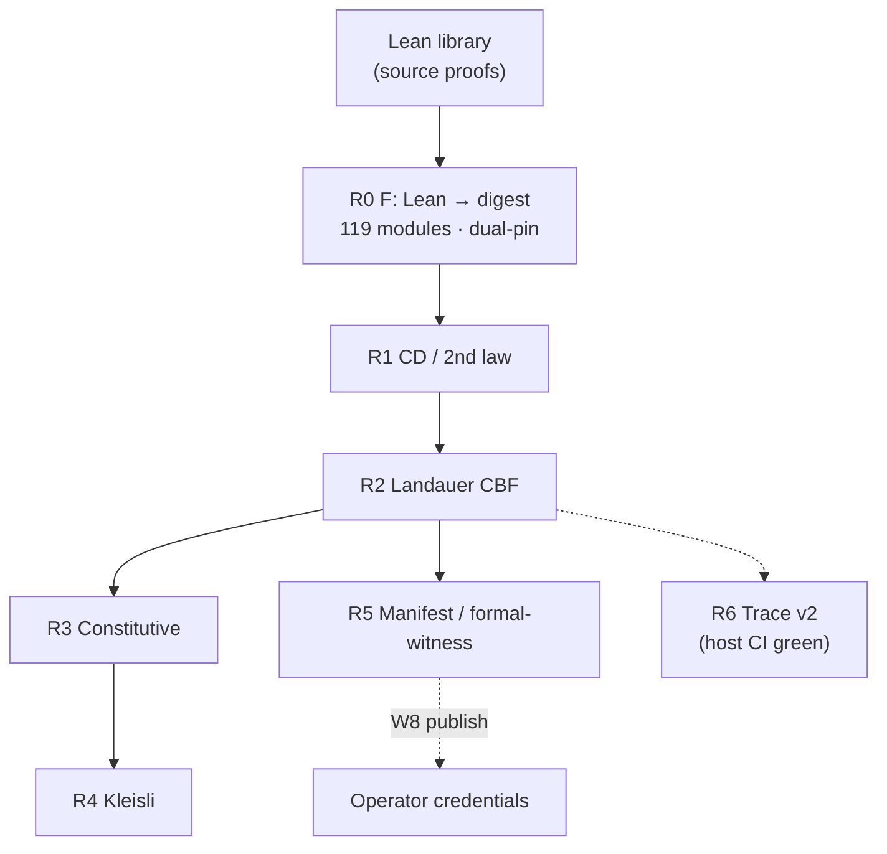

# Completion truth — what is 100%, what is not

**As of:** 2026-05-22  
**Audience:** Coordinators, reviewers, and operators who need one honest page — not a checklist chase.  
**Master verify:** `UMST_REQUIRE_FORMAL_EXPORT=1 bash scripts/verify_umst_stack.sh` ([`VERIFY.md`](VERIFY.md))

This document is the **completion SSOT**: it states what is genuinely closed, what remains human-only, and how morphism layers (Lean library → R0 pin → gates → manifest → traces) stack. Per-todo evidence lives in [`TODO_COMPLETION.md`](TODO_COMPLETION.md); command ledger in [`TODO_VERIFICATION_REPORT.md`](TODO_VERIFICATION_REPORT.md).

---

## Plain English — what is 100% today

These items are **done in this workspace** with **green tests** on the recorded pin — not “files exist,” but **exit 0** on the agreed verify bundle.

| Truth | What it means |
|-------|----------------|
| **Plan 15/15** | All **14** YAML plan todos are implemented on disk, plus milestone **`formal-fiber-merge`** (not a YAML id; closes the second Lean fiber). Plan front-matter still shows pending by policy — **disk wins**. |
| **119-module R0 pin** | Unified export: digest `0697014fb5b90a3aca4db3e5cc226896ca198802c910d5395f254e4262aa6227`, **119** modules, `cross_repo_merge: true`. Formal and manifold locks agree. |
| **Dual-pin schema v2** | Per-fiber pins (69 double-slit + 62 `umst-formal`) compose to the same **119**-module certificate; lock enforces `upstream_catalog_digest_hex == composed_catalog_digest_hex`. |
| **Tests green** | `verify_umst_stack.sh` exit **0**; `catalog_all_ids_registered` **4/4**; `gate_dual_run_parity` **8/8** golden + live; `gate_adversarial` **FNR=0** (75 cases); `formal-witness` + embodied orchestrator in stack path. |
| **Gates as law (R1–R4)** | Fixed short-circuit order on the hot path: CD → Landauer CBF → constitutive → Kleisli; stable `catalog_id` rejects; no Lean replay at inference. |
| **TCB unchanged** | Single Lean axiom `physicalSecondLaw`; Rust adds no axioms — [`TCB.md`](TCB.md). |

**One sentence:** The extraction pipeline from Lean proofs to manifold enforcement is **closed locally** — catalog pin, gates, parity, and stack verify are trustworthy without a human re-auditing every merge.

---

## What cannot be 100% without a human

Automation stops where **credentials, product policy, or optional lanes** begin. These are **not** missing Rust scaffolding; they need an operator decision.

| Blocker | Why a human is required | SSOT |
|---------|-------------------------|------|
| **W8 — git publish** | Push `tytolabs/umst-manifold` `main` with public `manifest` API so `umst-concrete-cartridge` CI runs `manifest-bridge` **without** workspace `[patch]`. Agents must not push without operator credentials. | [`W8_PUBLISH_RUNBOOK.md`](W8_PUBLISH_RUNBOOK.md) · [`AGENT_W8_STATUS.txt`](AGENT_W8_STATUS.txt) · Track **A** in [`PENDING_GOD_GRADE_ROADMAP.md`](PENDING_GOD_GRADE_ROADMAP.md) |
| **Strict catalog default** | `StrictCatalogMatch` exists but release default remains `CatalogPinnedRos2` until product flips policy. | Track **H** · [`GOD_GRADE_CHECKLIST.md`](GOD_GRADE_CHECKLIST.md) |
| **Optional R6 polish** | PPO η reward wire + `NumericTraceApproxConsistent` rollout witness — not automation blockers. | Track **G** optional · [`GOD_GRADE_CHECKLIST.md`](GOD_GRADE_CHECKLIST.md) rows 14–15 |
| **Optional prototype thin-delete** | v1 shim **226** lines + 2a hybrid **517** lines; dual-run proves equivalence — deletion is sign-off, not safety. | [`../umst-prototype/docs/THIN_PROTOTYPE_STATUS.md`](../umst-prototype/docs/THIN_PROTOTYPE_STATUS.md) · Track **B** |
| **Optional `rust.yml` gate lane** | Drift CI is SSOT; standalone manifold workflow is polish (W10). | [`AGENT_STATUS.md`](AGENT_STATUS.md) |

**God-grade headline:** see [headline SSOT table](GOD_GRADE_PROGRESS_VERIFIED.md#headline-percentages-ssot--one-table) (verified 2026-05-21T22:09:30Z).

---

## Morphism layers (Lean → runtime)

Each row is a **layer** in the extraction stack: what category it lives in, what morphism it implements, and how completion is judged.

| Layer | Plain name | Categorical role | Object / morphism | Completion criterion | SSOT |
|-------|------------|------------------|-------------------|----------------------|------|
| **Lean library** | Proof inventory in git | Source category **Lean** | Objects: modules/theorems; morphisms: proofs & declarations | Export regen produces stable `catalog.json` | [`../umst-formal-double-slit/Docs/EXPORT_COVERAGE.md`](../umst-formal-double-slit/Docs/EXPORT_COVERAGE.md) · [`../umst-formal-double-slit/Docs/UMST_FORMAL_REPOS_ALIGNMENT.md`](../umst-formal-double-slit/Docs/UMST_FORMAL_REPOS_ALIGNMENT.md) |
| **R0 — Catalog pin** | “What we ship today” | Functor **F**: Lean → `CatalogPin` (digest certificate) | Object: pinned bundle; morphism: export + lock bump | Digest match + `UMST_CATALOG_LOCK_SHA256_HEX`; drift CI fails on skew | [`FORMAL_BIDIRECTIONAL_ALIGNMENT.md`](FORMAL_BIDIRECTIONAL_ALIGNMENT.md) · [`DUAL_PIN_ARCHITECTURE.md`](DUAL_PIN_ARCHITECTURE.md) · [`FORMAL_FIBER_MERGE_RUNBOOK.md`](FORMAL_FIBER_MERGE_RUNBOOK.md) |
| **R1 — CD / 2nd law** | Thermodynamic admissibility (scalar) | Witness **W₁**: transition → admissible \| reject | `ThermodynamicState` → transition; highest-priority reject | `umst.gate.cd_transition`; host + embodied routing | [`GateUnificationSpec.md`](GateUnificationSpec.md) · [`claims-vs-proofs.md`](claims-vs-proofs.md) |
| **R2 — Landauer / MI budget** | Energy–information cost on tensors | Witness **W₂** after **W₁** on gateway path | Tensor state → CBF verify | `umst.gate.landauer_cbf`; η only post-CBF | [`TCB.md`](TCB.md) · [`COMPOSITIONAL_INFERENCE_AUDIT.md`](COMPOSITIONAL_INFERENCE_AUDIT.md) |
| **R3 — Constitutive** | Mix / hydration / strength closure | Witness **W₃** below **W₂** | Mix proposals → registry evaluators | `thermodynamic_mix`, cartridge policy ids | [`CATALOG_COVERAGE_AUDIT.md`](CATALOG_COVERAGE_AUDIT.md) |
| **R4 — Kleisli / probe** | Composed probe policies | Witness **W₄** (lowest gate priority) | Kleisli unit + embodied `GateEvaluatorRegistry` | `umst.gate.kleisli_unit`; `gate_kleisli` tests | [`GOD_GRADE_WITNESS_LADDER.md`](GOD_GRADE_WITNESS_LADDER.md) § R4 |
| **R5 — Manifest / digest witness** | Cartridge grounding ↔ manifold lock | Fiber functor over manifests; deployment certificate | `UmstManifest`, `GroundingContract`, `formal-witness` | Local ✅ with `[patch]`; remote **needs W8** | [`W8_PUBLISH_RUNBOOK.md`](W8_PUBLISH_RUNBOOK.md) · [`FORMAL_INTEGRATION_STATUS.md`](FORMAL_INTEGRATION_STATUS.md) |
| **R6 — Trace schema v2** | Emitted steps match Lean contract | Natural transformation **η**: surrogate numerics → trace bounds | `EpistemicRuntimeSchema` / `EmittedTraceSchema` | Host CI **✅** — G.2 **13/13** · G.3 **8/8** in `verify_umst_stack.sh` | [`GOD_GRADE_CHECKLIST.md`](GOD_GRADE_CHECKLIST.md) rows 13–15 |

**Composition law (god-grade):** `W₄ ∘ W₃ ∘ W₂ ∘ W₁` is **lazy** — stop at the first reject; do not run lower witnesses after a higher failure ([`GOD_GRADE_WITNESS_LADDER.md`](GOD_GRADE_WITNESS_LADDER.md) decision 1).



---

## Dual-pin (how 69 + 62 = 119)

| Pin | Digest (prefix) | Modules | Role |
|-----|-----------------|--------:|------|
| `umst-formal-double-slit` | `c1d9ba2…` | 69 | Primary historical fiber |
| `umst-formal` | `534d9e18…` | 62 | Classical / constitutional fiber |
| **Composed R0** | `0697014f…` | **119** | Manifold `upstream_catalog_digest_hex` |

Independent release cadence per fiber; one composed digest for drift CI. Details: [`DUAL_PIN_ARCHITECTURE.md`](DUAL_PIN_ARCHITECTURE.md).

---

## Plan 15/15 map

| # | Id / milestone | Status |
|---|----------------|--------|
| 1–14 | YAML todos (`repo-layout-ssot` … `thin-prototypes`) | ✅ on disk |
| 15 | `formal-fiber-merge` (= `lean-export-cross-repo`) | ✅ unified **119** pin |

Evidence table: [`TODO_COMPLETION.md`](TODO_COMPLETION.md) § 14/14 map + § `formal-fiber-merge`.

---

## Categorical vocabulary box

> **For agents and formal readers** — plain definitions sit in § Plain English above.

| Term | UMST meaning |
|------|----------------|
| **Object** | Admissible state: `ThermodynamicState`, `UnifiedMaterialStateTensor`, Lean carrier types |
| **Morphism** | Transition, probe, or export step mapping state → state (or → measurement) |
| **Functor F** | `export_catalog.py`: Lean modules → `catalog.json` → lock digest → `build.rs` constant |
| **Witness Wᵢ** | Endomorphism on admissible states **or** arrow to the **reject** object; ordered R0…R6 |
| **Fiber** | One formal repo + its digest (`umst-formal-double-slit`, `umst-formal`) |
| **Natural transformation η** | Calibration from emitted traces to bounded surrogate (`ManifoldGateway::eta`) |
| **Lazy composite** | `W₄∘W₃∘W₂∘W₁` short-circuits at first non-invertible step |

Full ladder prose: [`GOD_GRADE_WITNESS_LADDER.md`](GOD_GRADE_WITNESS_LADDER.md) § Categorical vocabulary.

---

## Re-verify (copy-paste)

From `MaOS-Workspace/umst-manifold`:

```bash
export UMST_REQUIRE_FORMAL_EXPORT=1
export UMST_FORMAL_ROOT="$PWD/../umst-formal-double-slit"
bash scripts/verify_umst_stack.sh
cargo test -p umst-manifold --test catalog_all_ids_registered
cargo test -p umst-manifold --test gate_dual_run_parity --test gate_adversarial
cd ../umst-concrete-cartridge && cargo test -p umst-concrete-cartridge --features manifest-bridge
```

Expect exit **0** on the unified pin. Record timestamp in [`TODO_VERIFICATION_REPORT.md`](TODO_VERIFICATION_REPORT.md).

---

## SSOT document index (all linked)

Use this table as the **single navigation hub**. “SSOT” means: if two docs disagree, the doc listed here for that topic wins after re-verify.

### Completion & truth (this page)

| Doc | Role |
|-----|------|
| **This file** | What is / is not 100%; morphism layers; W8 boundary |
| [`TODO_COMPLETION.md`](TODO_COMPLETION.md) | Per-todo requirement + evidence commands |
| [`TODO_VERIFICATION_REPORT.md`](TODO_VERIFICATION_REPORT.md) | Command → exit → files ledger |
| [`GOD_GRADE_PROGRESS_VERIFIED.md`](GOD_GRADE_PROGRESS_VERIFIED.md) | Last green run, 69→119 table, robustness vs completeness |
| [`UMST_PROGRESS_REPORT.md`](UMST_PROGRESS_REPORT.md) | Executive day rollup |
| [`UMST_IMPACT_FOR_HUMANS.md`](UMST_IMPACT_FOR_HUMANS.md) | Before/after story for non-engineers |
| [`END_CONDITION_REPORT.md`](END_CONDITION_REPORT.md) | Gate/manifest matrix PASS snapshot |

### Pipeline & formal

| Doc | Role |
|-----|------|
| [`FORMAL_BIDIRECTIONAL_ALIGNMENT.md`](FORMAL_BIDIRECTIONAL_ALIGNMENT.md) | Lean → catalog → manifold → cartridge → drift |
| [`FORMAL_INTEGRATION_STATUS.md`](FORMAL_INTEGRATION_STATUS.md) | Module buckets: hot-path vs digest-only |
| [`FORMAL_FIBER_MERGE_RUNBOOK.md`](FORMAL_FIBER_MERGE_RUNBOOK.md) | Cross-repo merge operator steps |
| [`DUAL_PIN_ARCHITECTURE.md`](DUAL_PIN_ARCHITECTURE.md) | v2 lock schema, per-fiber pins |
| [`CATALOG_TRACEABILITY.md`](CATALOG_TRACEABILITY.md) | `catalog_all_ids_registered` partitions |
| [`CATALOG_COVERAGE_AUDIT.md`](CATALOG_COVERAGE_AUDIT.md) | Semantic coverage classes |
| [`CATALOG_ROW_COUNT.md`](CATALOG_ROW_COUNT.md) | Row-count reconciliation |
| [`../umst-formal-double-slit/Docs/EXPORT_COVERAGE.md`](../umst-formal-double-slit/Docs/EXPORT_COVERAGE.md) | Exporter scope, last production merge |
| [`../umst-formal-double-slit/Docs/UMST_FORMAL_REPOS_ALIGNMENT.md`](../umst-formal-double-slit/Docs/UMST_FORMAL_REPOS_ALIGNMENT.md) | Two-repo alignment |
| [`../umst-formal-double-slit/artifacts/README.md`](../umst-formal-double-slit/artifacts/README.md) | Canonical `make lean-catalog-export` |

### Witness ladder & god-grade

| Doc | Role |
|-----|------|
| [`GOD_GRADE_WITNESS_LADDER.md`](GOD_GRADE_WITNESS_LADDER.md) | R0→R6 order, decisions 1–5, categorical box |
| [`GOD_GRADE_CHECKLIST.md`](GOD_GRADE_CHECKLIST.md) | Production automation criteria (17/17) |
| [`GOD_GRADE_LAYER_MATRIX.md`](GOD_GRADE_LAYER_MATRIX.md) | Category × phase × track matrix |
| [`PENDING_GOD_GRADE_ROADMAP.md`](PENDING_GOD_GRADE_ROADMAP.md) | Tracks A–J, owners |
| [`UNFINISHED_FEATURES_AUDIT.md`](UNFINISHED_FEATURES_AUDIT.md) | Plain-language open items |
| [`PREVIEW_STUB_AUDIT.md`](PREVIEW_STUB_AUDIT.md) | Non-normative preview artifacts |
| [`TRUTH_AUDIT_LOG.md`](TRUTH_AUDIT_LOG.md) | Stale-doc corrections after `formal-fiber-merge` |

### Gates, claims, layout

| Doc | Role |
|-----|------|
| [`GateUnificationSpec.md`](GateUnificationSpec.md) | Predicate registry, dual-run, `catalog_id` |
| [`PROTOTYPE_GATE_MAP.md`](PROTOTYPE_GATE_MAP.md) | Prototype → manifold map |
| [`claims-vs-proofs.md`](claims-vs-proofs.md) | Theorem ↔ `catalog_id` ↔ Rust |
| [`TCB.md`](TCB.md) | Trusted computing base |
| [`REPO_LAYOUT_SSOT.md`](REPO_LAYOUT_SSOT.md) | `src/` layout under manifold |
| [`COMPOSITIONAL_INFERENCE_AUDIT.md`](COMPOSITIONAL_INFERENCE_AUDIT.md) | PPO → gateway → CBF → orchestrator stack |

### Ops & agents

| Doc | Role |
|-----|------|
| [`VERIFY.md`](VERIFY.md) | Canonical test / feature matrix |
| [`W8_PUBLISH_RUNBOOK.md`](W8_PUBLISH_RUNBOOK.md) | Human-only publish checklist |
| [`AGENT_STATUS.md`](AGENT_STATUS.md) | Waves W1–W10, lanes |
| [`AGENT_W8_STATUS.txt`](AGENT_W8_STATUS.txt) | W8 local-done snapshot |
| [`PARALLEL_HANDOFFS.md`](PARALLEL_HANDOFFS.md) | Wave handoffs |
| [`SWARM_TEST_REPORT.md`](SWARM_TEST_REPORT.md) | Full cargo test sweep |

### Coordinator index & reference

| Doc | Role |
|-----|------|
| [`README.md`](README.md) | Doc families + reading order |
| [`Mathematical-Foundations.md`](Mathematical-Foundations.md) | Carrier math |
| [`PROOF-STATUS.md`](PROOF-STATUS.md) | Formal verification track |
| [`Solver-Status.md`](Solver-Status.md) | Solver roadmap |
| [`Validation.md`](Validation.md) | Validation methodology |
| [`FINAL_SESSION_REPORT.md`](FINAL_SESSION_REPORT.md) | Session closure narrative |
| [`PROTOTYPE_2A_HOST_GAPS.md`](PROTOTYPE_2A_HOST_GAPS.md) | 2a hybrid gaps |

### Sibling repos

| Doc | Role |
|-----|------|
| [`../umst-prototype/docs/THIN_PROTOTYPE_STATUS.md`](../umst-prototype/docs/THIN_PROTOTYPE_STATUS.md) | v1 shim + 2a hybrid |
| [`../umst-supercap-cartridge/docs/FORMAL_SCALING.md`](../umst-supercap-cartridge/docs/FORMAL_SCALING.md) | Supercap formal anchors |
| [`../README.md`](../README.md) | Crate overview |

---

## Honest split (one table — SSOT)

**Verified (UTC):** 2026-05-21T22:09:30Z  
**Bundle:** `UMST_REQUIRE_FORMAL_EXPORT=1 bash scripts/verify_umst_stack.sh` (exit **0**; includes G.2 `epistemic_trace_schema` **13/13**, G.3 `trace_calibration` **8/8**, J.3 **1/1**)

| Lens | % | Meaning in one sentence |
|------|---|-------------------------|
| **Plan completeness** | **100%** | All 14 plan todos are implemented on disk; YAML status in the plan file was left unchanged on purpose. |
| **Plan + cross-repo completeness** | **100%** | The second Lean library (`umst-formal`) is merged into one **119**-module pin; formal and manifold locks agree. |
| **Automation (in-repo)** | **100%** | **17/17** checklist rows green — [`GOD_GRADE_CHECKLIST.md`](GOD_GRADE_CHECKLIST.md). |
| **God-grade weighted (R0–R6, in-repo)** | **~98%** | Six rungs at 100%; R6 optional polish (η reward wire, rollout approx) only. |
| **God-grade weighted (incl. org W8)** | **~95%** | **G-01** + **G-02** ✅ @ **fe22437** / **6742fa3**; **G-03** supercap optional. |
| **Robustness (verify bundle)** | **100%** | `verify_umst_stack.sh` exit **0** at the timestamp above. |
| **Hot-path proof coverage** | **~26%** | About **18 of 69** primary Lean modules are hand-wired on the gate hot path; **119/119** digest still enforced in CI. |
| **Org W8 (Track A)** | **~67%** | **2/3** — publish + concrete remote **done**; **G-03** supercap optional. |
| **Scoped true 100% blockers** | **G-03** (optional) + **FFI** | G.2 · G.3 · J.3 no longer block in-repo automation. |

**Robustness vs completeness:** Completeness is “how much of the roadmap is done.” Robustness is “did the agreed checks pass without drift?” — they did @ **22:05:32Z**.

**Bottom line:** Treat **plan + fibers + local stack verify + 17/17 automation** as **truth-complete in-repo**. Treat **G-03** (optional) and **FFI** as the remaining scoped blockers — not W8 G-01/G-02 or G.2/G.3 host CI.

---

*Coordinator handoff:* start here → drill [`TODO_COMPLETION.md`](TODO_COMPLETION.md) for evidence → run [`VERIFY.md`](VERIFY.md) before any pin change.
