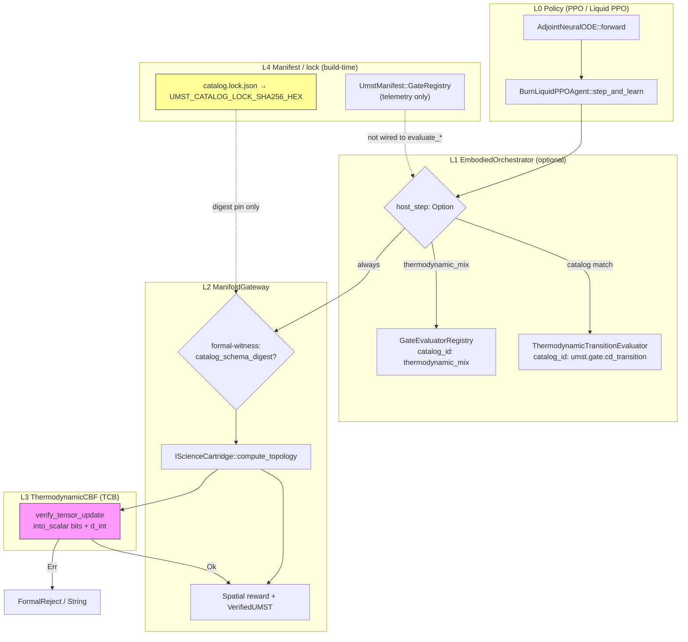

# Compositional inference audit — `umst-manifold`

**Scope:** Multi-layer policy inference from PPO/liquid-PPO through `ManifoldGateway`, optional `EmbodiedOrchestrator` host gates, formal witness, and manifest/registry composition.  
**SSOT traceability:** `docs/claims-vs-proofs.md`, `docs/GateUnificationSpec.md`, `docs/TCB.md`, [`CATALOG_COVERAGE_AUDIT.md`](CATALOG_COVERAGE_AUDIT.md).

**God-grade normative order:** CD / 2nd law → Landauer CBF → constitutive → probe; MI surrogate only post-CBF; see [`GOD_GRADE_WITNESS_LADDER.md`](GOD_GRADE_WITNESS_LADDER.md). Pipeline — [`FORMAL_BIDIRECTIONAL_ALIGNMENT.md`](FORMAL_BIDIRECTIONAL_ALIGNMENT.md).

**Generated:** 2026-05-21

---

## 1. Layer stack (call order)

| Layer | Type | Primary files | Role |
|-------|------|---------------|------|
| **L0 — Policy / ODE** | Tensor + AdamW | `src/ai/liquid_ppo.rs`, `src/ai/adjoint.rs` | `BurnLiquidPPOAgent::step_and_learn`: Neural ODE forward → proposed UMST → gateway → adjoint backward |
| **L1 — Embodied composition** | Host `f64` + tensor | `src/manifest/orchestrator.rs` | Optional `HostTransitionStep` then `ManifoldGateway::evaluate_topology_step` |
| **L2 — Manifold gateway** | Tensor IO barrier | `src/ai/ppo.rs` | Cartridge `compute_topology` → CBF scalar sync → spatial reward → `VerifiedUMST` |
| **L3 — Thermodynamic CBF** | Host `f64` TCB | `src/ai/cbf.rs` | Landauer erasure + Clausius–Duhem on batch-summed `info_gain` / `d_int` |
| **L4 — Host transition gates** | Host `f64` | `src/gate/thermo_transition.rs`, `src/gate/mix_eval_registry.rs` | `umst.gate.cd_transition`, `thermodynamic_mix` (registry) |
| **L5 — Formal witness** | Optional digest | `src/ai/formal.rs`, `catalog_schema_digest` on UMST | Byte equality gate before physics; **not** Lean runtime |
| **L6 — Catalog lock** | Build-time TCB | `build.rs`, `artifacts/catalog.lock.json`, `src/runtime/catalog/mod.rs` | `UMST_CATALOG_LOCK_SHA256_HEX`; no per-step Lean |

**Default training path (no embodied host step):**  
`BurnLiquidPPOAgent` → `ManifoldGateway::evaluate_topology_step` → `ThermodynamicCBF` only.

**Embodied path:**  
`EmbodiedOrchestrator::evaluate_topology_step(…, host_step: Some(…))` → host gate → same gateway/CBF path.

---

## 2. Mermaid — compositional inference flow

---

## 3. Topology step — internal sequence (`ManifoldGateway`)

From `src/ai/ppo.rs` (`evaluate_topology_step_formal`):

1. **Formal witness (feature `formal-witness`):** If both `expected_catalog_schema_digest` and `raw_state.catalog_schema_digest` are `Some`, reject on mismatch (`FormalReject::CatalogSchemaDigestMismatch`). If either is `None`, skip.
2. **Physics cartridge:** `cartridge.compute_topology(&raw_state)` → `PhysicalResult` (tensors stay on device).
3. **Dissipation reduction:** `dissipation.sum_dim(1)` → `d_int`.
4. **CBF:** `ThermodynamicCBF::verify_tensor_update(d_int, info_gain)` — **two** `.into_scalar()` syncs per step (documented IO barrier).
5. **Reward:** α·F − β·D − γ·C − erasure, plus optional ζ·mean(safety_margin), η·mean(information_density).
6. **Output:** `VerifiedUMST<ClausiusDuhemProof>` + per-batch scalar reward tensor.

`EmbodiedOrchestrator` runs **before** step 1 only when `host_step` is provided (or errors if `dual_run` and host missing).

---

## 4. Gate registry composition

| Component | Executes gates? | `catalog_id` | Notes |
|-----------|-----------------|--------------|-------|
| `UmstManifest::gate_registry` | **No** — `declared_lanes: Vec<String>` only | — | `umst_manifest.rs`: does **not** execute gate logic |
| `EmbodiedOrchestrator::host_transition_gate` | Yes (if `host_step` matches) | `umst.gate.cd_transition` | Default from manifest |
| `EmbodiedOrchestrator::mix_gate_registry` | Yes (if `catalog_id == "thermodynamic_mix"`) | `thermodynamic_mix` | Single slot; not namespaced as `umst.gate.*` |
| `ManifoldGateway::cbf` | Always on tensor path | `umst.gate.landauer_cbf` (spec) | TCB per `TCB.md` |
| `gate_server` HTTP | Yes (separate bin) | `umst.gate.http_shim` | Not in embodied loop |
| `gate::kleisli` | `KleisliUnitEvaluator` | `umst.gate.kleisli_unit` | Routed in `check_host_transition` after R1–R3 host gates |

**Routing in `check_host_transition`:** `host_transition_gate.catalog_id()`, `"thermodynamic_mix"`, and `"umst.gate.kleisli_unit"`; any other id → `HostRegistryMissing`.

**Spec vs code — `dual_run`:** `GateUnificationSpec.md` says run transition gate **and** CBF independently and reject if either fails. `EmbodiedOrchestrator` with `dual_run=true` only **requires** a host step; CBF always runs via gateway. True dual-run parity lives in `tests/gate_dual_run_parity.rs` (mix filter vs prototype goldens), not in the orchestrator’s `evaluate_topology_step`.

---

## 5. Lean proof families — invoke vs hand-aligned (by layer)

**Global rule:** No layer **invokes Lean at runtime**. Lean appears as (a) **proved** catalog inventory, (b) **hand-aligned** Rust mirrors, (c) **TCB** digest/HTTP enforcement.

### L0 — PPO / Liquid PPO

| Lean families | `catalog_id` | Runtime link | Status |
|---------------|--------------|--------------|--------|
| `EpistemicMI`, `EpistemicSensing`, `EpistemicTrajectoryMI` | `umst.gate.landauer_cbf` | `info_gain` tensor → CBF “bits” by caller convention | **hand-aligned** (MSE surrogate in `info_gain.rs`, not MI) |
| `PhysicsConstrainedAI` | `umst.gate.landauer_cbf` | Via gateway/CBF | hand-aligned |
| `ProbeOptimization` | `umst.gate.kleisli_unit` | `KleisliUnitEvaluator` on embodied host step | hand-aligned (not in PPO tensor step) |
| Epistemic policy/dynamics/Galois, quantum modules | — | No Rust in training loop | **proved** (formal only) |

### L1 — EmbodiedOrchestrator

| Lean families | `catalog_id` | Runtime link | Status |
|---------------|--------------|--------------|--------|
| `Gate`, `UMSTCore`, `GateCompat`, `Naturality`, `DoubleSlit` | `umst.gate.cd_transition` | `ThermodynamicTransitionEvaluator` | hand-aligned |
| Mix / Powers closure | `thermodynamic_mix` | `ThermodynamicMixEvaluator` | hand-aligned |
| `MonoidalState` combine lemmas | `umst.gate.cd_transition` | Host transition only | **proved** (Lean); Rust hand-aligned |
| Manifest `GateRegistry` | — | Not executed | N/A |

### L2–L3 — ManifoldGateway + CBF

| Lean families | `catalog_id` | Runtime link | Status |
|---------------|--------------|--------------|--------|
| `LandauerBound`, `LandauerExtension`, `MeasurementCost`, `InformationCostIdentity`, `ErasureChannel` | `umst.gate.landauer_cbf` | `ThermodynamicCBF` | hand-aligned |
| `LandauerLaw` (`physicalSecondLaw` axiom) | `umst.gate.landauer_cbf` | CBF inequalities | **TCB** |
| Gateway + CBF stack | `umst.gate.landauer_cbf` | Full topology step | **TCB** |

### L5 — Formal witness

| Lean families | `catalog_id` | Runtime link | Status |
|---------------|--------------|--------------|--------|
| `EpistemicRuntimeContract` | `umst.formal.catalog_lock` | `FormalReject::CatalogSchemaDigestMismatch` | hand-aligned |
| Full export bundle (**119** modules) | `umst.formal.catalog_lock` | `build.rs` digest only | **TCB** (pin, not per-step proof) |

**Witness gap:** `catalog_schema_digest` is **not** auto-filled from `UMST_CATALOG_LOCK_SHA256_HEX`; callers must set both sides to `Some` manually.

### L4 — Physics / DEC (outside gateway, same crate)

| Lean | Rust | Status |
|------|------|--------|
| `umst-formal` `DEC.lean` | `physics/dec_primal.rs`, `dec_operators.rs` | hand-aligned (no gateway call) |

### Proved in Lean, no manifold runtime surface (examples)

`Complementarity`, `QuantumClassicalBridge`, `VonNeumannEntropy`, `DataProcessingInequality`, `SimLeanBridge`, `FormalFoundations.umst_double_slit_formal_complete`, etc. — digest pin only where noted in claims table.

---

## 6. “God-grade automation” gaps

| Area | Automated today | Manual / missing |
|------|-----------------|------------------|
| Lean → Rust proof extraction | Catalog export + lock SHA-256 in `build.rs` | No extracted obligations; no runtime Lean checker |
| Per-step formal certificate | `VerifiedUMST` marker type | `ClausiusDuhemProof` is empty trait; CBF pass does not load a Lean proof term |
| `catalog_schema_digest` witness | Enum + field on UMST | Not tied to lock hash; `tests/formal_witness.rs` is compile smoke only |
| Epistemic MI / Landauer bits | CBF enforces scalar budget | `info_gain` = MSE surrogate; not `EpistemicMI` semantics |
| Manifest `GateRegistry` | Declared lane strings | **Not** consulted by `EmbodiedOrchestrator` |
| Registry-first evaluator selection | Spec in `GateUnificationSpec.md` | Orchestrator hard-codes two host ids + gateway CBF |
| `dual_run` | Parity tests vs prototype JSON | Embodied API only forces host step; no auto parallel CBF+CD disagree logic |
| `umst.gate.kleisli_unit` | `gate_kleisli` + embodied routing | ✅ `KleisliUnitEvaluator`; not on default PPO-only path |
| Catalog drift on Lean edit | `umst-catalog-drift.yml` | Manual `make lean-catalog-export` + refresh `catalog.lock.json` |
| PPO training loop | AdamW + adjoint + gateway reject | No auto-calibration of `k_phys_dint_to_joules` / temperature / credit from Lean |
| ROS / embodied buses | Serde `catalog_hash` (`ros2-contract`) | No automatic gate ack pipeline from manifest into ROS runtime |

---

## 7. Key file map

| Concern | Path |
|---------|------|
| Gateway / topology step | `umst-manifold/src/ai/ppo.rs` |
| Formal reject enum | `umst-manifold/src/ai/formal.rs` |
| CBF / Landauer | `umst-manifold/src/ai/cbf.rs` |
| Liquid PPO composition | `umst-manifold/src/ai/liquid_ppo.rs` |
| Embodied stack | `umst-manifold/src/manifest/orchestrator.rs` |
| Manifest + `GateRegistry` | `umst-manifold/src/manifest/umst_manifest.rs` |
| Host CD gate | `umst-manifold/src/gate/evaluator.rs`, `thermo_transition.rs` |
| Mix registry | `umst-manifold/src/gate/mix_eval_registry.rs` |
| Claims ↔ Lean table | `umst-manifold/docs/claims-vs-proofs.md` |
| Integration tests | `tests/embodied_orchestrator.rs`, `tests/gateway_info_gain.rs` |

---

## 8. God-grade failure composition (normative)

When multiple witnesses apply on one step, evaluate in **short-circuit** order ([`GOD_GRADE_WITNESS_LADDER.md`](GOD_GRADE_WITNESS_LADDER.md) decision 1):

1. **L1 host CD** — `ThermodynamicTransitionEvaluator` / mix CD legs (`umst.gate.cd_transition`).
2. **L3 CBF** — `ThermodynamicCBF` after cartridge (`umst.gate.landauer_cbf`).
3. **L1 mix / constitutive** — `thermodynamic_mix`, cartridge policy.
4. **Kleisli / probe** — `umst.gate.kleisli_unit` via `KleisliUnitEvaluator` when host step requests it (after CD/mix on embodied path).

**MI surrogate:** `info_gain` MSE is admissible as CBF input only **after** this composition (decision 2). **η** calibration should come from trace-driven witnesses (`EpistemicTraceDrivenCalibrationWitness`), not ad hoc constants.

**v1 / v2 witnesses:** v1 = `formal-witness` digest reject; v2 = `EmittedTraceSchema` serde roundtrip in `src/ros/epistemic_trace.rs` (G.1 ✅); bounds / η-from-traces (G.2–G.3) open.

---

## 9. Summary

Inference is **compositional** (optional host `f64` gates → tensor cartridge → scalar CBF TCB → optional digest witness), but **Lean is never invoked at runtime**—only pinned via lock digest and hand-aligned Rust.

Largest automation gaps: MI surrogate vs `EpistemicMI`, inert manifest `GateRegistry`, weak `formal-witness` tests, and `dual_run` spec/implementation mismatch.
