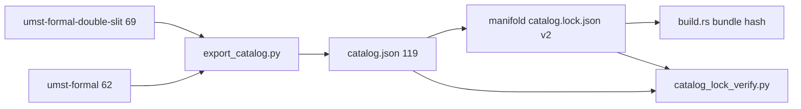

# Dual-pin catalog architecture

**Status:** Implemented (schema v2 live in `artifacts/catalog.lock.json`).  
**Gate:** `RECOMMEND_DUAL_PIN=implement`

## Summary

| Model | Manifold lock | Fiber independence | CI complexity |
|-------|---------------|-------------------|---------------|
| **Monolith (transitional)** | Single `upstream_catalog_digest_hex` = merged export | Low — one bump per any `.lean` change in either repo | Lowest |
| **Dual-pin (target, live)** | Per-fiber digests + `composed_catalog_digest_hex` | High — formal can ship without re-exporting double-slit | Medium |
| **Primary-only (rollback)** | `c1d9ba2…`, 69 modules | Ignores `umst-formal` fiber | Lowest, incomplete R0 |

**Recommendation:** **Dual-pin schema v2** for god-grade modular composition; retain merged `umst-formal-double-slit/artifacts/catalog.json` as the composed inventory for bidirectional gate checks. **Single TCB axiom** (`physicalSecondLaw`) is independent of pin shape.

## Current pins (2026-05-21)

| Pin | Digest (prefix) | Modules |
|-----|-----------------|--------:|
| `umst-formal-double-slit` | `035ea948…` | 69 |
| `umst-formal` | `265db0ed…` | 62 |
| **Composed (R0)** | `ef0ed071…` | 119 |

`upstream_catalog_digest_hex` and `composed_catalog_digest_hex` are equal in v2 (composed verification view).

## Why dual-pin

1. **Independent release cadence** — classical lemmas (`umst-formal`) vs double-slit stack bump separately.
2. **Clear rollback** — revert one fiber pin without losing the other.
3. **Provenance** — lock documents which repo caused drift; merged catalog tags `repo` per module.
4. **God-grade composition** — R0 verifies `(pin_ds, pin_fm) → composed_ok`; physics axiom remains singleton in TCB.

## Lock schema

### v1 (legacy) — `manifold_runtime_lock`

```json
{
  "version": 1,
  "role": "manifold_runtime_lock",
  "upstream_repo": "umst-formal-double-slit",
  "upstream_catalog_digest_hex": "<64-hex>",
  "module_count": 119
}
```

### v2 (live) — backward compatible

See `artifacts/catalog.lock.json`. Invariants enforced by `scripts/catalog_lock_verify.py`:

- `upstream_catalog_digest_hex == composed_catalog_digest_hex`
- Each `fiber_pins[i].catalog_digest_hex` matches a per-root `export_catalog.py` regen
- Merged export digest matches composed pin and `module_count`

`build.rs`: `UMST_CATALOG_LOCK_SHA256_HEX` = SHA-256(**lock file bytes**), not a Lean digest. TCB unchanged.

## CI

| Script | Behavior |
|--------|----------|
| `scripts/catalog_lock_verify.py` | Composed + optional per-fiber export checks |
| `scripts/verify_umst_stack.sh` | Regen merged + fibers when siblings present; call verifier |
| `scripts/bidirectional_catalog_check.sh` | Same + gate ⊆ `catalog.json` |
| `.github/workflows/umst-catalog-drift.yml` | `UMST_REQUIRE_FORMAL_EXPORT=1` stack verify |

**Env:** `UMST_FORMAL_ROOT` (double-slit), `UMST_FORMAL_CLASSICAL_ROOT` (optional override for `umst-formal`).

## Impact

### umst-manifold

- `runtime/catalog/mod.rs`: [`CatalogLock`](../../src/runtime/catalog/mod.rs), [`catalog_lock_quickcheck`](../../src/runtime/catalog/mod.rs), [`witness_catalog_quickcheck_ok`](../../src/runtime/catalog/mod.rs) — parses bundled lock JSON; v2 requires `composed_catalog_digest_hex == upstream_catalog_digest_hex` and valid per-fiber hex digests; v1 monolith (no `fiber_pins`) remains accepted for rollback.
- `traceability.rs` / `catalog_all_ids_registered`: unchanged — composed `catalog.json` path.
- Docs: Track F composed pin ✅; Track F′ dual-pin ✅.

### umst-concrete-cartridge

- **No TCB change** — `physicalSecondLaw` only.
- Manifest grounding: composed digest + lock bundle hash over full v2 JSON.

## Rollback

| Scenario | Action |
|----------|--------|
| Dual-pin CI false positive | Revert lock to v1 monolith `0697014f…` / 119 (drop `fiber_pins`) |
| Full fiber demotion | v1 `c1d9ba2…` / 69; regen without `--also-lean-root` |
| One fiber bad | v2: update single `fiber_pins[]` entry; v1: regen entire composed export |

Never patch Rust gates to accept digest mismatch — fix export/lock pairing (R0).

## Architecture



---

RECOMMEND_DUAL_PIN=implement
