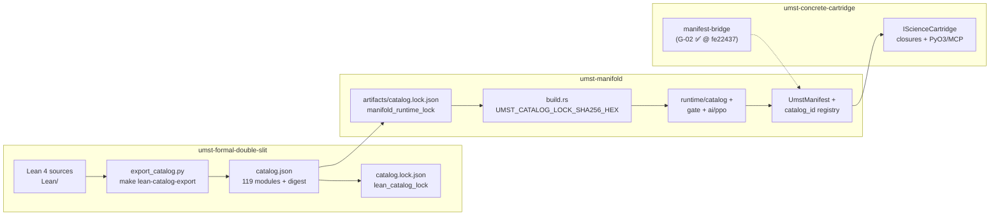

# Formal bidirectional alignment (plain English)

**As of:** 2026-05-21  
**Synthesized from:** `umst-formal-double-slit/artifacts/catalog.json`, `umst-formal-double-slit/artifacts/catalog.lock.json`, `umst-manifold/artifacts/catalog.lock.json`, `docs/claims-vs-proofs.md`, `docs/PROTOTYPE_GATE_MAP.md`, `docs/TCB.md`, `docs/AGENT_STATUS.md`, `scripts/verify_umst_stack.sh`, and `.github/workflows/umst-catalog-drift.yml`.

**Companions:** [`FORMAL_INTEGRATION_STATUS.md`](FORMAL_INTEGRATION_STATUS.md) (module buckets), [`GOD_GRADE_WITNESS_LADDER.md`](GOD_GRADE_WITNESS_LADDER.md) (witness order, failure priority, v1/v2 trace contracts).

**Narrative:** This file is the **pipeline spine** (Lean → catalog → manifold → cartridge → drift). Roll up percentages in [`PENDING_GAPS_PLAIN.md`](PENDING_GAPS_PLAIN.md); close gaps via [`PENDING_GOD_GRADE_ROADMAP.md`](PENDING_GOD_GRADE_ROADMAP.md).

---

## Process & verification

**Progress date:** 2026-05-21 · **Verify:** `UMST_REQUIRE_FORMAL_EXPORT=1 bash scripts/verify_umst_stack.sh` → **OK**

| Metric | Value |
|--------|-------|
| Forward pin (R0) | Digest match on regen; bidirectional `catalog_id` OK |
| Reverse drift | `umst-catalog-drift.yml` + dual-run 8/8 |
| Plan infra / god-grade | **100%** / **~84%** ([`PENDING_GAPS_PLAIN.md`](PENDING_GAPS_PLAIN.md)) |

### Learnings

- **Proofs as a versioned library** — Authoritative artifact is **regenerated** `export_catalog.py` output, not the slim `entries[]` index file. Promotion = export → lock bump → verify ([§ Reverse flow](#reverse-flow-drift-detection)).
- **Bidirectional ≠ prover** — Downstream checks fail on **fingerprint** and **parity**, not Lean replay at runtime. Hand-aligned Rust stays inside the pinned revision.
- **Second-law on the wire** — CD transition and Landauer CBF are the operational anchors for forward enforcement; `physicalSecondLaw` stays in Lean only ([`GOD_GRADE_WITNESS_LADDER.md`](GOD_GRADE_WITNESS_LADDER.md) § Proof library · gate law · MI).

### Impact

- Formal merges cannot silently drift: CI prints `FAIL: catalog drift upstream=… export=…`.
- Cartridge path documented end-to-end; **G-02** enables git-pinned `manifest-bridge` without workspace `[patch]` (local `[patch]` remains dev Evidence).
- God-grade ladder steps 1–3 (always-on CI, Lean PR checklist, registry completeness) map directly to open tracks C, E, H in the roadmap.

> **Design lens** — Forward flow is functorial export **F** (Lean → digest); reverse flow is a **natural transformation** of regression tests detecting when **F** changes without promotion.

---

## What this document is for

This is the **pipeline story**: how proofs in Lean become a catalog fingerprint, how the manifold enforces policy against that fingerprint, how a concrete cartridge plugs in, and how **reverse** checks catch drift when any layer moves. It is written for operators and reviewers, not proof engineers.

---

## Forward flow: Lean → catalog → manifold → cartridge

Think of four layers. Data mostly flows **down**; enforcement flows **up** through tests and digests.

### 1. Lean (proofs)

- **Where:** `umst-formal-double-slit/Lean/` (UMST.DoubleSlit namespace).
- **What:** Machine-checked lemmas for gates, Landauer bounds, epistemic MI, double-slit / density-matrix theory, activation, and completion witnesses.
- **Build:** `lake build` in the formal repo (not run on every manifold `cargo test`).

### 2. Catalog (machine-readable inventory + fingerprint)

- **Exporter:** `tools/lean_export/export_catalog.py` scans every `*.lean` file, records declarations and import edges, and computes a **canonical digest** (SHA-256 of the JSON body **before** the `digest` field is added).
- **Outputs:**
  - **`artifacts/catalog.json`** — full export (currently **119 modules**, `cross_repo_merge: true`; **582** theorem/lemma/axiom names on primary-fiber scan).
  - **`artifacts/catalog.lock.json`** (formal repo) — `catalog_digest_hex` + `module_count`.
- **Command:** `make lean-catalog-export` in `umst-formal-double-slit`.

There is also a **slim** `catalog.json` on disk that uses an `entries[]` index (59 stable `catalog_id` rows). That file is **not** what CI drift checks hash. The **authoritative** fingerprint is always the **regenerated** export from `export_catalog.py` (see reverse drift below).

### 3. Manifold (runtime SSOT)

| Step | Artefact | Role |
|------|----------|------|
| Pin | `umst-manifold/artifacts/catalog.lock.json` | Stores `upstream_catalog_digest_hex` and `module_count: 119` (`cross_repo_merge: true`). |
| Compile-time | `build.rs` | SHA-256 of the **lock file bytes** → `UMST_CATALOG_LOCK_SHA256_HEX`. |
| Runtime API | `src/runtime/catalog/` | `catalog_lock_bundle_sha256_hex()`, optional `WitnessCatalog` embed. |
| Policy | `src/gate/*`, `src/ai/cbf.rs`, `src/ai/ppo.rs` | Host `f64` gates and tensor CBF aligned to Lean **families** (not extracted proof terms). |
| Routing | `catalog_id` strings | Stable slugs (`umst.gate.cd_transition`, `umst.gate.landauer_cbf`, …) per [`GateUnificationSpec.md`](GateUnificationSpec.md). |
| Wire | `src/manifest/`, `src/ros/contract.rs`, `gate_server` | Echo `catalog_hash` / `catalog_hash_hex` on manifests, ROS DTOs, HTTP responses. |

**Important distinction:** The lock digest proves **“the formal export the team agreed to”** has not changed unexpectedly. It does **not** mean every one of the **119** modules is executed when you run a topology step (~**18/69** primary modules on the hot path).

### 4. Cartridge (domain physics on the manifold)

- **Trait:** `IScienceCartridge` — domain closures (concrete, metals, …) run **inside** `ManifoldGateway` / orchestration without forking the DEC substrate.
- **Concrete path:** [`umst-concrete-cartridge`](https://github.com/tytolabs/umst-concrete-cartridge) supplies cementitious chemistry; manifold holds a **host policy stub** `umst.cartridge.concrete.policy` in `src/gate/concrete_cartridge.rs` for HTTP defaults when Burn is not linked.
- **Manifest bridge (W8):** **G-01** publish @ **fe22437** and **G-02** concrete remote CI without `[patch]` are **done** (2026-05-29). local workspace `[patch]` remains dev Evidence only ([`AGENT_STATUS.md`](AGENT_STATUS.md)).

**End-to-end story for one topology step:** Cartridge proposes a state update → `ManifoldGateway` runs physics + **Landauer CBF** → host **CD transition gate** (and optional dual-run) → result carries `catalog_id` / hash for telemetry. Formal Lean proofs justify the **design** of those checks; Rust implements them by hand.

---

## Reverse flow: drift detection

“Bidirectional” here means: when **any** upstream layer changes, downstream must **fail loudly** unless someone deliberately promotes a new pin.

| Direction | Check | Automated? | Where |
|-----------|--------|------------|--------|
| Lean → catalog | Re-run `export_catalog.py`; digest must match `upstream_catalog_digest_hex` in manifold lock | **Yes** (when formal repo present) | `scripts/verify_umst_stack.sh`; workspace `.github/workflows/umst-catalog-drift.yml` (`UMST_REQUIRE_FORMAL_EXPORT=1`) |
| Catalog lock → build | `build.rs` hashes lock JSON; env constant baked into binary | **Yes** | Every `cargo build` / `cargo test` |
| Manifold → prototype | Dual-run parity: manifold vs prototype dissipation / gate paths | **Yes** | `tests/gate_dual_run_parity.rs`, `tests/gate_parity_fixture.rs` |
| Manifest / HTTP / ROS | Responses include `catalog_hash_hex`; tests assert length and stability | **Yes** | `gate_server_http`, `ros_contract_serde_roundtrip` |
| Lean theorem ↔ Rust behavior | No prover call at runtime; parity tests only on **selected** obligations | **Partial** | `gate_cbf_parity`, `formal_witness` (feature-gated) |
| Cartridge ↔ manifold manifest | Git revision + `manifest-bridge` on git pin | **Yes** (concrete G-02) | **G-03** supercap optional |

**Typical drift failure:** Someone edits Lean, merges, but forgets to run `make lean-catalog-export` and bump `umst-manifold/artifacts/catalog.lock.json`. CI prints:

`FAIL: catalog drift upstream=… export=…`

**Promotion ritual (manual):**

1. `make lean-catalog-export` in `umst-formal-double-slit`
2. Copy/update `upstream_catalog_digest_hex` (+ `module_count`) in `umst-manifold/artifacts/catalog.lock.json`
3. Run `bash umst-manifold/scripts/verify_umst_stack.sh`
4. Update [`claims-vs-proofs.md`](claims-vs-proofs.md) if Lean↔Rust mapping changed

---

## Automated vs manual

| Activity | Automated | Manual |
|----------|-----------|--------|
| Lean proof checking (`lake build`) | CI in formal repo (when wired) | Discharging new lemmas |
| Catalog export + digest vs manifold lock | `verify_umst_stack.sh`, `umst-catalog-drift.yml` | Promoting lock after intentional Lean churn |
| Lock bundle hash in Rust binary | `build.rs` | Choosing `UMST_CATALOG` override path |
| Gate / Kleisli / CBF regression tests | `cargo test` gate suite | Interpreting parity diffs |
| `formal-witness` digest reject | Test + feature flag | Enabling feature in product builds |
| Lean → Rust code extraction | **Not implemented** | Hand-aligning `thermo_transition`, `cbf`, `kleisli` |
| `catalog_id` registry for Kleisli | `KleisliUnitEvaluator` + `GateEvaluatorRegistry` | `umst.gate.kleisli_unit` → Lean `ProbeOptimization` |
| `StrictCatalogMatch` on every proposal | Enum exists; **not default** | Ops choosing grounding contract |
| Cartridge `manifest-bridge` on git `main` | Cartridge CI (when enabled) | Publish manifold `manifest` API (W8) |
| Traceability ledger | — | Maintaining `claims-vs-proofs.md` rows |
| Solver ↔ formal proof index | `check_solver_status.py` on `Solver-Status.md` | Row updates per solver |

**Anchor, not block:** Lean proofs document invariants; day-to-day kernel work does not wait on a prover. CI catches **fingerprint** drift and **regression** drift, not full formal–runtime equivalence.

---

## Coverage (percentages)

Two counting bases matter; do not mix them.

### A. By Lean module (69 in lock) — from export + [`FORMAL_INTEGRATION_STATUS.md`](FORMAL_INTEGRATION_STATUS.md)

| Bucket | Modules | Share | Meaning |
|--------|---------|-------|---------|
| **Hot path** (hand-aligned / TCB runtime) | 18 | **~26%** | Gate, Landauer, epistemic MI families wired to Rust |
| **Catalog-only (proved, not enforced)** | 26 | **~38%** | In digest; no runtime mirror |
| **Support lemmas** | 18 | **~26%** | Proof graph only |
| **Test / tooling in export** | 7 | **~10%** | `Test*`, `lakefile`, eigen smoke |

**Build pin:** All **69** modules affect whether the **lock digest** matches; that is **100% catalog fingerprint coverage**, **not** 100% runtime enforcement.

### B. By traceability ledger ([`claims-vs-proofs.md`](claims-vs-proofs.md))

| Status | Rows | Share of ledger |
|--------|------|-----------------|
| hand-aligned | 21 | ~54% |
| proved (Lean only / no Rust) | 16 | ~41% |
| TCB | 2 | ~5% |

| Rust artefact column | Rows |
|----------------------|------|
| Mapped to `src/...` | 25 |
| No Rust (`—`) | 13 |
| Digest pin only | 1 |

The ledger is **theorem-family granular** (39 rows), not 1:1 with 69 files.

### C. Engineering claim surface (what operators feel)

| Claim | Operational witness | Formal anchor |
|-------|---------------------|---------------|
| CD admissibility on host transitions | `gate::thermo_transition`, parity tests | `Gate`, `GateCompat` |
| Landauer / MI on topology steps | `ManifoldGateway`, `ThermodynamicCBF` | `LandauerBound`, `EpistemicMI`, … |
| Catalog identity on the wire | `catalog_hash_hex` on HTTP/ROS | `umst.formal.catalog_lock` |
| Mix / HTTP gate | `thermodynamic_mix`, `gate_server` | Prototype + `GateCompat` |

**Current digest (pinned):** `0697014fb5b90a3aca4db3e5cc226896ca198802c910d5395f254e4262aa6227` (**119** modules)

**Rollup (2026-05-21):** Plan infra **100%** · god-grade **~84%** weighted — [`PENDING_GAPS_PLAIN.md`](PENDING_GAPS_PLAIN.md) · [`PENDING_GAPS_PLAIN.md`](PENDING_GAPS_PLAIN.md).

---

## Next steps toward god-grade

**God-grade** (for UMST) means: **bad states are rejected automatically**, with the formal catalog as SSOT, without relying on human parity review for every change.

**Normative witness order and six locked decisions** (failure priority CD → Landauer → constitutive → probe; MI surrogate post-CBF; CI `manifest-bridge` + `formal-witness`; `umst-formal` second fiber; prototype deletion gated on parity identity; v1 digest vs v2 trace schema): see [`GOD_GRADE_WITNESS_LADDER.md`](GOD_GRADE_WITNESS_LADDER.md).

Practical ladder (order matters):

1. **Always-on CI** — workspace `umst-catalog-drift.yml` + full gate/formal/ros/server tests ([`VERIFY.md`](VERIFY.md) §2.2). Optional: duplicate gate job in manifold `rust.yml` (W10-a).
2. **Lean PR bot / checklist** — On every formal merge: `lean-catalog-export` → bump manifold lock → green `verify_umst_stack.sh` (W10-b; today manual).
3. **Unify catalog artefacts** — Treat `export_catalog.py` output as the only `catalog.json` for drift; generate or retire the slim `entries[]` index so agents do not read the wrong file.
4. **Registry completeness** — Implement `GateEvaluator` for `umst.gate.kleisli_unit`; namespace `thermodynamic_mix` in `GateUnificationSpec.md`.
5. **Strict grounding in production** — Default `GroundingContract::StrictCatalogMatch` + enable `formal-witness` on release manifests (today advisory / off by default).
6. **Cartridge closure (W8)** — **Done** @ 2026-05-29: **G-01** publish @ **fe22437**; **G-02** concrete `manifest-bridge` CI without `[patch]`. Optional: **G-03** supercap remote ([`W8_PUBLISH_RUNBOOK.md`](W8_PUBLISH_RUNBOOK.md)).
7. **Long horizon** — Extracted witnesses or FFI for high-value lemmas (gate soundness, Landauer bound). Required for **full** formal–runtime equivalence; not required for current end-condition smoke ([`PENDING_GAPS_PLAIN.md`](PENDING_GAPS_PLAIN.md)).

---

## Quick reference

| Item | Location |
|------|----------|
| Lean sources | `umst-formal-double-slit/Lean/` |
| Export tool | `umst-formal-double-slit/tools/lean_export/export_catalog.py` |
| Manifold lock | `umst-manifold/artifacts/catalog.lock.json` |
| Traceability ledger | `umst-manifold/docs/claims-vs-proofs.md` |
| Prototype audit | `umst-manifold/docs/PROTOTYPE_GATE_MAP.md` |
| TCB list | `umst-manifold/docs/TCB.md` |
| Verify script | `umst-manifold/scripts/verify_umst_stack.sh` |
| Swarm status | `umst-manifold/docs/AGENT_STATUS.md` |

**Related:** [`GOD_GRADE_WITNESS_LADDER.md`](GOD_GRADE_WITNESS_LADDER.md) (witness order + six decisions), [`FORMAL_INTEGRATION_STATUS.md`](FORMAL_INTEGRATION_STATUS.md) (module-level percentages), [`claims-vs-proofs.md`](claims-vs-proofs.md) (row-level Lean ↔ Rust), [`VERIFY.md`](VERIFY.md) (commands).
