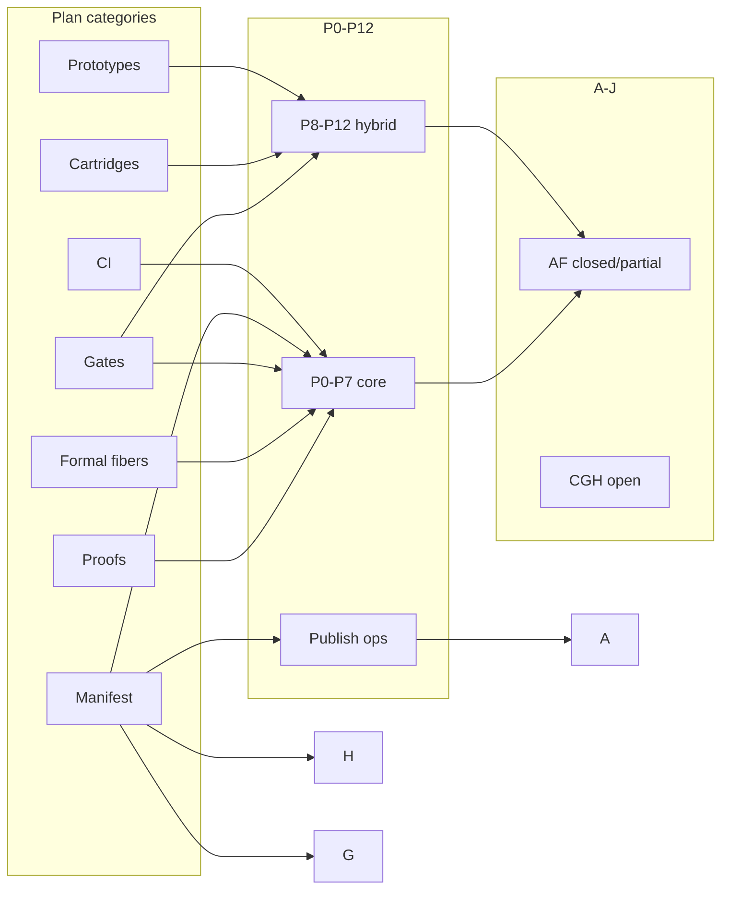

# God-grade layer matrix

**As of:** 2026-05-21  
**Audience:** Coordinators, formal lane, manifold / prototype / cartridge CI owners  
**SSOT companions:** [`TODO_COMPLETION.md`](TODO_COMPLETION.md) · [`PENDING_GOD_GRADE_ROADMAP.md`](PENDING_GOD_GRADE_ROADMAP.md) · [`GOD_GRADE_CHECKLIST.md`](GOD_GRADE_CHECKLIST.md) · [`GOD_GRADE_WITNESS_LADDER.md`](GOD_GRADE_WITNESS_LADDER.md)

**Normative witness order:** R0 → R1 (CD) → R2 (Landauer) → R3 (constitutive) → R4 (Kleisli) → R5 (manifest / digest / trace) — [`GOD_GRADE_WITNESS_LADDER.md`](GOD_GRADE_WITNESS_LADDER.md)

---

## Executive rollup

**Percentages:** use the [single headline table](GOD_GRADE_PROGRESS_VERIFIED.md#headline-percentages-ssot--one-table) only — do not maintain a second % rollup here.

| Axis | Status | Master verify |
|------|--------|---------------|
| **Stack verify (this session)** | **exit 0** | **2026-05-21T21:58:12Z** — [`verify_umst_stack.sh`](../scripts/verify_umst_stack.sh) + bidirectional + END_CONDITION subset + `manifest_strict_witness` |
| **Plan + R0 pin** | **100%** (see headline table) | **119** modules · digest `0697014f…` |
| **God-grade weighted R0–R6** | **~84%** (see headline table) | W8 publish · strict default · R6 traces remain human |
| **Layer detail** | category matrix below | Per-layer % are illustrative only |

---

## Plan category matrix

Each row is a **plan layer** (not a single YAML `id`). `%` reflects on-disk delivery + CI truth + ops gaps documented in [`TODO_COMPLETION.md`](TODO_COMPLETION.md) and [`PENDING_GOD_GRADE_ROADMAP.md`](PENDING_GOD_GRADE_ROADMAP.md).

| Category | % | Verify command | Gap | Owner |
|----------|---|----------------|-----|-------|
| **Proofs** | **100%** | `cd umst-formal-double-slit && APPROVE_CROSS_REPO_MERGE=1 python3 tools/lean_export/export_catalog.py --lean-root Lean --also-lean-root ../umst-formal/Lean --also-lean-repo-tag umst-formal` then lock assert | None for unified pin; Appendix B → `catalog_id` graduation is ops | formal / coordinator |
| **Gates** | **100%** | `cd umst-manifold && cargo test --test gate_kleisli --test gate_reject_catalog_id --test gate_adversarial --test gate_dual_run_parity` | Prototype 2a thin delete optional (Track B); not a gate-law gap | manifold / prototype |
| **Manifest** | **~90%** | `cargo test --features formal-witness --test manifest_strict_witness --test formal_witness` · `embodied_orchestrator` | W8 git publish (Track A); G.2–G.3 (Track G) | product / ops · manifold |
| **Cartridges** | **~80%** | `cd umst-concrete-cartridge && cargo test -p umst-concrete-cartridge --features manifest-bridge` · `cd umst-supercap-cartridge && cargo test --test formal_anchors` | Remote GHA without workspace `[patch]`; generated `formal_anchor` rows (I.3–I.4) | manifold publish → cartridge |
| **CI** | **~92%** | `UMST_REQUIRE_FORMAL_EXPORT=1 UMST_FORMAL_ROOT=$WORKSPACE/umst-formal-double-slit bash umst-manifold/scripts/verify_umst_stack.sh` | Optional Python E6 only when prototype checkout absent; standalone `umst-manifold/.github/workflows/rust.yml` gate lane | CI / coordinator |
| **Prototypes** | **~85%** | `cd umst-manifold && cargo test --test gate_dual_run_parity -- --nocapture` · `cd umst-prototype/src/rust/core && cargo test thermodynamic_filter::tests --lib` | v1 shim **226L**; 2a hybrid **517L** (B.3–B.4 full delete); legacy `gate_server` deprecation | prototype lane |
| **Formal fibers** | **100%** | v2 dual-pin lock + **119** composed digest `0697014f…`; per-fiber `c1d9ba2…` (69) + `534d9e18…` (62) | None — dual-pin v2 + `formal-fiber-merge` closed 2026-05-21 | formal / coordinator |

### Category → plan todo IDs

| Category | Plan `id`s / milestones |
|----------|-------------------------|
| Proofs | `lean-export-lake`, `claims-vs-proofs`, `formal-fiber-merge` |
| Gates | `gate-unification-spec`, `manifold-gate-evaluator`, `parity-ci` (adversarial/Kleisli/rejects) |
| Manifest | `manifold-manifest`, `formal-witness-integration`, `embodied-orchestrator` |
| Cartridges | `concrete-cartridge-wire`, supercap sibling (`FORMAL_SCALING.md`) |
| CI | `parity-ci`, MaOS `umst-catalog-drift.yml`, `verify_umst_stack.sh` |
| Prototypes | `prototype-audit`, `thin-prototypes`, `ros2-in-manifold` (HTTP path) |
| Formal fibers | `formal-fiber-merge` (= `lean-export-cross-repo`) |

### Category → witness rungs

| Category | Primary rungs |
|----------|---------------|
| Proofs | **R0** |
| Gates | **R1**, **R2**, **R3**, **R4** |
| Manifest | **R5** v1 |
| Cartridges | **R3**, **R5** deployment fiber |
| CI | Cross-cutting (drift + parity functor) |
| Prototypes | **R1**, **R3**, **R5** parity |
| Formal fibers | **R0** (+ second fiber in unified export) |

---

## P0–P12 phase matrix

Historical migration phases from plan §5 ([`lean-to-rust_proof_extraction_fd8f70b5.plan.md`](~/.cursor/plans/lean-to-rust_proof_extraction_fd8f70b5.plan.md)). **P0–P7** = Lean → manifold core; **P8–P12** = prototype thin + cartridge wire.

| Phase | Deliverable | % | Verify command | Gap | Owner | Tracks |
|-------|-------------|---|----------------|-----|-------|--------|
| **P0** | Audit + `GateUnificationSpec.md` | **100%** | `test -f umst-manifold/docs/GateUnificationSpec.md && test -f umst-manifold/docs/PROTOTYPE_GATE_MAP.md` | — | docs / coordinator | — |
| **P1** | Lean export + `catalog.lock` | **100%** | `UMST_REQUIRE_FORMAL_EXPORT=1 bash umst-manifold/scripts/verify_umst_stack.sh` (export digest step) | — | formal | **F** |
| **P2** | `runtime/catalog` + `build.rs` | **100%** | `cd umst-manifold && cargo test --test catalog_all_ids_registered` | Partition table if module count shifts | manifold | **F** |
| **P3** | `gate/` + Kleisli port | **100%** | `cargo test --test gate_kleisli -p umst-manifold` | — | manifold | **C** |
| **P4** | `GateEvaluator` + CBF | **100%** | `cargo test --test gate_cbf_parity --test cbf -p umst-manifold` | — | manifold | **D** |
| **P5** | `manifest` re-exports | **100%** | `grep 'pub mod manifest' umst-manifold/src/lib.rs && cargo test --test embodied_orchestrator` | Git consumers need W8 | manifold | **A**, **H** |
| **P6** | `gate_server` in manifold | **100%** | `cargo test --features gate-server-bin,ros2-contract,serde --test gate_server_http` | Legacy prototype HTTP bins | manifold / prototype | **B** |
| **P7** | Dual-run + adversarial production | **100%** | `cargo test --test gate_dual_run_parity --test gate_adversarial` · in `verify_umst_stack.sh` | 1-week production monitor (ops); optional `rust.yml` | CI / ops | **E**, **J** |
| **P8** | Replace prototype filter core | **~70%** | `wc -l umst-prototype/src/rust/core/src/science/thermodynamic_filter.rs` → 226; 2a → 517 | Full delete 2a Constitution/CGS/functor body | prototype | **B** |
| **P9** | `ros/contract` + bridge | **~95%** | `cargo test --test ros_contract_serde_roundtrip -p umst-manifold` | Live ROS smoke optional | prototype Python | — |
| **P10** | Concrete facade + anchors | **~75%** | `cargo test -p umst-concrete-cartridge --features manifest-bridge` (workspace patch) | Remote git CI; catalog-generated `formal_anchor` | cartridge · publish | **A**, **I** |
| **P11** | `EmbodiedOrchestrator` + claims doc | **100%** | `cargo test --test embodied_orchestrator` · `test -f umst-manifold/docs/claims-vs-proofs.md` | — | manifold | — |
| **P12** | Thin prototypes | **~85%** | `gate_dual_run_parity` 8/8; v1 `thermodynamic_filter::tests` 5/5 | 2a hybrid body; no concrete path dep (Burn pin) | prototype | **B** |
| **Publish** | `tytolabs/umst-manifold` `main` | **0%** ops | `git ls-remote https://github.com/tytolabs/umst-manifold.git refs/heads/main` + clean-clone `cargo check` | Blocks cartridge GHA without `[patch]` | manifold publish | **A** |

**Phase rollup:** P0–P7 **100%** · P8–P12 **~88%** hybrid · Publish **ops-only**.

---

## Tracks A–J matrix

God-grade ops tracks from [`PENDING_GOD_GRADE_ROADMAP.md`](PENDING_GOD_GRADE_ROADMAP.md). Maps to categories and P-phases above.

| Track | Name | Status | % | Verify command | Gap | Owner |
|-------|------|--------|---|----------------|-----|-------|
| **A** | W8 publish (`tytolabs/umst-manifold` `main`) | ✅ **G-01** · ✅ **G-02** · **G-03** optional | **~95%** | `w8_publish_readiness.sh` + git-pinned `manifest-bridge` in `verify_umst_stack.sh` | **G-03** supercap remote `manifest-bridge` in GHA | operator (G-03 only) |
| **B** | `umst-prototype-2a` thin | ⚠️ hybrid | **~85%** | `cargo test --test gate_dual_run_parity -p umst-manifold` | B.3–B.4 full 2a body delete; Constitution/CGS port or HTTP-only | prototype |
| **C** | Kleisli `GateEvaluator` | ✅ done | **100%** | `cargo test --test gate_kleisli -p umst-manifold` | — | manifold |
| **D** | `catalog_id` on every reject | ✅ done | **100%** | `cargo test --test gate_reject_catalog_id -p umst-manifold` | — | manifold |
| **E** | Adversarial gate CI | ✅ done | **100%** | `cargo test --test gate_adversarial` · in `verify_umst_stack.sh` (FNR=0, 75 cases) | Optional Python E6 when prototype absent | CI / coordinator |
| **F** | Cross-repo catalog + v2 dual-pin (**119**) | ✅ done | **100%** | Lock `version: 2`, `fiber_pins`, composed digest `0697014f…`, **119** modules | — | formal |
| **G** | Epistemic runtime schema v2 | ✅ done | **100%** | `epistemic_trace_schema` **13/13** · `trace_calibration` **8/8** in `verify_umst_stack.sh` | — | manifold |
| **H** | Strict witness + `formal-witness` | ✅ CI | **100%** | `manifest_strict_witness` in `verify_umst_stack.sh` | Dev `UmstManifest::default()` stays `CatalogPinnedRos2` (not a blocker) | product / ops |
| **I** | Supercap formal anchor parity | ⚠️ partial | **~70%** | `formal_anchors` **6/6** | I.3–I.4 remote `manifest-bridge` (**G-03** optional) | cartridge |
| **J** | Warnings / lint hygiene | ⚠️ partial | **~60%** | `grep gate_dual_run_parity umst-manifold/scripts/verify_umst_stack.sh` | J.1 clippy `-D warnings` all features; J.3 regime policy | manifold CI |

**Track closure (2026-05-29):** **A** (G-01/G-02) · **C, D, E, F, G, H** ✅ · **B, I, J** ⚠️ hybrid · **G-03** supercap optional.

---

## Cross-map: category × phase × track

| Category | P-phases | Tracks |
|----------|----------|--------|
| Proofs | P0, P1, P11 | **F** |
| Gates | P0, P3, P4, P7, P8 | **C**, **D**, **E**, **B** |
| Manifest | P5, P11 | **A**, **H**, **G** |
| Cartridges | P10 | **A**, **I** |
| CI | P1, P7 | **E**, **J** |
| Prototypes | P0, P6, P7, P8, P12 | **B**, **E** |
| Formal fibers | P1 | **F** |



---

## Layer × witness ladder (R0–R6)

| Rung | Layer / category | % | Verify |
|------|------------------|---|--------|
| **R0** | Proofs + formal fibers (v2 dual-pin, **119**) | **100%** | `catalog.lock.json` `version: 2` + `catalog_all_ids_registered` + export lock in `verify_umst_stack.sh` |
| **R1** | Gates (CD) | **100%** | `gate_dual_run_parity`, `gate_reject_catalog_id` |
| **R2** | Gates (Landauer CBF) | **100%** | `gate_cbf_parity`, `formal_witness` |
| **R3** | Gates (constitutive / mix) | **100%** | `gate_parity_fixture`, mix registry tests |
| **R4** | Gates (Kleisli) | **100%** | `gate_kleisli` 6/6 |
| **R5** | Manifest + cartridges | **~88%** | `manifest_strict_witness`, `formal_witness`, `manifest-bridge` (local), supercap anchors |
| **R6** | Epistemic v2 traces | **~33%** | G.1 `epistemic_trace_schema` ✅; G.2–G.3 open |

---

## Stack verify record (exit 0)

**Verified:** 2026-05-21T21:52:12Z (UTC)  
**Host:** `darwin` / MaOS-Workspace  
**Command:**

```bash
cd umst-manifold
UMST_REQUIRE_FORMAL_EXPORT=1 \
  UMST_FORMAL_ROOT=/Users/santhoshshyamsundar/Desktop/MaOS-Workspace/umst-formal-double-slit \
  bash scripts/verify_umst_stack.sh
echo "EXIT_CODE=$?"
```

**Result:** `verify_umst_stack: OK` · **EXIT_CODE=0**

| Step (script order) | Outcome |
|---------------------|---------|
| Export digest vs lock | OK — unified pin `0697014fb5b90a3aca4db3e5cc226896ca198802c910d5395f254e4262aa6227`, **119** modules |
| `bidirectional_catalog_check.sh` | OK |
| `catalog_all_ids_registered` | 4 passed |
| `gate_kleisli` | 6 passed |
| `gate_reject_catalog_id` | 6 passed |
| `gate_adversarial` (Rust) | FNR=0, 75 cases |
| `gate_dual_run_parity` | 8/8 golden + 8/8 live subprocess |
| `manifest_strict_witness` | release profile + digest mismatch reject |
| Adversarial Python E6 (optional) | FNR=0, 75 cases (prototype_2 present) |
| `formal_witness` / ROS / HTTP (feature bundle) | passed per script |

**Catalog lock (manifold):**

| Field | Value |
|-------|-------|
| `upstream_catalog_digest_hex` | `0697014fb5b90a3aca4db3e5cc226896ca198802c910d5395f254e4262aa6227` |
| `module_count` | **119** |

Reproduce any time: [`VERIFY.md`](VERIFY.md) § stack verify.

---

## Remaining to scoped true 100% (~8%)

| Gap | Track / rung | Notes |
|-----|--------------|-------|
| **W8** — publish `tytolabs/umst-manifold` `main` | **A** | Remote cartridge GHA without workspace `[patch]` |
| **G.2** — per-step numerics bounds in CI | **G**, **R6** | Extend `epistemic_trace_schema` with fixture bound cases — **partial**; RegimeSoundness is **J.3** (hand-aligned doc ✅, no host evaluator) |
| **G.3** — η calibration from traces (optional feature) | **G**, **R6** | `trace-calibration` feature; post-CBF only |
| **FFI** / extracted witnesses | horizon | Long horizon; excluded from **~92%** headline |

**Closed (not in remaining ~8%):** v2 dual-pin lock, **119** composed pin, strict witness CI, epistemic G.1 serde, `umst.cartridge.concrete.policy` anchor.

**Not counted as automation blockers:** dev manifest default (`CatalogPinnedRos2`), prototype 2a thin delete, `rust.yml` lane, Appendix B graduation.

**No new Rust gate scaffolding** required — [`UMST_PROGRESS_REPORT.md`](UMST_PROGRESS_REPORT.md) § scoped completion.

---

## Related documents

| Doc | Role |
|-----|------|
| [`TODO_COMPLETION.md`](TODO_COMPLETION.md) | Per–plan-todo evidence blocks |
| [`PENDING_GOD_GRADE_ROADMAP.md`](PENDING_GOD_GRADE_ROADMAP.md) | Track A–J substeps |
| [`GOD_GRADE_CHECKLIST.md`](GOD_GRADE_CHECKLIST.md) | Automation criteria + honest **~92%** rollup |
| [`GOD_GRADE_WITNESS_LADDER.md`](GOD_GRADE_WITNESS_LADDER.md) | R0→R6 normative order |
| [`AGENT_STATUS.md`](AGENT_STATUS.md) | W1–W10 / P0–P7 wave narrative |
| [`FORMAL_FIBER_MERGE_RUNBOOK.md`](FORMAL_FIBER_MERGE_RUNBOOK.md) | Track F operator steps |
| [`W8_PUBLISH_RUNBOOK.md`](W8_PUBLISH_RUNBOOK.md) | Track A operator steps |
