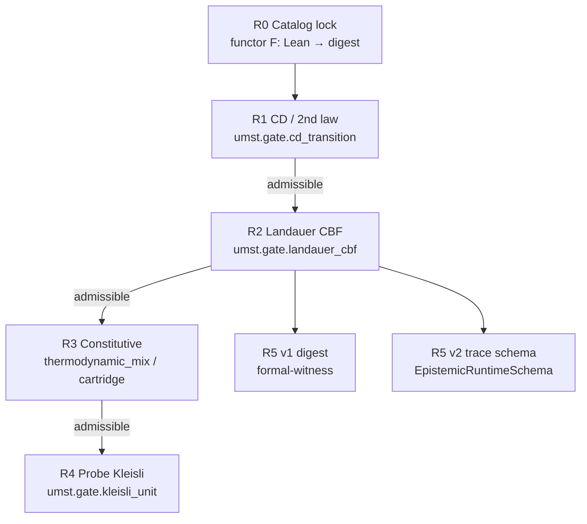

# God-grade witness ladder

**As of:** 2026-05-21  
**Audience:** Operators, reviewers, and agents wiring UMST formal → manifold → cartridges.

**Plain English:** UMST reaches *god-grade* when every bad transition is rejected automatically, the Lean catalog is the single source of truth for what was proved, and humans are not the backstop for digest drift or gate parity. This document is the **ordered ladder** of witnesses (what gets checked, in what order). Foundational split: **proofs = versioned library**, **gates = law**, **MI only inside the Landauer/trace envelope**, **no new Lean axioms in Rust** — see [§ Proof library · gate law · MI envelope · no Rust axioms](#proof-library--gate-law--mi-envelope--no-rust-axioms). Pipeline mechanics: [`FORMAL_BIDIRECTIONAL_ALIGNMENT.md`](FORMAL_BIDIRECTIONAL_ALIGNMENT.md); module buckets: [`FORMAL_INTEGRATION_STATUS.md`](FORMAL_INTEGRATION_STATUS.md); rollup: [`UMST_PROGRESS_REPORT.md`](UMST_PROGRESS_REPORT.md).

---

## Process & verification

**Progress date:** 2026-05-21 · **Normative order:** R0 → R1 (CD) → R2 (Landauer) → R3 (constitutive) → R4 (Kleisli) → R5 (manifest/digest/trace)

| Rung | Status | TCB / law note |
|------|--------|----------------|
| R0 Catalog | ✅ CI + lock | Library pin; not runtime prover |
| R1 CD / 2nd law | ✅ host gates | Highest-priority reject; `umst.gate.cd_transition` |
| R2 Landauer / MI | ✅ CBF | `physicalSecondLaw` axiom only in Lean; MI surrogate post-CBF |
| R3 Constitutive | ✅ mix registry | Below R2 on gateway path |
| R4 Kleisli | ✅ | `KleisliUnitEvaluator` + embodied host routing; `gate_kleisli` |
| R5 Manifest | ✅ CI / ⚠️ W8 git | `manifest_strict_witness` 3/3 + `formal-witness` in verify script |
| R6 Trace v2 | ✅ G.1–G.3 | `epistemic_trace_schema` 12/12; `trace_calibration` 3/3 |

**Headline completion:** **17/17 automation** (in-repo CI); **W8** org-only outside %. Hot-path Lean **~26%** of catalog — [`GOD_GRADE_AUTOMATION_CEILING.md`](GOD_GRADE_AUTOMATION_CEILING.md).

### Learnings

- **Proofs as a versioned library** ([§ Proofs as a versioned library](#proofs-as-a-versioned-library)) — Export bundle is semver’d; runtime imports the pin, never replays tactics.
- **Gates as law** ([§ Gates as law](#gates-as-law)) — Witnesses short-circuit; advisory catalog mode is not god-grade.
- **MI inside the envelope** ([§ MI inside the envelope](#mi-inside-the-envelope)) — Surrogate `info_gain` valid only as input to R2, with η from traces post-CBF.
- **No Rust axioms** ([§ No new Lean axioms in Rust](#no-new-lean-axioms-in-rust)) — Strengthening the TCB requires Lean + export bump first.

### Impact

- Operators and agents share one **failure priority** (decision 1) across embodied, gateway, and cartridge paths.
- CI pairs `formal-witness` with future `manifest-bridge` on git `main` (decision 3).
- Prototype deletion stays **gated** on parity functor identity while fixtures remain (decision 5).

> **Design lens** — Witnesses are endomorphisms on the admissible subcategory **or** arrows to the reject object; lazy composite `W₄ ∘ W₃ ∘ W₂ ∘ W₁` must stop at the first non-invertible step (decision 1).

---

## Plain English summary

| Rung | What it witnesses | When it runs |
|------|-------------------|--------------|
| **R0 — Catalog fiber** | “The proof inventory we agreed to” (119-module unified digest (dual-pin: 69 primary historical)) | Build + CI export regen |
| **R1 — CD / 2nd law** | Clausius–Duhem admissibility on host `f64` state | Optional embodied step, then always on scalar transitions |
| **R2 — Landauer / MI budget** | Erasure + information cost on tensor topology step | Every `ManifoldGateway` step |
| **R3 — Constitutive closure** | Mix/hydration/strength (Powers-style) | Registry host gates (`thermodynamic_mix`, cartridge policy) |
| **R4 — Probe / Kleisli** | Composition of admissible probe policies | `KleisliUnitEvaluator` + embodied host routing; `gate_kleisli` |
| **R5 — Manifest + digest** | Cartridge manifest hash ↔ manifold lock | CI (`manifest-bridge`) + optional per-step digest |
| **R6 — Trace schema (v2)** | Emitted step records match Lean `EmittedTraceSchema` | Telemetry / future trace serde |

**Failure order (god-grade decision 1):** reject at the **highest-priority** witness that fires — CD before Landauer before constitutive before probe. Lower layers are not consulted after a higher layer rejects (short-circuit composition).

**Not on the hot path:** Lean prover, per-step `lake build`, or extracted proof terms. Rust implements witnesses by hand; Lean justifies design.

---

## Categorical vocabulary

*Reference table for agents; executive one-liner in § [Process & verification](#process--verification) Design lens.*

| Idea | UMST reading | Typical location |
|------|--------------|------------------|
| **Object** | Admissible material / thermodynamic **state** (`ThermodynamicState`, `UnifiedMaterialStateTensor`, density-matrix slice in Lean) | `src/gate/thermo_transition.rs`, `src/core/tensors.rs` |
| **Morphism** | **Transition** or **probe** that maps state → state (or state → measurement outcome) | Host `GateEvaluator`, cartridge `compute_topology`, Kraus/Lüders in Lean |
| **Composition** | Kleisli / sequential rollout: policy then physics then barrier | `EmbodiedOrchestrator` → `ManifoldGateway` → `ThermodynamicCBF` |
| **Functor** | **Export** `F`: Lean modules → catalog JSON → lock digest → Rust constants | `export_catalog.py`, `build.rs`, `runtime/catalog/` |
| **Natural transformation** | **Calibration** `η`: surrogate numerics ⇒ trace-consistent bounds (utility / MI / cost fields aligned to rollout) | `EpistemicTraceDrivenCalibrationWitness`, `ManifoldGateway::eta`, trace-driven `SolverCalibration` |
| **Fiber** | One proof repository + its catalog pin (primary: double-slit export; secondary: `umst-formal` classical fiber) | See [§ Second catalog fiber](#4-umst-formal-as-second-catalog-fiber) |

**Witness** = a morphism from “proposed transition” to either **admissible** (identity on the admissible subcategory) or **reject** (initial object / error). The ladder below lists witnesses in **evaluation order**, not proof difficulty.

---

## Proof library · gate law · MI envelope · no Rust axioms

Four invariants separate **what was proved** (Lean fiber) from **what is enforced** (Rust witnesses). They are normative for god-grade wiring; details of export and parity live in [`FORMAL_BIDIRECTIONAL_ALIGNMENT.md`](FORMAL_BIDIRECTIONAL_ALIGNMENT.md) and [`claims-vs-proofs.md`](claims-vs-proofs.md).

### Proofs as a versioned library

| Layer | Role |
|-------|------|
| **Library** | `umst-formal-double-slit/artifacts/catalog.json` — 119 modules, declaration inventory, canonical digest (regenerated by `export_catalog.py` / `make lean-catalog-export`). |
| **Version pin** | `artifacts/catalog.lock.json` in formal + manifold repos → `UMST_CATALOG_LOCK_SHA256_HEX` in `build.rs`. |
| **Consumer** | Manifold **imports the pin**, not live proof terms: `runtime/catalog/`, `catalog_id` registry, parity tests. |

**Rule:** Treat the export bundle like a **semver’d dependency**: bump digest only with an explicit regen + lock update + green `verify_umst_stack.sh` / `umst-catalog-drift.yml`. The hot path never runs `lake build` or replays Lean tactics; Rust witnesses are **hand-aligned implementations** justified by the pinned library revision.

**Categorical reading:** Export functor `F: \mathbf{Lean} \to \mathbf{CatalogPin}` is the **library morphism**; runtime checks are **not** an extension of `F`, only consumers of its digest certificate (R0).

### Gates as law

| Reading | UMST |
|---------|------|
| **Law** | Witness ladder `W_1 \ldots W_4` (CD → Landauer → constitutive → probe) — **mandatory** short-circuit rejects on transitions, not advisory scores. |
| **Article** | Stable `catalog_id` per gate family (`umst.gate.cd_transition`, `umst.gate.landauer_cbf`, …) — registry in [`GateUnificationSpec.md`](GateUnificationSpec.md). |
| **Court** | `GateEvaluator`, `ThermodynamicCBF`, mix evaluators, future Kleisli slot — return **reject** or proceed; no silent override. |

**Rule:** If a transition violates Clausius–Duhem, Landauer/MI budget, or constitutive closure, the step **fails** at the highest-priority witness that fires ([§ God-grade decision 1](#1-failure-priority-cd--2nd-law--landauer--constitutive--probe)). Product “advisory” catalog modes are **not** god-grade law ([`GOD_GRADE_CHECKLIST.md`](GOD_GRADE_CHECKLIST.md) strict-catalog row).

**Categorical reading:** Gates are endomorphisms on the admissible subcategory **or** arrows into the reject object — law as **witness functors**, not comments in `claims-vs-proofs.md`.

### MI inside the envelope

| Envelope | What bounds MI |
|----------|----------------|
| **Landauer CBF (W₂)** | Tensor step: `info_gain` / `d_int` sums must pass `ThermodynamicCBF::verify_tensor_update` after cartridge physics — surrogate MI is **not** a standalone certificate. |
| **Witness catalog JSON** | Embedded [`WitnessCatalog`](../../src/runtime/catalog/mod.rs) envelope (`build.rs`) — bounded checkpoint ids alongside the lock digest. |
| **Trace contract (v2)** | `EpistemicRuntimeSchemaContract` / `EmittedTraceSchema` — per-step `epsMIAgg`, `epsCostAgg`; calibration η from traces ([§ decision 2](#2-mi-surrogate-safe-iff-gated-post-composition-calibration-η-from-traces)). |

**Rule:** Runtime `info_gain` (MSE / sensing surrogate in `src/ai/info_gain.rs`) is admissible **only inside** the composed envelope **post** `W_2`. Fitting η or ε from rollout aggregates does not bypass CBF; it aligns utility to trace-consistent bounds already proved in Lean.

**Categorical reading:** Surrogate feature map `S` lands in the admissible envelope only as `W_2 \circ S` (lazy), with η: `S \Rightarrow T` valid relative to emitted trace objects.

### No new Lean axioms in Rust

| Allowed in Rust | Forbidden in Rust |
|-----------------|-------------------|
| **Witness predicates** — inequalities and admissibility checks hand-aligned to theorem **families** | New **axioms** or “we assume” constants with no `catalog.json` row |
| **TCB implementation** of `physicalSecondLaw` consequences (Landauer/CBF bookkeeping) | Duplicating `physicalSecondLaw` as a Rust `axiom` or undocumented `register_axiom` |
| **`catalog_id` + `Proof:` citations** in comments/docs linking to Lean modules | Silent strengthening of the formal TCB (extra free parameters, weaker gates) |

**Lean fiber (today):** One explicit axiom in the primary export — `physicalSecondLaw` in `LandauerLaw` ([`claims-vs-proofs.md`](claims-vs-proofs.md)). All other catalog entries are theorems/lemmas; Rust **must not** enlarge the axiom closure.

**Rule:** Any new assumption → prove or axiomatize in **`umst-formal` / `umst-formal-double-slit` first**, regenerate the versioned library, bump the lock, then hand-align Rust. If Rust needs a stronger check, the diff is a **Lean change + export bump**, not a private axiom in `src/ai/cbf.rs` or `src/gate/`.

**Audit:** `TCB.md` boundary moves; `scripts/check_lean_axioms.py` / formal `print_axioms` in the formal repos — not duplicated in manifold CI yet, but the **policy** is fixed here.

---

## Witness ladder (ordered)



### R0 — Catalog lock (build-time functor)

- **Object:** Full Lean export bundle (119 modules in lock at time of writing).
- **Morphism:** Regenerate `catalog.json`; compare digest to `umst-manifold/artifacts/catalog.lock.json`.
- **Witness:** `UMST_CATALOG_LOCK_SHA256_HEX` in `build.rs`; CI `umst-catalog-drift.yml` + `verify_umst_stack.sh`.
- **Doc:** [`FORMAL_BIDIRECTIONAL_ALIGNMENT.md`](FORMAL_BIDIRECTIONAL_ALIGNMENT.md) § Reverse flow.

### R1 — Clausius–Duhem / second law (host scalar)

- **Object:** `ThermodynamicState` with `d_int ≥ 0` (and related admissibility fields).
- **Morphism:** `ThermodynamicTransitionEvaluator` — port of prototype `thermodynamic_filter`.
- **`catalog_id`:** `umst.gate.cd_transition`.
- **Priority:** **Highest** runtime policy reject among physics gates (decision 1).

### R2 — Landauer / epistemic MI budget (tensor CBF)

- **Object:** Batch tensor state after cartridge `compute_topology`.
- **Morphism:** `ThermodynamicCBF::verify_tensor_update` — sums `info_gain` / `d_int`, two scalar syncs.
- **`catalog_id`:** `umst.gate.landauer_cbf`.
- **Priority:** After CD on embodied path; **always** on gateway path (decision 1).

### R3 — Constitutive closure

- **Object:** Mix proposal / hydration–strength feasible set.
- **Morphism:** `ThermodynamicMixEvaluator`, `umst.cartridge.concrete.policy`.
- **`catalog_id`:** `thermodynamic_mix` (namespace migration: `umst.gate.thermodynamic_mix`).
- **Priority:** Below Landauer unless host step routes mix-only (decision 1).

### R4 — Probe / Kleisli composition

- **Object:** Probe policy slots in Lean; host Kleisli predicates in Rust.
- **Morphism:** `gate::kleisli` — **not** yet a `GateEvaluator` on the hot path.
- **`catalog_id`:** `umst.gate.kleisli_unit`.
- **Priority:** Lowest among gate family rejects (decision 1).

### R5 — Manifest bridge + formal witness (deployment fiber)

See [§ v1 digest vs v2 trace schema](#6-v1-digest-reject-v2-epistemicruntimeschema-in-traces).

---

## God-grade decisions (normative)

### 1. Failure priority: CD / 2nd law → Landauer → constitutive → probe

**Rule:** When composing witnesses on a single step, evaluate and **short-circuit** in this order:

1. **CD / second law** (`umst.gate.cd_transition`) — embodied host transition, mix CD legs, `ThermodynamicGate` scalar checks.
2. **Landauer / MI budget** (`umst.gate.landauer_cbf`) — `ManifoldGateway` CBF after cartridge physics.
3. **Constitutive** — `thermodynamic_mix`, hydration/strength bounds, cartridge policy evaluators.
4. **Probe / Kleisli** — composition laws and probe optimization (tests + future registry slot).

**Categorical reading:** Let `W_i` be witness functors to the reject object. God-grade requires the composite witness `W_4 ∘ W_3 ∘ W_2 ∘ W_1` to be implemented as **lazy** composition (stop at first non-invertible arrow), not as a commutative diagram where all four always run.

**Implementation anchors:** `src/manifest/orchestrator.rs` (host before gateway), `src/ai/ppo.rs` (CBF after cartridge), `src/gate/mix_eval_registry.rs`, `src/gate/kleisli.rs`.

**Audit:** [`COMPOSITIONAL_INFERENCE_AUDIT.md`](COMPOSITIONAL_INFERENCE_AUDIT.md) § Layer stack; [`CATALOG_COVERAGE_AUDIT.md`](CATALOG_COVERAGE_AUDIT.md) § Bidirectional table.

---

### 2. MI surrogate safe iff gated post-composition; calibration η from traces

**Surrogate:** Runtime `info_gain` tensors follow an MSE / sensing surrogate (`src/ai/info_gain.rs`), **not** full `EpistemicMI` quantum semantics.

**Safe use (god-grade):** Treat the surrogate as admissible **only after** post-composition with the Landauer CBF gate — i.e. as input to `W_2`, never as a standalone certificate of epistemic MI.

**Calibration η (natural transformation):**

- **Lean:** `EpistemicTraceDrivenCalibrationWitness`, `EpistemicRuntimeSchemaContract` — bounds utility deviation from trace aggregates (`epsMIAgg`, `epsCostAgg`).
- **Rust (reward channel):** `ManifoldGateway::eta` weights **η · mean(information_density)** when the feature is enabled (`src/ai/ppo.rs`).
- **God-grade target:** Fit η (and related ε) from **emitted traces**, not hand-tuned constants unrelated to `EmittedTraceSchema`.

**Categorical reading:** Surrogate feature map `S` is not a functor into admissible states; calibration natural transformation `η: S ⇒ T` is valid only when post-composed with CBF witness `W_2`.

**Audit:** [`COMPOSITIONAL_INFERENCE_AUDIT.md`](COMPOSITIONAL_INFERENCE_AUDIT.md) § L0–L3; formal module `Lean/EpistemicTraceDrivenCalibrationWitness.lean`.

---

### 3. `manifest-bridge` + `formal-witness` ON in CI

**Normative CI lane** (MaOS + local):

```bash
cd umst-manifold && UMST_REQUIRE_FORMAL_EXPORT=1 ./scripts/verify_umst_stack.sh
```

This already runs:

| Feature / test | Proves |
|----------------|--------|
| `formal-witness` | `tests/formal_witness.rs` — digest mismatch path compiles and rejects structurally |
| `ros2-contract` + `serde` | Wire `catalog_hash` stability |
| Gate parity suite | CD / mix / dual-run vs prototype fixtures |

**`manifest-bridge`:** God-grade requires cartridge CI to `cargo check --features manifest-bridge` against a git-pinned `umst-manifold` revision — **G-02** concrete remote ✅ @ **fe22437**; **G-03** supercap optional ([`AGENT_STATUS.md`](AGENT_STATUS.md) W8). Treat **manifest-bridge + formal-witness** as a **paired** CI fiber over the same catalog digest.

**Promotion:** Add cartridge jobs to the same workflow as `umst-catalog-drift.yml` once manifold `manifest` is on git `main`.

---

### 4. `umst-formal` as second catalog fiber

**Primary fiber (export functor):** `umst-formal-double-slit` → `artifacts/catalog.json` → manifold lock (**119 modules**).

**Second fiber:** `umst-formal` — classical ℚ gate, `DIBKleisli`, `Constitutional`, `DEC`, `Powers`, Economic layer — **not** scanned by `export_catalog.py`. Manifold still hand-aligns rows that cite `lean://umst-formal/...` in [`claims-vs-proofs.md`](claims-vs-proofs.md).

**Categorical reading:** A **fibration** over workspace repos: base category = manifold runtime; fibers = `{DoubleSlit export, Formal classical}`. God-grade does **not** merge fibers into one JSON without an explicit cross-repo exporter (see [`../umst-formal-double-slit/Docs/UMST_FORMAL_REPOS_ALIGNMENT.md`](../umst-formal-double-slit/Docs/UMST_FORMAL_REPOS_ALIGNMENT.md) §7–9).

**Policy:** Gate/Landauer edits land in `umst-formal` first; vendored copies in double-slit follow changelog porting.

---

### 5. Delete prototype filter when parity functor is identity; keep fixtures

**Parity functor:** `P: \text{ManifoldMixGate} \to \text{PrototypeFilter}` implemented by dual-run tests (`tests/gate_dual_run_parity.rs`, `tests/gate_parity_fixture.rs`) on frozen JSON fixtures (`tests/data/gate_dual_run_fixtures.json`).

**God-grade rule:** When `P` is **identity** on all fixtures (bitwise or agreed ε tolerance on dissipation / admissibility), **delete** `umst-prototype/.../thermodynamic_filter.rs` (and 2a copy) from the dependency graph — **do not** delete fixtures or parity tests.

**Categorical reading:** Prototype filter is a **presentation** of the same morphism; once natural isomorphism is proven by tests, keep only the manifold presentation and the **test natural transformation** (fixtures) as regression witnesses.

**Status (2026-05-21):** Parity tests green on manifold port; prototype bodies still present for wasm/legacy bins — deletion is **gated** on explicit identity sign-off ([`PROTOTYPE_GATE_MAP.md`](PROTOTYPE_GATE_MAP.md)).

---

### 6. v1 digest + reject; v2 `EpistemicRuntimeSchema` in traces

| Version | Witness object | Mechanism | Lean anchor |
|---------|----------------|-----------|-------------|
| **v1** | 32-byte catalog/schema digest | `formal-witness`: `catalog_schema_digest` on UMST vs `ManifoldGateway::expected_catalog_schema_digest` → `FormalReject::CatalogSchemaDigestMismatch` | `EpistemicRuntimeContract`, `umst.formal.catalog_lock` |
| **v2** | Emitted trace schema | Serde `EmittedStepRecord` / `EmittedTraceSchema` in step telemetry; rollout consistency → per-step MI/cost contracts | `EpistemicRuntimeSchemaContract` |

**v1 today:** Byte-compare reject only when **both** sides `Some`; not auto-wired to `UMST_CATALOG_LOCK_SHA256_HEX` ([`src/ai/formal.rs`](../src/ai/formal.rs)).

**v2 target:** Traces carry schema-shaped records; CI checks well-formedness + consistency hooks against `EpistemicPerStepNumerics` bounds (module in traceability allowlist — not yet enforced in `tests/formal_witness.rs`).

**Categorical reading:** v1 is a **fiber functor** over manifests (digest = certificate of catalog fiber). v2 is a **lax natural transformation** from rollout morphisms to numeric contract objects.

---

## Cross-links

| Document | Role |
|----------|------|
| [`FORMAL_BIDIRECTIONAL_ALIGNMENT.md`](FORMAL_BIDIRECTIONAL_ALIGNMENT.md) | Forward/backward Lean → catalog → manifold → cartridge |
| [`GOD_GRADE_CHECKLIST.md`](GOD_GRADE_CHECKLIST.md) | CI matrix + performance budget |
| [`CATALOG_COVERAGE_AUDIT.md`](CATALOG_COVERAGE_AUDIT.md) | Per-module `catalog_id` ↔ Rust |
| [`COMPOSITIONAL_INFERENCE_AUDIT.md`](COMPOSITIONAL_INFERENCE_AUDIT.md) | PPO / gateway layer stack |
| [`../umst-formal-double-slit/Docs/EXPORT_COVERAGE.md`](../umst-formal-double-slit/Docs/EXPORT_COVERAGE.md) | 69 vs 59 export scope |
| [`../umst-formal-double-slit/Docs/UMST_FORMAL_REPOS_ALIGNMENT.md`](../umst-formal-double-slit/Docs/UMST_FORMAL_REPOS_ALIGNMENT.md) | Two-repo fiber policy |
| [`../umst-supercap-cartridge/docs/FORMAL_SCALING.md`](../umst-supercap-cartridge/docs/FORMAL_SCALING.md) | Cartridge manifest / catalog pin scaling |
| [`claims-vs-proofs.md`](claims-vs-proofs.md) | Row-level Lean ↔ Rust ledger |
| [`GateUnificationSpec.md`](GateUnificationSpec.md) | `catalog_id` registry |
| [`VERIFY.md`](VERIFY.md) | Operator commands |
| [`TCB.md`](TCB.md) | Rust trusted boundary; no axiom expansion |
| [`claims-vs-proofs.md`](claims-vs-proofs.md) | `physicalSecondLaw` and hand-aligned rows |

---

## Ladder status (2026-05-21)

**Automation:** **17/17** per [`GOD_GRADE_CHECKLIST.md`](GOD_GRADE_CHECKLIST.md). **Org W8:** **G-01/G-02** ✅; **G-03** optional. **Hot-path ceiling:** ~26% of catalog — [`GOD_GRADE_AUTOMATION_CEILING.md`](GOD_GRADE_AUTOMATION_CEILING.md).

| Decision | Status |
|----------|--------|
| (1) Failure priority order | **Documented**; embodied path partially lazy (CBF always on gateway) |
| (2) MI surrogate post-CBF; η from traces | **Partial** — CBF enforces; η hand-set; trace calibration Lean proved, Rust telemetry open |
| (3) CI `formal-witness` | **ON** in `verify_umst_stack.sh` |
| (3) CI `manifest-bridge` | **G-02** concrete remote ✅; **G-03** supercap optional |
| (4) Second fiber `umst-formal` | **Documented**; no unified export |
| (5) Delete prototype filter | **Blocked** on parity identity sign-off; fixtures **kept** |
| (6) v1 digest | **Implemented** (feature-gated) |
| (6) v2 trace schema | **Lean proved**; Rust serde / CI **open** |
| Proof library / gate law / MI envelope / no Rust axioms | **Documented** ([§ invariants](#proof-library--gate-law--mi-envelope--no-rust-axioms)); enforcement via R0–R2 + TCB |
