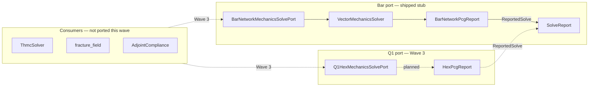

# Mechanics trait ports — bar→Q1 boundary

**Task:** `integration-mechanics-trait` · **Track:** Fracture 2 (solver witness + operator ports)  
**Rust module:** `src/physics/mechanics_solve_port.rs` (feature `mechanics-adjoint`)  
**Companion:** [`MECHANICS_SSOT.md`](MECHANICS_SSOT.md) (`MechanicsOperator`), [`SOLVE_CONTRACT.md`](SOLVE_CONTRACT.md) (`SolveReport` law)

This document fixes the **port trait boundary** between the bar-network DEC skeleton and the Q1-hex continuum lane. Consumers migrate from direct `VectorMechanicsSolver` calls to **`dyn MechanicsSolvePort`** (witnessed equilibrium) while retaining **`MechanicsOperator`** for tensor-only hot paths that do not yet need telemetry.

---

## Two traits, one migration

| Trait | Module | Returns | Role |
| --- | --- | --- | --- |
| [`MechanicsOperator`](../src/physics/mechanics_operator.rs) | `mechanics_operator` | `(u, σ)` tensors | Typed equilibrium morphism — **no** solve witness |
| [`MechanicsSolvePort`](../src/physics/mechanics_solve_port.rs) | `mechanics_solve_port` | `(u, σ, SolveReport)` | Port boundary for adjoint / gate / CI consumers |

**Rule:** prefer `MechanicsSolvePort` when the caller must fail-closed on non-convergence ([`SolveReport::converged`](../src/solve_report.rs)); keep `MechanicsOperator` for operator-split inner loops until Wave 3 consumer ports land.

---

## Discretization ports

| Port | ZST / impl | `PrecisionLane` | Cargo feature | SSOT today |
| --- | --- | --- | --- | --- |
| **Bar** | [`BarNetworkMechanicsSolvePort`](../src/physics/mechanics_solve_port.rs) | `F64AdjointBarPcg` | `mechanics-adjoint` | [`VectorMechanicsSolver::solve_equilibrium_with_pcg_report`](../src/physics/mechanics.rs) |
| **Q1 hex** | `Q1HexMechanicsSolvePort` *(planned)* | `HexQ1Pcg` | `mechanics-adjoint-q1-hex` | [`hex_solve_pcg_masked`](../src/physics/hex_elasticity.rs), [`ExtrudedPlateMechanics`](../src/physics/extruded_plate.rs) |



---

## `MechanicsSolvePort` contract

```rust
pub trait MechanicsSolvePort<B: Backend<FloatElem = f32>> {
    fn precision_lane(&self) -> PrecisionLane;

    fn solve_equilibrium_reported(
        &self,
        displacement: Tensor<B, 3>,
        coords: Tensor<B, 2>,
        stiffness: Tensor<B, 3>,
        body_force: Tensor<B, 3>,
        edges_b1: Tensor<B, 2, Int>,
        damage: Tensor<B, 3>,
        boundary_mask: Tensor<B, 3>,
        cross_section_area: f32,
        inner_cfg: &MechanicsInnerLoopConfig,
        rel_tol: f32,
    ) -> (Tensor<B, 3>, Tensor<B, 4>, SolveReport);
}
```

**Shapes** match [`MechanicsOperator::solve_equilibrium`](../src/physics/mechanics_operator.rs). Dirichlet DOFs are masked in `boundary_mask` (`0` = fixed, `1` = free).

**Witness law:** `rel_tol` is forwarded into [`SolveReport`](../src/solve_report.rs); `converged()` follows [`SOLVE_CONTRACT.md`](SOLVE_CONTRACT.md).

---

## Bar→Q1 parity context

Slender axial limit probes (`adjoint_q1_hex_matches_bar_in_limit`) compare bar skeleton compliance to Q1 hex on z-aligned edges. The ~44% gap (2026-06-19) is **documented** in verification manifests — ports do not claim bit-identical `(u, σ)` across discretizations. Migration swaps the **port impl**, not the physics kernel, and records `PrecisionLane` on every witness.

| Check | Bar port | Q1 port |
| --- | --- | --- |
| PCG telemetry | `BarNetworkPcgReport` → `F64AdjointBarPcg` | `HexPcgReport` → `HexQ1Pcg` |
| Equilibrium residual scale | \(\|P(f-Ku)\|_2/\|Pf\|_2\) | lane-equivalent on hex DOFs |
| Consumer adoption | stub only | planned `Q1HexMechanicsSolvePort` |

---

## Consumer inventory (read-only — Wave 3 targets)

| Module | Symbol today | Target port |
| --- | --- | --- |
| `solvers::thmc` | `VectorMechanicsSolver::solve_equilibrium` | `BarNetworkMechanicsSolvePort` → Q1 when roof PCG stall (#2) closes |
| `solvers::fracture_field` | `solve_equilibrium`, `voigt_strain_from_edge_displacement` | bar port first |
| `adjoint` | `packed_bar_network_equilibrium` | `BarNetworkMechanicsSolvePort` (witness on forward pass) |
| `adjoint_q1_hex` | `hex_solve_pcg_masked` | `Q1HexMechanicsSolvePort` |
| `protocols::MechanicsEquilibrium` | namespace delegate | unchanged until tensor-only path needs witness |

**Migration order** (from [`MECHANICS_SSOT.md`](MECHANICS_SSOT.md)): THMC \(R_u\) → fracture stagger → adjoint TO.

---

## Feature gates

| Feature | Enables |
| --- | --- |
| `mechanics-voigt-cauchy` | bar Voigt stress path (prerequisite) |
| `mechanics-adjoint` | `mechanics_solve_port` module + `BarNetworkMechanicsSolvePort` |
| `mechanics-adjoint-q1-hex` | Q1 hex elasticity + planned `Q1HexMechanicsSolvePort` |

```bash
export PATH="$HOME/.cargo/bin:$PATH"
cargo test -p umst-manifold --features mechanics-adjoint bar_port_emits_converged_solve_report
```

---

## Adoption ladder

| Stage | Action | Status |
| --- | --- | --- |
| 0 | `MechanicsOperator` + `SolveReport` contract | **shipped** (`integration-contracts`) |
| 1 | `MechanicsSolvePort` trait + bar stub | **this task** |
| 2 | `Q1HexMechanicsSolvePort` impl + `ReportedSolve` for `HexPcgReport` | Wave 3 bar→Q1 |
| 3 | Consumer ports (`thmc`, `fracture_field`, `adjoint`) | Wave 3 (B6-gated) |
| 4 | Optional `solve_witness` on CLI / MCP payloads | [`INTEGRATION_SOLVE_REPORT.md`](../../docs/INTEGRATION_SOLVE_REPORT.md) |

---

## Deliberately not done (this wave)

- No `Q1HexMechanicsSolvePort` Rust impl (documented boundary only).
- No edits to `thmc.rs`, `fracture_field.rs`, `adjoint.rs` call sites.
- No changes to `hex_elasticity.rs` or roof harness fixtures.
- No Lean proof linking port trait to discrete equilibrium — open ([`rfc/GATE_EVIDENCE.md`](rfc/GATE_EVIDENCE.md)).

---

## Related

- [`MECHANICS_SSOT.md`](MECHANICS_SSOT.md) — two-discretization inventory + `MechanicsOperator`
- [`SOLVE_CONTRACT.md`](SOLVE_CONTRACT.md) — `SolveReport` law and adoption ladder
- [`Solver-Status.md`](Solver-Status.md) — per-slice completion honesty
- [`INTEGRATION_SOLVE_REPORT.md`](../../docs/INTEGRATION_SOLVE_REPORT.md) — JSON consumer guide (cold edge)
