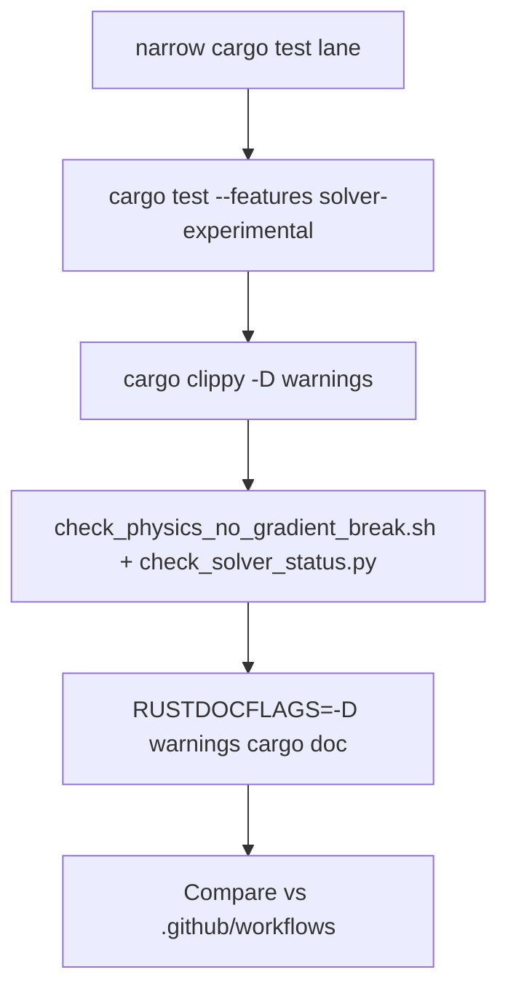
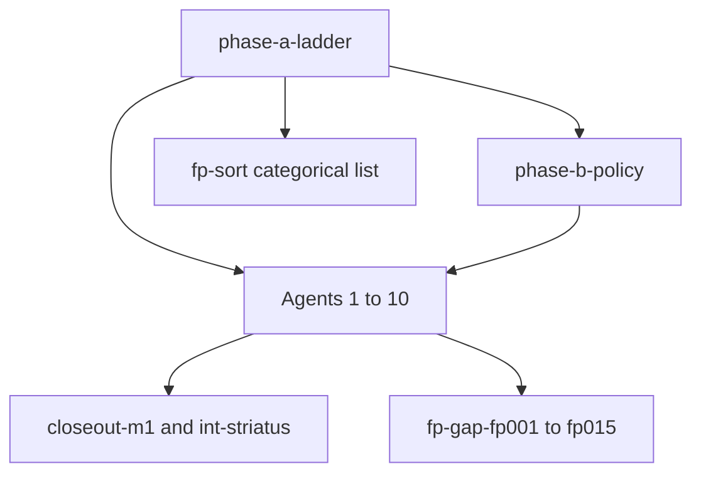

<!--
  ARCHIVE COPY — saved under docs/ so parallel agents and git history retain the plan.
  Source of truth in Cursor may still live at:
  ~/.cursor/plans/multi-agent_gap_closure_df6bae78.plan.md
  Re-sync this file when the Cursor plan changes materially.
-->

# Multi-agent FP gap hunt + rigorous CI closure

## Ground truth and hazards

- **100% solver realization (post-swarm executive directive):** [`EXEC_SOLVER_REALIZATION_MAOS_V04.md`](EXEC_SOLVER_REALIZATION_MAOS_V04.md) — directives **1–5** plus execution **deferrals**; run after categorical hardening and honest CI/matrix alignment.
- **Canonical close-out doc:** `[umst-manifold/docs/MAOS_SOLVER_100_PERCENT_CLOSEOUT_PLAN.md](MAOS_SOLVER_100_PERCENT_CLOSEOUT_PLAN.md)` (nested verification gate chain).
- **Alignment tensions (must not ignore):** `[umst-manifold/docs/MAOS_PLAN_ALIGNMENT_REPORT.md](MAOS_PLAN_ALIGNMENT_REPORT.md)` — several Cursor todos marked **completed** while `[Solver-Status.md](Solver-Status.md)` matrix rows remain **<100%** (**m5-scale**, **m9-upscale**, **m10-contact**, **m7-longrun**, **m3-memo7**, etc.).
- **Discovery backlog (may be partially stale):** `[umst-manifold/docs/FP_GAP_BACKLOG.md](FP_GAP_BACKLOG.md)` — rustdoc/clippy counts were fixed in later sessions; **Agent 1** must **re-run** commands and refresh rows before treating anything as open.
- **CI entrypoints:** Workspace `[.github/workflows/rust-solvers.yml](../../.github/workflows/rust-solvers.yml)` (manifold default + `solver-tests`; cartridge job); `[umst-manifold/.github/workflows/rust.yml](../.github/workflows/rust.yml)` (`solver-stable` on PR; additional jobs on `main`). **Gap:** PR may not run full `**solver-experimental`** union — Agent 2 maps **GitHub job matrix vs local ladder**.
- **After gap-close / hardening swarms:** Phase for **100% solver realization** (PNP GMRES+SG, photonics DEC 3D, monad purge, Striatus topology/JFNK/shell criteria, CBF/dissipation) — executive structure and honest gates in [`EXEC_SOLVER_REALIZATION_MAOS_V04.md`](EXEC_SOLVER_REALIZATION_MAOS_V04.md); defer large execution until categorical hardening and electrochemistry parity work report **done**.

## Todo registry — carried forward (original MaOS close-out + workspace)

**Purpose:** Single index so nothing is dropped between Cursor, `[MAOS_SOLVER_100_PERCENT_CLOSEOUT_PLAN.md](MAOS_SOLVER_100_PERCENT_CLOSEOUT_PLAN.md)`, and this plan.

**MaOS YAML → this plan (pending items):** `m1-b6` → `closeout-m1-b6`; `m1-b8` → `closeout-m1-b8`; `m6-dec` → `closeout-m6-dec`; `int-striatus` → `closeout-int-striatus`. **`closeout-m1-l`:** YAML **`completed-with-residual`** — same artefact/log evidence as 2026-05-11 (`check_shell_artifact_budgets.sh` + GIF/STL/JSON sizes and genus/VF vs matrix in [`MAOS_CLOSEOUT_VERIFICATION_LOG.md`](MAOS_CLOSEOUT_VERIFICATION_LOG.md) §`m1-l`), but **honest rollup** stays open until **`gates_track_b8_all_pass`** flips **`true`** in committed **`striatus_shell_v0.4.print_ready.json`** (**`closeout-m1-b8`**). **`m1-l` → `closeout-m1-l`** mapping retained for traceability. **Cross-cutting:** `x-cut-ci` is folded into **every** gate (`phase-a-ladder`, Agent 9 allowlist, Solver-Status edits); `**x-stash`** stays a manual hygiene task (not a YAML todo — resolve before large refactors).

### Completed (engineering slices — matrix row may still be <100%; see MAOS_PLAN_ALIGNMENT_REPORT)

| Original id                                                                                                                                                                 | Notes                                                                                                |
| --------------------------------------------------------------------------------------------------------------------------------------------------------------------------- | ---------------------------------------------------------------------------------------------------- |
| **x-cut-ci**                                                                                                                                                                | Ongoing obligation; recursive gate after Solver-Status edits                                         |
| **x-stash**                                                                                                                                                                 | Hygiene                                                                                              |
| **m1-doc**                                                                                                                                                                  | Docs sync; does not alone close matrix **#1**                                                        |
| **m2-sri**, **m2-doc**                                                                                                                                                      | Plate/Kirchhoff slice; matrix **#2** may still be partial vs §R2.1 default-CI                        |
| **m3-stagger-stop**, **m3-memo7**                                                                                                                                           | Stagger + memo backlog slices; matrix **#3** may still list §7 bullets                               |
| **m4-maint**                                                                                                                                                                | Acoustics regression lock                                                                            |
| **m5-scale**, **m5-graph**                                                                                                                                                  | Scale/graph slices; matrix **#5** honest % may still be **75%** until dense ceiling narrative closes |
| **m6-fresnel**                                                                                                                                                              | Fresnel/tensor slices; **m6-dec** matrix acceptance separate                                         |
| **m7-longrun**, **m7-mac**                                                                                                                                                  | Rheology slices; matrix **#7** long-run acceptance may stay open                                     |
| **m8-jfnk**, **m8-scale-ad**                                                                                                                                                | THMC JFNK / AD slices; matrix **#8** scale story may stay partial                                    |
| **m9-upscale**                                                                                                                                                              | Johnson bridge slice; matrix **#9** MD/virial/**γ_gc** may stay open                                 |
| **m10-transient**, **m10-contact**                                                                                                                                          | Scope/contact documentation slices; matrix **#10** may still defer contact/3D                        |
| **maos-fp-categorical-v04**                                                                                                                                                 | FP v04 epic (**fp-v04-1..6**, **fp-elegance-*** completed in session)                                |
| **gap-track14**, **gap-ci-physics-allowlist**, **gap-fp-inner-loop-syncs**, **gap-rustdoc-d-warnings**, **gap-rustdoc-solver-experimental**, **gap-cartridge-proof-status** | Gap closures landed — **re-verify on execute** if tree drifted                                       |
| **`closeout-m1-l`**                                                                                                                                                         | YAML **`completed-with-residual`**: Track L artefact budgets + sidecar genus/VF vs matrix **#1** logged 2026-05-11; **`gates_track_b8_all_pass`** still **false** — Ring‑1 blocked until **`closeout-m1-b8`** |

### Pending (explicitly in this plan YAML)

- **Close-out matrix:** `closeout-m1-b6`, `closeout-m1-b8`, `closeout-int-striatus`. **`closeout-m6-dec`** remains **`completed`** in YAML (DEC curl–curl slice — production follow-ups tracked in Solver-Status); **`closeout-m1-l`** is **`completed-with-residual`** until **`gates_track_b8_all_pass`** reads **`true`** (B8 rollup still open).
- **Alignment audits:** `maos-gate-b-backward-chain`, `maos-matrix9-exact-audit`, `maos-matrix10-combined-audit`, `maos-m5-matrix-narrative-sync` — honest checklist vs [`Solver-Status.md`](Solver-Status.md) bullets: [`MAOS_MATRIX_AUDIT_SNAPSHOT.md`](MAOS_MATRIX_AUDIT_SNAPSHOT.md) (no **100%** claims unless matrix text already matches).
- **FP merge rows:** `fp-gap-fp001` … `fp-gap-fp015` (`**fp_004`** omitted — superseded by closed **gap-ci**; confirm on execute)
- **Phases / swarm:** `phase-a-ladder`, `phase-b-policy`, **Agent 1–10**, **FP Categorical** `fp-sort-`*

### Dependencies (high level)

## Phase A — Single verification ladder (before parallel agents)

Run from repo roots **once**, record exit codes + timestamps in `[umst-manifold/docs/MAOS_CLOSEOUT_VERIFICATION_LOG.md](MAOS_CLOSEOUT_VERIFICATION_LOG.md)` (append **CI ladder snapshot** section):

| Step | Command (representative)                                                                                                  |
| ---- | ------------------------------------------------------------------------------------------------------------------------- |
| A1   | `bash umst-manifold/scripts/check_physics_no_gradient_break.sh`                                                           |
| A2   | `cd umst-manifold && cargo test --features solver-experimental`                                                           |
| A3   | `cd umst-concrete-cartridge && cargo test -p umst-concrete-cartridge --features solver-experimental`                      |
| A4   | `cd umst-manifold && cargo clippy --all-targets --features solver-experimental -- -D warnings`                            |
| A5   | Same clippy for cartridge                                                                                                 |
| A6   | `RUSTDOCFLAGS='-D warnings' cargo doc -p umst-manifold --no-deps` (+ `--all-features` if policy requires)                 |
| A7   | Cartridge rustdoc same                                                                                                    |
| A8   | `python3 umst-manifold/scripts/check_solver_status.py --check-paths --check-memo-links --check-statmech-verification-set` |

**Stop-on-first-failure policy:** Fix or ticket before spawning parallel agents on unrelated lanes (avoid burning 10 agents on one compile error).

## Phase B — Cursor / matrix hygiene (policy decision)

Using `[MAOS_PLAN_ALIGNMENT_REPORT.md](MAOS_PLAN_ALIGNMENT_REPORT.md)` §“Tensions summary”:

- **Option B1 (recommended):** Add separate `**matrix-row-*-open`** todos for acceptance gaps; **keep** engineering todos (**m5-scale**, etc.) as **“delivered slice”** completed **only if** renamed to avoid implying matrix **100%**—or reopen with narrower wording (e.g. **m5-scale-slice** vs **m5-matrix-100**).
- **Option B2:** Reopen completed todos until matrix matches—heavy churn; only if product demands strict YAML parity.

Document the chosen policy in [`CURSOR_TODO_SEMANTICS.md`](CURSOR_TODO_SEMANTICS.md) (**Option B1** adopted; cross-links [`MAOS_PLAN_ALIGNMENT_REPORT.md`](MAOS_PLAN_ALIGNMENT_REPORT.md)).

- **Alignment audit ids** (`maos-gate-b-backward-chain`, `maos-matrix9-exact-audit`, `maos-matrix10-combined-audit`, `maos-m5-matrix-narrative-sync`): checklist vs [`Solver-Status.md`](Solver-Status.md) in [`MAOS_MATRIX_AUDIT_SNAPSHOT.md`](MAOS_MATRIX_AUDIT_SNAPSHOT.md); update when matrix **%** or acceptance paragraphs change.

## Phase C — Ten parallel agents (after Phase A green)

Each agent: **read-only discovery → minimal fix PR slice → repeat Phase A subset affecting touched crates → append one section to verification log.**

| #      | Agent lane                         | Scope                                                                                                                                                                                 | Primary outputs              |
| ------ | ---------------------------------- | ------------------------------------------------------------------------------------------------------------------------------------------------------------------------------------- | ---------------------------- |
| **1**  | **Fresh FP_GAP rescan**            | Re-run clippy/rustdoc/tests; update `[FP_GAP_BACKLOG.md](FP_GAP_BACKLOG.md)` stale rows (LU test names, rustdoc counts).                                                              | Updated backlog + diff stats |
| **2**  | **CI parity**                      | Diff `.github/workflows/*.yml` vs ladder; propose workflow edits (`solver-experimental` on PR optional job).                                                                          | PR or `CI_GAP_NOTES.md`      |
| **3**  | **Todo/matrix reconcile**          | Implement **Phase B** choice; align `[CURSOR_TODO_RECOMMENDATIONS_MAOS_CLOSEOUT.md](CURSOR_TODO_RECOMMENDATIONS_MAOS_CLOSEOUT.md)`.                                                   | Todo list patch              |
| **4**  | **Electrochemistry #5**            | Truth `[try_solve](../src/physics/solvers/electrochemistry.rs)` narrative vs matrix row **#5**; no false “band LU shipped” claims.                                                     | Doc + optional test          |
| **5**  | **Photonics #6 / m6-dec**          | Gap list from `[GAP_AUDIT.md](../GAP_AUDIT.md)` / Solver-Status; next smallest testable slice (metric/Hodge/sparse—pick one PR-sized).                                             | Tests + matrix honesty       |
| **6**  | **Stat mech #9**                   | Bridge vs matrix bullets (MD ref, **γ_gc**); extend tests or matrix wording—single coherent PR.                                                                                         | Tests or docs                |
| **7**  | **Mechanics #2/#10**               | §R2.1 vs `[mechanics_analytic.rs](../tests/verification/mechanics_analytic.rs)`; contact deferral explicit in matrix.                                                                | Tests or scope doc           |
| **8**  | **Cartridge Striatus**             | `verify_striatus_coupled_gates.sh`, `PROOF-STATUS` refresh, `UMST_REQUIRE_B8` contract.                                                                                               | Green cartridge suite        |
| **9**  | **Gradient allowlist / FP burn**   | `[physics_gradient_escape_allowlist.txt](../scripts/physics_gradient_escape_allowlist.txt)` + `[FP_CATEGORICAL_BURN.md](FP_CATEGORICAL_BURN.md)` drift.                                | Script green                 |
| **10** | **Ignored tests / end conditions** | Triage `[FP_GAP_BACKLOG.md](FP_GAP_BACKLOG.md)` §ignored; add reasons/env for `mechanics_analytic` ignore; shell full B6 scheduling note only—no claiming B6 pass.                       | Rustdoc in tests             |

**Orchestration rules:** agents **must not** edit both repos’ **Completion %** in one PR without single-writer rule; **Solver-Status** edits require `**check_solver_status.py`** after.

## Phase D — Recursive correction loop (per agent)

## Phase E — FP Superintelligence: “Categorical Sorting List” (audit + refactor)

**Downstream execution map:** After Phase E (and honest matrix rows), the **solver realization** executive directives **1–5** and **deferrals** live in [`EXEC_SOLVER_REALIZATION_MAOS_V04.md`](EXEC_SOLVER_REALIZATION_MAOS_V04.md) — do not conflate E1–E5 table work here with “matrix 100%” until that doc’s gates are met.

**Scope:** `[../src/physics/solvers/](../src/physics/solvers/)`, `[../src/physics/mechanics.rs](../src/physics/mechanics.rs)`, `[../src/physics/solvers/thmc_residual.rs](../src/physics/solvers/thmc_residual.rs)`, `[../src/physics/orchestration.rs](../src/physics/orchestration.rs)`. **Line numbers in user brief are hints** — re-locate symbols with `rg` before editing.

**Recursive verification template (every FP slice):**

1. **Baseline:** narrow `cargo test` for the touched module/feature union.
2. **Parity / regression:** where the change replaces a loop, add or reuse a deterministic parity test (same seed/tolerances as old path).
3. **Broad:** `cargo test --features solver-experimental` for `umst-manifold` (and cartridge if cartridge glue changes).
4. **Lint:** `cargo clippy --all-targets --features solver-experimental -- -D warnings`.
5. **Docs:** update `[FP_FIXED_POINT_CANONICAL.md](FP_FIXED_POINT_CANONICAL.md)` / `[FP_CATEGORICAL_BURN.md](FP_CATEGORICAL_BURN.md)` when behavior or host-sync policy shifts.
6. **Scripts:** if `into_scalar`/`into_data` inventory changes, refresh `[physics_gradient_escape_allowlist.txt](../scripts/physics_gradient_escape_allowlist.txt)` with dated rationale.

### E1 — Functional fixed-point migration (`src/physics/solvers/`)

| Target                                                                                                  | Current signal                                       | Action                                                                                                                                                                                                             | VERIFY                                      |
| ------------------------------------------------------------------------------------------------------- | ---------------------------------------------------- | ------------------------------------------------------------------------------------------------------------------------------------------------------------------------------------------------------------------ | ------------------------------------------- |
| `[fracture_field.rs](../src/physics/solvers/fracture_field.rs)` `update_damage_experimental` | Raw `for _ in 0..DAMAGE_RELAXATION_ITERS` (~466–484) | Drive relaxation via `[repeat_controlled](../src/physics/solvers/fixed_point.rs)` or `[iterate_until](../src/core/iterate_until.rs)` with explicit step closure; preserve physics thresholds | Fracture/stagger tests + parity on toy mesh |
| `[electrochemistry.rs](../src/physics/solvers/electrochemistry.rs)` Picard PNP coupling      | `for` loop (~655–683)                                | `repeat_controlled` + **L∞** residual stopping consistent with existing tolerances                                                                                                                                 | `newton_chain_tests`, Debye layer           |

### E2 — Higher-order MatVec / mechanics (`mechanics.rs`)

| Target                                      | Action                                                                                                                                                                                                                                                                                                                                                              | VERIFY                                 |
| ------------------------------------------- | ------------------------------------------------------------------------------------------------------------------------------------------------------------------------------------------------------------------------------------------------------------------------------------------------------------------------------------------------------------------- | -------------------------------------- |
| `bar_matvec` (~363)                         | Decide **Operator** trait / closure signature consumable by `**gmres_f32`** (or shared “LinearOperator” adapter); avoid duplicate matvec paths                                                                                                                                                                                                                      | Mechanics analytic + bar network tests |
| `packed_bar_network_equilibrium` (~401–450) | Replace **flat** PCG loop with Krylov driver `**apply(operator)`** pattern where tensor ownership allows; if `FnMut` + Burn tensors blocks zero-copy, document and keep smallest imperative kernel behind operator trait (`[FP_FIXED_POINT_CANONICAL.md](FP_FIXED_POINT_CANONICAL.md)` already contrasts `iterate_until` vs `repeat_controlled`) | Same + clippy                          |

### E3 — Pure residual / JFNK (`thmc_residual.rs`, `thmc_jfnk`)

| Target                    | Action                                                                                                             | VERIFY                        |
| ------------------------- | ------------------------------------------------------------------------------------------------------------------ | ----------------------------- |
| `evaluate_residual` (~67) | Enforce **pure** assembly: `ThmcState` in → `Result<Tensor, …>` out; no hidden globals                             | Unit tests for residual norms |
| `thmc_jfnk.rs`            | Confirm JFNK uses `**evaluate_residual`** as a **closure** / functor without side-effectful mutation between calls | JFNK + THMC coupled tests     |

### E4 — Zero-sync “IO monad” audit (whole physics tree)

**Policy (non-negotiable realism):** Not every `.into_scalar()` can become `mask_where`; classical CG/Newton on Burn often **requires** scalar reductions for norms and coefficients (`[FP_FIXED_POINT_CANONICAL.md](FP_FIXED_POINT_CANONICAL.md)` § inner CG). This phase is a **classification + minimization** exercise:

1. `rg -n 'into_scalar|into_data' umst-manifold/src/physics`
2. Tag each hit: **ConvergenceRequired**, **Diagnostic**, **LeakCandidate**
3. Replace **LeakCandidate** with tensor-native ops **only** when AD + numerics reviewers agree
4. Update allowlist + burn doc for **ConvergenceRequired** — **do not** break gradient script without rationale

**VERIFY:** `bash umst-manifold/scripts/check_physics_no_gradient_break.sh` exits 0.

### E5 — Categorical composition (`orchestration.rs`)

| Target          | Action                                                                                                                                                                                                                                             | VERIFY                                                                      |
| --------------- | -------------------------------------------------------------------------------------------------------------------------------------------------------------------------------------------------------------------------------------------------- | --------------------------------------------------------------------------- |
| `run_plan_step` | Refactor sequential branches toward **fold** over an explicit **intent/plan** iterator (even if internally still dispatches `thmc.step`); align prose with `[Category-of-Material-Updates.md](Category-of-Material-Updates.md)` | Existing orchestrator tests; **no behavior change** unless covered by tests |

**Composer grep (maintenance):** periodic `rg 'for ' umst-manifold/src/physics/solvers/` — prioritize loops already identified above; do not mechanical-convert inner Krylov loops without tensor-clone analysis.

### Mapping Phase E ↔ Phase C agents

| FP block                             | Suggested owner                                                                  | Notes                                                                 |
| ------------------------------------ | -------------------------------------------------------------------------------- | --------------------------------------------------------------------- |
| E1 + E4 (PNP loops + sync hot spots) | Extend **Agent 4** or spawn **Agent 4b**                                         | Shares electrochemistry context                                       |
| E2                                   | **Agent 7** (mechanics lane)                                                     | Large refactor — split PRs: operator trait first, GMRES wiring second |
| E3                                   | New **Agent 11** or fold into THMC lane after Phase A                            | Touches AD-safe residual norms                                        |
| E4 (classification doc)              | **Agent 9**                                                                      | Already owns gradient allowlist / burn                                |
| E5                                   | Small PR after **fold_plan_step** shim exists — coordinate with FP elegance docs |                                                                       |

## closeout-m1-b8 — Track L regeneration pathway (topology / B8)

**Goal:** flip **`gates_track_b8_all_pass`** to **`true`** in committed **`umst-concrete-cartridge/notebooks/_artifacts/striatus_shell_v0.4.print_ready.json`** only by **re-running the optimiser + exporter** on a solution that actually meets the gates — **not** by editing JSON booleans.

| Question | Answer |
| --- | --- |
| **Which notebook?** | **None** in-repo; artefacts come from **`bash notebooks/_run_shell_demo.sh`** in **`umst-concrete-cartridge/`** (Rust **`optimize_shell_3d`** → GIF scripts → **`python notebooks/export_print_ready.py`**). |
| **`gate_topo_complexity_b7` (current genus 0)** | Exporter requires largest watertight part **genus ≥ 1** *or* **≥ 4** components, with **χ ≤ 1.5** on that part — see [`../../umst-concrete-cartridge/docs/MAOS_PENDING_TRACK1_AUDIT.md`](../../umst-concrete-cartridge/docs/MAOS_PENDING_TRACK1_AUDIT.md) §**Regeneration pathway** and [`../../umst-concrete-cartridge/notebooks/export_print_ready.py`](../../umst-concrete-cartridge/notebooks/export_print_ready.py). |
| **Topology / solver knobs** | **`UMST_SHELL_*`** on **`optimize_shell_3d`** (grid, outers, dumps, roof ramp, Helmholtz, VF, CG, symmetry, …) — canonical list in [`../../umst-concrete-cartridge/notebooks/_run_shell_demo.sh`](../../umst-concrete-cartridge/notebooks/_run_shell_demo.sh) and **`docs/Solver-Status.md`**. |
| **Evidence / audit** | Executable snapshot and rollup semantics: **[`MAOS_PENDING_TRACK1_AUDIT.md`](../../umst-concrete-cartridge/docs/MAOS_PENDING_TRACK1_AUDIT.md)** (cartridge). |

**Verify after regen:** `bash scripts/verify_striatus_coupled_gates.sh`; optional strict B8: **`UMST_REQUIRE_B8=1 pytest notebooks/tests/test_print_ready.py`**.

## closeout-int-striatus — refreshed checklist (2026-05-11)

Single reference for Cursor todo **`closeout-int-striatus`** (no `.cursor/plans/*` required).

| Step | Scope | Command |
| --- | --- | --- |
| Cartridge coupled gates | Striatus / Track L script | From workspace root: `bash umst-concrete-cartridge/scripts/verify_striatus_coupled_gates.sh` |
| Manifold PPO | `liquid_ppo` backward-chain smoke | `cd umst-manifold && cargo test -p umst-manifold --features solver-experimental --lib burn_liquid_ppo_step_finite_backward_chain_smoke` |
| Manifold adjoint | Compliance analytic integration tests | `cd umst-manifold && cargo test -p umst-manifold --features solver-experimental --test adjoint_compliance_analytic` |
| B8 rollup | Committed sidecar | `umst-concrete-cartridge/notebooks/_artifacts/striatus_shell_v0.4.print_ready.json` → **`gates_track_b8_all_pass`** — **`false`** ⇒ **`closeout-int-striatus`** stays **pending** until Track L regen flips **`true`** |

### Bridge lane — int-striatus while **`gates_track_b8_all_pass`** is **false**

Use this block for **progress without YAML closure**: extra smokes, checklist pointers, and the **cartridge ↔ manifold** contract. **Do not** set **`closeout-int-striatus`** to **`completed`** in this plan’s frontmatter until the committed sidecar rollup is **`true`** *and* **`UMST_REQUIRE_B8=1 bash umst-concrete-cartridge/scripts/verify_striatus_coupled_gates.sh`** passes (see [`CI_GAP_NOTES.md`](CI_GAP_NOTES.md) § *Striatus script vs B8 rollup*).

| Kind | What | Where / command |
| --- | --- | --- |
| **Extra manifold smoke** | Mechanics analytic verification (Track A4 / extruded plate lane; complements PPO + adjoint rows above) | `cd umst-manifold && cargo test -p umst-manifold --features solver-experimental --test mechanics_analytic` |
| **Doc checklist** | Honest close criteria + pytest contract | [`Solver-Status.md`](Solver-Status.md) → *int-striatus — todo close criteria (honest)*; [`CI_GAP_NOTES.md`](CI_GAP_NOTES.md) § *Striatus* + *Cartridge ↔ manifold*; [`notebooks/tests/test_print_ready.py`](../../umst-concrete-cartridge/notebooks/tests/test_print_ready.py) module docstring (`UMST_REQUIRE_B8`) |
| **Cartridge ↔ manifold contract** | Coupled script **`cd`s** to cartridge **`ROOT`**; pytest uses **`"${ROOT}/notebooks/tests/test_print_ready.py"`**; step (4) runs cartridge **`scripts/check_solver_status.py`**, which forwards to **`../umst-manifold/scripts/check_solver_status.py`** with **`--status-md`** = cartridge **`docs/Solver-Status.md`** and **`--root`** = sibling **`umst-manifold/`** (skip exit 0 if sibling missing) | [`../../umst-concrete-cartridge/scripts/check_solver_status.py`](../../umst-concrete-cartridge/scripts/check_solver_status.py); [`../../umst-concrete-cartridge/scripts/verify_striatus_coupled_gates.sh`](../../umst-concrete-cartridge/scripts/verify_striatus_coupled_gates.sh) |

**2026-05-12 verification (re-run, `closeout-int-striatus`):** `verify_striatus_coupled_gates.sh` **exit 0** (cartridge default + `solver-experimental`, pytest with **`test_print_ready_track_b8_topology_gates` skipped**, `check_solver_status.py` OK against sibling `umst-manifold`); manifold **`burn_liquid_ppo_step_finite_backward_chain_smoke`** + **`adjoint_compliance_analytic`** **exit 0**. Committed **`striatus_shell_v0.4.print_ready.json`** → **`gates_track_b8_all_pass`: false** (`gate_topo_complexity_b7` / `gate_density_xy_variance_b8` **false**; `gate_volume_fraction_mesh_b7` **true**). Plan YAML **`closeout-int-striatus`** stays **`pending`** — Ring‑1 closure blocked until Track L regen + exporter flips the rollup **`true`** (optional strict pytest **`UMST_REQUIRE_B8=1`** still **fails** until then). Log: [`MAOS_CLOSEOUT_VERIFICATION_LOG.md`](MAOS_CLOSEOUT_VERIFICATION_LOG.md) § *int-striatus verification — 2026-05-12* and workspace twin [`../../MAOS_CLOSEOUT_VERIFICATION_LOG.md`](../../MAOS_CLOSEOUT_VERIFICATION_LOG.md).

Details and honesty rules: [`Solver-Status.md`](Solver-Status.md) → **int-striatus — todo close criteria (honest)**.

## Non-goals (this plan)

- **No** marking **m1-b6 / m1-b8 / m1-l / int-striatus** complete without `**gates_track_b8_all_pass`** and honest B6 metrics—only automation + docs toward those runs.
- **No** editing `.cursor/plans/`* unless you explicitly add the archived YAML into Cursor plans later.
- **No** claiming **zero** `.into_scalar()` inside all physics solvers while classical iterative methods remain Burn-hosted without a staged redesign (`[FP_CATEGORICAL_BURN.md](FP_CATEGORICAL_BURN.md)`).

## Deliverables checklist

- [`EXEC_SOLVER_REALIZATION_MAOS_V04.md`](EXEC_SOLVER_REALIZATION_MAOS_V04.md) kept current as the **post–Phase E** directive (items **1–5** + **deferrals**); execution batches reference it when opening `exec-solver-*` / `exec-striatus-*` work.
- Phase A ladder log appended (timestamped).
- `FP_GAP_BACKLOG.md` refreshed from current tree.
- CI parity notes or workflow PR.
- Cursor todo semantics doc + reconciled IDs.
- Per-lane PRs or stacked commits with focused verification.
- Phase E: FP sorting checklist completed or explicitly deferred with Solver-Status / matrix honesty (no fake “zero imperative” claims).
