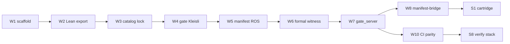

<!--
SPDX-License-Identifier: MIT
Copyright (c) 2026 Santhosh Shyamsundar, Santosh Prabhu Shenbagamoorthy — Studio TYTO
-->

# Parallel swarm handoffs (W1–W10)

Consolidated from per-lane notes (formerly `PARALLEL_W1_HANDOFF.txt`) and coordinator scans. **Status SSOT:** [`AGENT_STATUS.md`](AGENT_STATUS.md). **Commands:** [`VERIFY.md`](VERIFY.md). **Swarm test log:** [`SWARM_TEST_REPORT.md`](SWARM_TEST_REPORT.md).

**Scanned:** 2026-05-21 · **Verified:** 2026-05-21T20:50:20Z (UTC) · **Workspace:** `MaOS-Workspace/umst-manifold`

---

## Process narrative

### How waves were run

Parallel lanes were **not** started ad hoc: the coordinator split work into three waves so **catalog lock (R0)** landed before **host gates (R1–R4)** and **manifest/HTTP (R5–P6)** before **cartridge CI (W8)**.



| Wave | Lanes | Plan P0–P7 | Witness rungs |
|------|-------|------------|---------------|
| 1 | W1–W4 | P0–P4 | R0 pin + R1/R3/R4 test ports |
| 2 | W5–W7 | P5–P6 | R5 v1 manifest; R2 via formal-witness feature |
| 3 | W8, W10 | P7, P10+ | R5 git fiber; P7 dual-run in `verify_umst_stack.sh` |

**Philosophy:** Every handoff must preserve [witness ladder](GOD_GRADE_WITNESS_LADDER.md) **short-circuit order** (CD → Landauer → constitutive → probe). Proofs live in the **versioned Lean library**; gates are **law** in Rust; MI surrogates stay inside the Landauer envelope — see ladder § *Proof library · gate law · MI envelope*.

### Verification recipe (handoff gate)

Before marking a lane **DONE**, the owner runs the matching row from [`VERIFY.md`](VERIFY.md) and (for integration lanes) the stack script:

```bash
cd umst-manifold
# Lane-local (examples)
cargo test --test gate_kleisli          # W4 / P3
cargo test --test gate_dual_run_parity  # W10 / P7
cargo test --test catalog_all_ids_registered  # W3 / P2

# Monorepo stack (W2, W8, W10, S2, S8)
UMST_REQUIRE_FORMAL_EXPORT=1 \
  UMST_FORMAL_ROOT=../umst-formal-double-slit \
  bash scripts/verify_umst_stack.sh
```

**2026-05-21:** stack verify exit **0**; catalog digest `0697014f…`, **119** modules (`cross_repo_merge: true`). Matrix replay: [`END_CONDITION_REPORT.md`](END_CONDITION_REPORT.md).

### Completion % and P0–P7 pending

| Scope | % | Pending |
|-------|---|---------|
| Plan infra todos (14) | **86%** strict / **93%** local | `parity-ci`, `thin-prototypes` |
| Migration **P0–P7** | **~88%** (7✅ 1⚠️) | **P7** production week + adversarial CI |
| God-grade automation | **60%** | Kleisli evaluator, strict catalog default, W8 git, P8 body delete |

| Phase | Status | Handoff owner |
|-------|--------|---------------|
| P0–P6 | ✅ | — |
| **P7** | ⚠️ | W10 — dual-run 8/8 in tests; not adversarial-required in drift |
| P8+ | ⏳ | prototype lane — 226-line shim; 2a body retained |

Full tables: [`AGENT_STATUS.md`](AGENT_STATUS.md) · [`TODO_COMPLETION.md`](TODO_COMPLETION.md) · [`UMST_PROGRESS_REPORT.md`](UMST_PROGRESS_REPORT.md).

---

## Lane summary

| Lane | Scope | Owner outcome | Blockers |
|------|-------|---------------|----------|
| **W1** | `Cargo.toml`, `lib.rs`, `gate_server` stub → full bin | **DONE** — crate parses; `gate_server` is stdlib HTTP behind `gate-server-bin` | Merge races on `Cargo.toml` (duplicate deps/bins) — resolved to single tables |
| **W2** | Lean `catalog.json` export | **DONE** — `umst-formal-double-slit/tools/lean_export/` + `artifacts/catalog.json` (**119** modules unified) | Re-export when Lean changes (`make lean-catalog-export`) |
| **W3** | `runtime/catalog` + `build.rs` lock digest | **DONE** — `UMST_CATALOG_LOCK_SHA256_HEX` from `artifacts/catalog.lock.json` | Refresh lock digest after catalog promotion |
| **W4** | `gate/` Kleisli + mix evaluator registry | **DONE** — `kleisli.rs`, `mix_eval_registry.rs`, 4 tests in `gate_kleisli.rs` | R4: `GateEvaluator` for `kleisli_unit` still open |
| **W5** | `manifest/` + `ros` contract | **DONE** — `UmstManifest`, ROS DTOs + `catalog_hash`; feature `ros2-contract` | `serde` feature for roundtrip tests |
| **W6** | formal witness + `ManifoldGateway` | **DONE** — `src/ai/formal.rs`, `tests/formal_witness.rs`, `formal-witness` | — |
| **W7** | `gate_server` HTTP | **DONE** — `gate_server_router.rs`, `POST /gate`, `GET /health` | Feature `gate-server-bin` |
| **W8** | concrete `manifest-bridge` | **PARTIAL** | Git `tytolabs/umst-manifold` `main` must export `manifest`; local `[patch]` verifies `cargo check -p umst-concrete-cartridge --features manifest-bridge` |
| **W9** | docs audit tables | **DONE** — `claims-vs-proofs.md`, `PROOF-STATUS.md`, `REPO_LAYOUT_SSOT.md`, `PROTOTYPE_GATE_MAP.md` | — |
| **W10** | tests parity + CI | **PARTIAL** | `verify_umst_stack.sh` green; **P7** adversarial + manifold `rust.yml` verify lane optional |

---

## W1 — scaffold & merge hygiene (historical)

### Conflict patterns observed

- **Cargo.toml:** duplicate `serde` / `sha2`, merged `[[example]]` + `[[test]]` rows, duplicate `[[bin]] gate_server`. Coordinator rule: one valid table per kind.
- **Module roots:** `src/gate.rs` vs `src/gate/mod/` (and similarly `manifest`) — only one tree per `pub mod` name. Current tree: `src/gate/`; **no** top-level `src/gate.rs`.
- **Scope creep:** manifest / ROS / HTTP grew beyond “empty stub”; default `cargo check` stays green with real `serde` / `serde_json` / `sha2` and `build.rs`.

### W1 verified surface (this lane)

| Artifact | State |
|----------|-------|
| `Cargo.toml` features | `ros2-contract`, `gate-server-bin`, `gate-server`, `gate-full`, `formal-witness`, `manifest-bridge`, … |
| `[[bin]] gate_server` | `src/bin/gate_server.rs` (requires `gate-server-bin`) |
| `src/lib.rs` | `runtime`, `gate`, `manifest`, `embodied`; `ros` behind `ros2-contract` |
| `src/ai/cbf.rs` | `Debug, Clone, PartialEq` on `ThermodynamicCBF` for manifest derives |
| `src/embodied/mod.rs` | Manual `Debug` (gateway not `Debug`) |

### Not owned by W1 (sibling lanes)

`src/gate/*` logic, `gate_http_manifest`, `gate_server_router`, `manifest/` tree, `runtime/catalog`, HTTP server body — touch only for parse/build unblock.

---

## W8 — manifest bridge (pending)

**Goal:** `umst-concrete-cartridge` re-exports `umst_manifold::manifest::*` behind `manifest-bridge` without workspace `[patch]`.

**Witness ladder:** [R5 — Manifest bridge](GOD_GRADE_WITNESS_LADDER.md#r5--manifest-bridge--formal-witness-deployment-fiber) — digest fiber must be consumable without local patch ([decision 3](GOD_GRADE_WITNESS_LADDER.md#3-manifest-bridge--formal-witness-on-in-ci)).

**Local verify (patch in `umst-concrete-cartridge/Cargo.toml`):**

```bash
cd umst-concrete-cartridge
cargo check -p umst-concrete-cartridge --features manifest-bridge
cargo test -p umst-concrete-cartridge --features manifest-bridge
```

**Publish checklist**

1. Push `umst-manifold` `main` with public `manifest` module and stable `UmstManifest` API.
2. Bump cartridge git dep revision (remove or narrow `[patch]`).
3. Enable `manifest-bridge` in cartridge CI when git pin catches up.

---

## W10 — CI parity (pending)

**Done**

- Gate golden vectors: `gate_parity_fixture`, `gate_cbf_parity`
- Kleisli: `gate_kleisli` (4 tests)
- Dual-run: `gate_dual_run_parity` **8/8** golden + live (P7 test criterion met)
- Workspace `umst-catalog-drift.yml`: formal, ros, gate-server steps
- `scripts/verify_umst_stack.sh` exit 0 @ 2026-05-21T20:50:20Z

**Open (P7 / god-grade)**

- Production-config dual-run disagreement monitoring (1 week)
- Adversarial E6: optional in verify script; not required in drift workflow (`UMST_REQUIRE_ADVERSARIAL_GATE=1` for fail-closed)
- Optional: mirror §2.2 gate bundle inside `umst-manifold/.github/workflows/rust.yml`

---

## Coordinator merge pass (single PR)

1. **Publish** manifold `main` → unblocks W8 git consumers (R5).
2. **Refresh** catalog lock + optional upstream `catalog.json` after Lean export (R0).
3. **Wire** cartridge `manifest-bridge` in CI after git revision bump.
4. **Close P7** — adversarial + production dual-run per [`PENDING_GOD_GRADE_ROADMAP.md`](PENDING_GOD_GRADE_ROADMAP.md) track E.

---

## Related docs

- [`REPO_LAYOUT_SSOT.md`](REPO_LAYOUT_SSOT.md) — directory map
- [`claims-vs-proofs.md`](claims-vs-proofs.md) — traceability tables (W9)
- [`PROTOTYPE_GATE_MAP.md`](PROTOTYPE_GATE_MAP.md) — prototype → manifold ports
- [`GOD_GRADE_WITNESS_LADDER.md`](GOD_GRADE_WITNESS_LADDER.md) — normative witness order
- [`SWARM_TEST_REPORT.md`](SWARM_TEST_REPORT.md) — cargo sweep + verification recipe
