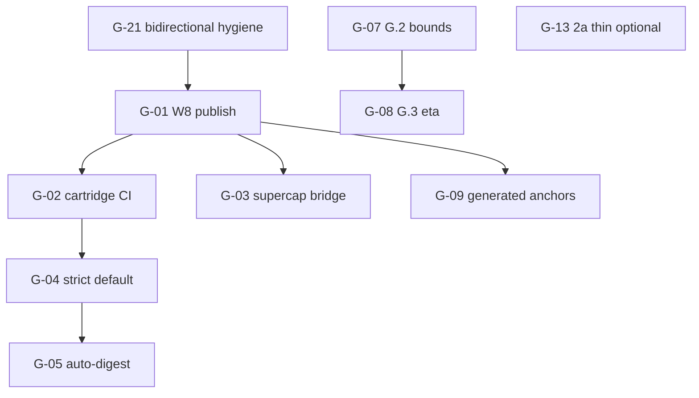

# Pending gaps — deep audit

**As of:** 2026-05-21  
**Audience:** Coordinators who need one table of what is still open, who owns it, how to check it, and what breaks if it is ignored.

**Cross-read (do not duplicate these files here):**

| Source | Role |
|--------|------|
| [`UNFINISHED_FEATURES_AUDIT.md`](UNFINISHED_FEATURES_AUDIT.md) | Plain-language open items: owner + execute vs wait |
| [`PREVIEW_STUB_AUDIT.md`](PREVIEW_STUB_AUDIT.md) | Preview JSON, schema placeholders, runtime stubs |
| [`COMPLETION_TRUTH.md`](COMPLETION_TRUTH.md) | What is / is not 100%; morphism stack R0–R6 |

**Evidence SSOT:** [`TODO_COMPLETION.md`](TODO_COMPLETION.md) · [`GOD_GRADE_CHECKLIST.md`](GOD_GRADE_CHECKLIST.md) · [`PENDING_GOD_GRADE_ROADMAP.md`](PENDING_GOD_GRADE_ROADMAP.md)

---

## Honest completion ceiling

| Lens | % | Human required? |
|------|---|-----------------|
| Plan 15/15 (14 YAML todos + fiber merge) | **100%** | No — re-run verify only |
| Local stack + tests on pin `0697014f…` / **119** modules | **100%** robustness when green | No |
| **Code / automation (weighted R0–R5 + CI)** | **~92%** | Partial — see gaps below |
| **Organization 100%** (remote CI, release policy, traces) | **~92% → 100%** needs **W8** + policy + R6 | **Yes** |

**Policy (do not over-claim):**

- Say **~92%** for automation: in-repo gates, lock, parity, adversarial, local `manifest-bridge` with workspace patch.
- Say **100% for the org** only after **W8** (git publish), plus product choices on strict manifest default and epistemic trace CI (G.2–G.3).
- **FFI / extracted Lean witnesses** are long-horizon; not in the 92% denominator.

Bottom line from [`COMPLETION_TRUTH.md`](COMPLETION_TRUTH.md): local correctness is **truth-complete**; remote consumers and R6 telemetry are **human-complete**.

---

## Morphism layer key (plain English)

Layers are the extraction stack from proofs to runtime. “Morphism” here means **which step in the pipeline** the gap affects.

| Layer | Plain name | Open gaps (count) |
|-------|------------|-------------------|
| **Lean library** | Proof inventory in git | 2 optional (export bot, test-module policy) |
| **R0** | Catalog pin / digest | 1 optional (per-fiber lock policy) |
| **R1** | CD / second law | 0 blocking |
| **R2** | Landauer / MI budget | 2 (surrogate semantics, η from traces) |
| **R3** | Mix / constitutive | 3 optional (2a body, anchors, regime docs) |
| **R4** | Kleisli / probe | 0 blocking |
| **R5** | Manifest / cartridge grounding | 5 (W8, strict default, auto-digest, remote bridge, generated anchors) |
| **R6** | Epistemic trace v2 | 2 (bounds CI, η calibration) |
| **CI / ops** | Automation & hygiene | 4 (clippy breadth, doc rows, Python E6, bidirectional hygiene) |
| **Prototype** | v1 shim / 2a hybrid | 4 optional (thin delete, subprocess, legacy HTTP) |
| **Preview / dev** | Non-production artifacts | 0 blocking (merge closed; dev-only preview) |

Normative order and composition: [`COMPLETION_TRUTH.md`](COMPLETION_TRUTH.md) § Morphism layers · [`GOD_GRADE_WITNESS_LADDER.md`](GOD_GRADE_WITNESS_LADDER.md).

---

## Master gap register

Each row is **still open** as of 2026-05-21. **Owner** = lane that should close it. **Verify** = copy-paste check (expect outcome noted). **Risk** = what goes wrong if ignored. **Refs** = which audit doc owns the narrative.

### Organization & publish (blocks remote 100%)

| ID | Gap (plain English) | Owner | Verify command | Risk if ignored | Morphism layer | Refs |
|----|---------------------|-------|----------------|-----------------|----------------|------|
| **G-01** | ~~Manifold `main` not published~~ **Done** @ **`fe22437`** | — | `git ls-remote https://github.com/tytolabs/umst-manifold.git refs/heads/main` | — | **R5** | Track **A** · [`PROGRESS_PLAIN.md`](PROGRESS_PLAIN.md) |
| **G-02** | ~~Cartridge CI without git `manifest-bridge`~~ **Done** 2026-05-29 | — | `cargo test -p umst-concrete-cartridge --features manifest-bridge` (no workspace `[patch]`) | — | **R5** | [`FORMAL_GROUNDING_AUDIT.md`](../umst-concrete-cartridge/docs/FORMAL_GROUNDING_AUDIT.md) |
| **G-03** | Supercap remote `manifest-bridge` / `manifold-gate` not wired on git pin | cartridge (supercap) | `cd umst-supercap-cartridge && cargo check --features manifest-bridge,manifold-gate` without patch | Supercap stays doc-only formal parity vs concrete | **R5** | [UNFINISHED § supercap] · Track **I.3** |

### Manifest & policy (local code exists; release default open)

| ID | Gap | Owner | Verify command | Risk if ignored | Morphism layer | Refs |
|----|-----|-------|----------------|-----------------|----------------|------|
| **G-04** | Release builds default `CatalogPinnedRos2`; strict catalog match is opt-in | product / ops | `rg 'CatalogPinnedRos2\|StrictCatalogMatch' umst-manifold/src/manifest/umst_manifest.rs` | Wrong digest in prod may not fail closed | **R5** | [UNFINISHED § strict default] · [COMPLETION_TRUTH § Human] · Track **H.1** |
| **G-05** | `formal-witness` digest field not auto-filled from lock; callers must pass `Some` manually | manifold | `rg 'catalog_schema_digest\|UMST_CATALOG_LOCK' umst-manifold/src/ai/formal.rs umst-manifold/src/manifest/` | Silent skip of digest check in custom gateways | **R5** | [PREVIEW_STUB § formal-witness] · Track **H.2** |
| **G-06** | `UmstManifest::gate_registry` lists lanes but does not execute gates | manifold | `rg 'gate_registry\|declared_lanes' umst-manifold/src/manifest/` — routing is in `EmbodiedOrchestrator` | Operators assume manifest drives gates; telemetry lies | **R5** | [PREVIEW_STUB § gate_registry] · [UNFINISHED § runtime stubs] |

### Epistemic traces (R6)

| ID | Gap | Owner | Verify command | Risk if ignored | Morphism layer | Refs |
|----|-----|-------|----------------|-----------------|----------------|------|
| **G-07** | Per-step numerics bounds not enforced in CI (G.2) | manifold / ops | `cargo test --features ros2-contract,serde --test epistemic_trace_schema -p umst-manifold` — bounds cases absent | Trace JSON can violate Lean tolerances without CI failure | **R6** | [UNFINISHED § G] · [PREVIEW_STUB § Epistemic v2] · Track **G.2** |
| **G-08** | η calibration from traces **stub only** (G.3): `ros/trace_calibration.rs` scans `EmittedStepRecord` vs catalog `stepMI ≤ ln 2` and suggests `eta_bound`; **`ManifoldGateway::eta` not wired** | manifold / research | `cargo test --features trace-calibration -p umst-manifold` · `rg 'trace_calibration\|ManifoldGateway::eta' umst-manifold/src/` | MI budget may be miscalibrated vs proved epistemic contract until gateway consumes stub | **R2**, **R6** | [PREVIEW_STUB § info_gain] · Track **G.3** · Lean `EpistemicTraceDrivenCalibrationWitness` **proved**, Rust **not** |

### Cartridge & traceability (optional promotion)

| ID | Gap | Owner | Verify command | Risk if ignored | Morphism layer | Refs |
|----|-----|-------|----------------|-----------------|----------------|------|
| **G-09** | PROOF-STATUS / `formal_anchor` still `lean://` URIs, not `catalog_id` slugs from export | cartridge | `rg 'lean://\|catalog_id' umst-concrete-cartridge/crates/umst-concrete-cartridge/docs/` | Harder drift detection between docs and R0 pin | **R0**, **R5** | [PREVIEW_STUB § formal_anchor] · [TODO_COMPLETION § concrete-cartridge-wire] |
| **G-10** | Supercap generated anchor rows (I.4) optional | cartridge | `rg 'lean://' umst-supercap-cartridge/docs/PROOF-STATUS.md` | Same as G-09 for supercap surface | **R5** | Track **I.4** |
| **G-11** | ~51 of **119** catalog modules not on inference hot path (by design) | formal / manifold | `cargo test --test catalog_all_ids_registered -p umst-manifold` — wired vs allowlist partition | Confusion that “119 in pin” means “119 in runtime” | **R0** | [UNFINISHED § 51/69] · [`FORMAL_INTEGRATION_STATUS.md`](FORMAL_INTEGRATION_STATUS.md) |
| **G-12** | Appendix B / `umst-formal` lemma rows — doc graduation to main table | docs / formal | `grep -c 'Appendix B' umst-manifold/docs/claims-vs-proofs.md` | Reviewers miss traceability for classical fiber lemmas | **Lean library**, **R0** | [UNFINISHED § Appendix B] |

### Prototype & parity (optional; plan-complete at hybrid level)

| ID | Gap | Owner | Verify command | Risk if ignored | Morphism layer | Refs |
|----|-----|-------|----------------|-----------------|----------------|------|
| **G-13** | 2a `thermodynamic_filter.rs` hybrid **~517** lines (Constitution/CGS/functor local) | prototype lane | `wc -l umst-prototype-2a/prototype/src/rust/core/src/science/thermodynamic_filter.rs` | Duplicate maintenance; parity burden | **R1**, **R3** | [UNFINISHED § 2a] · [COMPLETION_TRUTH § optional thin-delete] · Track **B** |
| **G-14** | Retire `gate_dual_fixture` subprocess when all callers use manifold `:8787` | prototype lane | `rg 'gate_dual_fixture' umst-prototype umst-prototype-2a` | Flaky CI from subprocess drift | **R5** parity | [UNFINISHED § gate_dual_fixture] · Track **B.4** |
| **G-15** | Legacy prototype `gate_server` bins (ROS telemetry / OCR) | prototype lane | `rg 'gate_server' umst-prototype/src/bin umst-prototype-2a` | Two HTTP gate stories confuse operators | **R5** | [UNFINISHED § legacy gate_server] |
| **G-16** | Python E6 adversarial optional in CI (Rust is SSOT) | CI / coordinator | `UMST_REQUIRE_FORMAL_EXPORT=1 bash umst-manifold/scripts/verify_umst_stack.sh` — note Python step skip without `umst-prototype_2` | None if Rust golden kept; loss of second implementation check | **R1**, **R3** | [UNFINISHED § Python E6] · Track **E.4** |

### CI, lint, and operator hygiene

| ID | Gap | Owner | Verify command | Risk if ignored | Morphism layer | Refs |
|----|-----|-------|----------------|-----------------|----------------|------|
| **G-17** | Clippy `-D warnings` not run for all feature umbrellas (`wgpu`, `train`, `solver-*`) | manifold CI | `cd umst-manifold && cargo clippy --all-targets --features solver-experimental -- -D warnings` | Latent deny-as-error debt on non-default features | **CI** | [TODO_COMPLETION § clippy] · Track **J.1** |
| **G-18** | Regime / calibration warnings policy not cross-linked Lean ↔ CLI | docs + cartridge | `cd umst-concrete-cartridge && cargo test -p umst-concrete-cartridge --test public_contract` | Operators treat warnings as proof failures or ignore real regime exits | **R3** | Track **J.3** |
| **G-19** | Stale Kleisli / parity rows in `claims-vs-proofs.md` | docs | `rg 'not yet\|Spec id only' umst-manifold/docs/claims-vs-proofs.md` | Checklist and ledger disagree with code | **CI** doc truth | [UNFINISHED § doc hygiene] · Track **J.2** tail |
| **G-20** | Lean PR → export bot (manual `make lean-catalog-export` + lock bump) | formal / coordinator | Manual: `cd umst-formal-double-slit && make lean-catalog-export` | Human slip on digest after Lean merge | **R0** | [UNFINISHED § W10-b] |
| **G-21** | `bidirectional_catalog_check.sh` / doc-comment parse hygiene | manifold CI | `UMST_FORMAL_ROOT=$PWD/../umst-formal-double-slit bash umst-manifold/scripts/bidirectional_catalog_check.sh` | Full stack verify fails on doc parse edge cases | **R0**, **CI** | [UNFINISHED § bidirectional] |
| **G-22** | Ignored module doctest in `umst_manifest.rs` | manifold | `cd umst-manifold && cargo test --doc 2>&1 \| rg ignored` | Example in docs rots | **R5** | [TODO_COMPLETION § doc-test] |

### Preview & dev-only (non-blocking)

| ID | Gap | Owner | Verify command | Risk if ignored | Morphism layer | Refs |
|----|-----|-------|----------------|-----------------|----------------|------|
| **G-23** | `--cross-repo-only` preview JSON — dev triage only | formal / coordinator | `python3 -c "import json; p=json.load(open('umst-formal-double-slit/artifacts/catalog-cross-repo-preview.json')); assert p.get('dry_run') is True"` | Operator treats preview as production pin | **R0** preview | [PREVIEW_STUB § Preview artifacts] · [UNFINISHED § preview SSOT] |
| **G-24** | `FlashMoERuntimeScaffold` in catalog, no manifold hook | formal | `rg FlashMoERuntimeScaffold umst-formal-double-slit/artifacts/catalog.json` | None until product needs runtime | **Lean library** | [PREVIEW_STUB § Lean export scaffolds] |
| **G-25** | `ClausiusDuhemProof` marker — no extracted Lean term at runtime | manifold | `rg 'ClausiusDuhemProof' umst-manifold/src/` | None — intentional; hot path is hand-aligned Rust | **R1** stub | [PREVIEW_STUB § ClausiusDuhemProof] |

### Long horizon (excluded from ~92% automation)

| ID | Gap | Owner | Verify command | Risk if ignored | Morphism layer | Refs |
|----|-----|-------|----------------|-----------------|----------------|------|
| **G-26** | Extracted witnesses / FFI — no Lean terms on hot path | formal / long | `rg 'lake build\|lean --run' umst-manifold/src` → empty (must stay) | Premature FFI reintroduces prover on inference path | **Lean library** → runtime | [GOD_GRADE_CHECKLIST § FFI] · [UNFINISHED § FFI] |

---

## Gaps by morphism layer (rollup)

Use this when explaining **where** in the stack work sits, not **who** owns it.

### Lean library → R0

| IDs | Blocking? |
|-----|-----------|
| G-11, G-12, G-20, G-21, G-23, G-24, G-26 | **No** for local v1 (G-21 may block full stack if broken) |
| Production pin | **Closed** — `0697014f…`, **119** modules ([COMPLETION_TRUTH](COMPLETION_TRUTH.md)) |

### R1–R4 (gates)

| IDs | Blocking? |
|-----|-----------|
| G-13, G-15, G-16, G-25 | **No** — parity and adversarial green |
| Hot path | **Closed** — CD → Landauer → mix → Kleisli ([`verify_umst_stack.sh`](../scripts/verify_umst_stack.sh)) |

### R5 (manifest / cartridges)

| IDs | Blocking for org 100%? |
|-----|------------------------|
| **G-01, G-02, G-03** | **Yes** — W8 |
| G-04, G-05, G-06, G-09, G-10 | **Partial** — policy and docs |

### R6 (traces)

| IDs | Blocking for weighted god-grade? |
|-----|----------------------------------|
| **G-07, G-08** | **Yes** for ~100% automation claim; **No** for local gate law |

### CI / prototype / preview

| IDs | Notes |
|-----|-------|
| G-14–G-19, G-22 | Optional hygiene |
| G-23–G-25 | Preview/stub awareness only |

---

## Cross-reference index

### [`UNFINISHED_FEATURES_AUDIT.md`](UNFINISHED_FEATURES_AUDIT.md)

| Section | Gap IDs |
|---------|---------|
| Executive summary (ops / hybrid) | G-01–G-08, G-13–G-16 |
| Ops-only table | G-01, G-04, G-05, G-07, G-20, G-21 |
| Prototype & parity | G-13–G-16 |
| Cartridge & supercap | G-02, G-03, G-09, G-10 |
| Runtime stubs | G-06, G-08, G-11, G-26 |
| God-grade tracks A–J | All G-01–G-08, G-13, G-17–G-19 |

### [`PREVIEW_STUB_AUDIT.md`](PREVIEW_STUB_AUDIT.md)

| Section | Gap IDs |
|---------|---------|
| Preview artifacts | G-23 (closed policy; dev-only) |
| Schema stubs | G-09, G-10, G-12 |
| Runtime / API stubs | G-05, G-06, G-07, G-08, G-09, G-25 |
| Lean export scaffolds | G-24 |

### [`COMPLETION_TRUTH.md`](COMPLETION_TRUTH.md)

| Section | Gap IDs |
|---------|---------|
| Plain English 100% | None blocking locally |
| What cannot be 100% without human | **G-01, G-04, G-07, G-13** |
| Morphism layers table | Layer mapping above |
| Honest split table | ~92% automation · W8 for org |

---

## Suggested close order (dependencies)



| Phase | Gap IDs | Outcome |
|-------|---------|---------|
| 1 — CI truth | G-21, G-19 | Full stack + ledger aligned |
| 2 — Org 100% | **G-01 → G-02 → G-03** | Remote consumers off `[patch]` |
| 3 — Policy | G-04, G-05 | Fail-closed prod manifests |
| 4 — R6 | G-07, G-08 | Trace contract enforced |
| 5 — Optional | G-13–G-16, G-09–G-10, G-17–G-18 | Hygiene and thin prototypes |

---

## Master verify (re-green everything closable in-repo)

From `MaOS-Workspace/umst-manifold`:

```bash
export UMST_REQUIRE_FORMAL_EXPORT=1
export UMST_FORMAL_ROOT="$PWD/../umst-formal-double-slit"
bash scripts/verify_umst_stack.sh
bash scripts/bidirectional_catalog_check.sh
cargo test -p umst-manifold --test catalog_all_ids_registered
cargo test -p umst-manifold --test gate_kleisli --test gate_reject_catalog_id --test gate_adversarial --test gate_dual_run_parity
cargo test -p umst-manifold --features formal-witness --test manifest_strict_witness --test formal_witness
cargo test -p umst-manifold --features ros2-contract,serde --test epistemic_trace_schema
cd ../umst-concrete-cartridge && cargo test -p umst-concrete-cartridge --features manifest-bridge
cd ../umst-supercap-cartridge && cargo test --test formal_anchors
```

Expect exit **0** on unified pin `0697014fb5b90a3aca4db3e5cc226896ca198802c910d5395f254e4262aa6227` (**119** modules). Record timestamp in [`TODO_VERIFICATION_REPORT.md`](TODO_VERIFICATION_REPORT.md).

**W8-only verify (human):** follow [`W8_PUBLISH_RUNBOOK.md`](W8_PUBLISH_RUNBOOK.md) — no agent `git push` without operator credentials.

---

## Summary counts

| Category | Open gaps | Blocks ~92% → automation 100%? | Blocks org 100%? |
|----------|-----------|--------------------------------|------------------|
| W8 / remote CI | 3 (G-01–G-03) | No (local green) | **Yes** |
| R5 policy & wiring | 3 (G-04–G-06) | Partial | Partial |
| R6 traces | 2 (G-07–G-08) | **Yes** for automation ceiling | Partial |
| Cartridge / doc promotion | 4 (G-09–G-12) | No | No |
| Prototype optional | 4 (G-13–G-16) | No | No |
| CI / hygiene | 6 (G-17–G-22) | Partial (G-21) | No |
| Preview / stub awareness | 3 (G-23–G-25) | No | No |
| Long horizon | 1 (G-26) | No (excluded) | No |
| **Total registered** | **26** | **~8%** automation debt (W8 + G.2–G.3 + hygiene) | **W8** is the org gate |

---

*Coordinator handoff:* read [`COMPLETION_TRUTH.md`](COMPLETION_TRUTH.md) for the one-page truth split → use this file for gap IDs → drill [`UNFINISHED_FEATURES_AUDIT.md`](UNFINISHED_FEATURES_AUDIT.md) / [`PREVIEW_STUB_AUDIT.md`](PREVIEW_STUB_AUDIT.md) for narrative → execute [`PENDING_GOD_GRADE_ROADMAP.md`](PENDING_GOD_GRADE_ROADMAP.md) tracks by ID.
