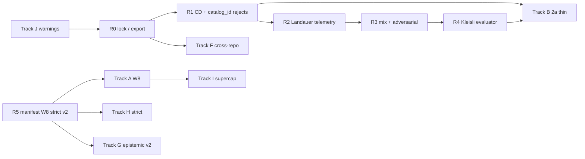

# Pending god-grade roadmap

**As of:** 2026-05-21  
**Audience:** Coordinators, formal lane, manifold/prototype/cartridge CI owners  
**Status SSOT:** [`TODO_COMPLETION.md`](TODO_COMPLETION.md), [`AGENT_STATUS.md`](AGENT_STATUS.md), [`GOD_GRADE_PROGRESS_VERIFIED.md`](GOD_GRADE_PROGRESS_VERIFIED.md), [`FORMAL_INTEGRATION_STATUS.md`](FORMAL_INTEGRATION_STATUS.md)

**Witness order (normative):** Every step below must preserve evaluation order and short-circuit semantics in [`GOD_GRADE_WITNESS_LADDER.md`](GOD_GRADE_WITNESS_LADDER.md) — **R0 → R1 (CD) → R2 (Landauer) → R3 (constitutive) → R4 (Kleisli) → R5 (manifest / digest / trace)**.

**Checklist companion:** [`GOD_GRADE_CHECKLIST.md`](GOD_GRADE_CHECKLIST.md)

**Narrative entry:** [`UMST_PROGRESS_REPORT.md`](UMST_PROGRESS_REPORT.md) (rollup) · [`GOD_GRADE_WITNESS_LADDER.md`](GOD_GRADE_WITNESS_LADDER.md) (§ [Proof library · gate law · MI](GOD_GRADE_WITNESS_LADDER.md#proof-library--gate-law--mi-envelope--no-rust-axioms)) · evidence [`TODO_COMPLETION.md`](TODO_COMPLETION.md)

**W8 publish (operator-only):** [`W8_PUBLISH_RUNBOOK.md`](W8_PUBLISH_RUNBOOK.md) — phases 0–4 for `tytolabs/umst-manifold` `main` + cartridge `manifest-bridge` without workspace `[patch]`.

---

## Tracks A–J closure (2026-05-21)

Verified **2026-05-21T21:18:04Z** — `verify_umst_stack.sh` exit 0; `gate_dual_run_parity` 8/8; Rust `gate_adversarial` FNR=0 ([`TODO_COMPLETION.md`](TODO_COMPLETION.md)).

| Track | Status | Closed today (summary) | Still open |
|-------|--------|------------------------|------------|
| **A** — W8 publish | ❌ **ops** | Local `pub mod manifest`, patch-green cartridge tests | Remote git + GHA — **[`W8_PUBLISH_RUNBOOK.md`](W8_PUBLISH_RUNBOOK.md)** |
| **B** — 2a thin | ⚠️ **hybrid** | v1 shim 226L, 8/8 dual-run, 2a `manifold-gate` Algorithm 1 delegate | B.3–B.4 full body delete + HTTP-only retirement |
| **C** — Kleisli | ✅ **done** | `KleisliUnitEvaluator`, registry + embodied routing, `gate_kleisli` 6/6 | — |
| **D** — reject `catalog_id` | ✅ **done** | `gate_reject_catalog_id` 6/6 (CD/mix/Landauer/HTTP) | — |
| **E** — adversarial CI | ✅ **Rust SSOT** | Golden vendored, `gate_adversarial` in verify + drift CI | Optional Python E6; `rust.yml` verify lane (W10) |
| **F** — cross-repo catalog | ✅ **done** | Unified `0697014f…` / **119** modules; `formal-fiber-merge` ✅ | — |
| **G** — epistemic v2 | ❌ **open** | — | G.1–G.3 trace schema + η calibration |
| **H** — strict catalog | ❌ **open** | Lock hash default on manifest builder | `StrictCatalogMatch` release default + CI triple |
| **I** — supercap anchors | ⚠️ **partial** | `formal_anchors` 6/6, lock pin in `topology_catalog_hash_advisory` | I.3–I.4 `manifest-bridge` / generated anchor rows (needs W8) |
| **J** — lint / docs | ⚠️ **partial** | J.2 `gate_dual_run_parity` ↔ verify script truth | J.1 clippy `-D warnings`; J.3 regime warnings policy |

**God-grade checklist ([`GOD_GRADE_CHECKLIST.md`](GOD_GRADE_CHECKLIST.md)):** **10 / 13 ≈ 77%** (✅ only) · weighted headline **~84%** · **~16%** automation debt to full v1 checklist (excluding long-horizon extracted-witness row).

---

## Remaining to 100% god-grade checklist

Maps open [`GOD_GRADE_CHECKLIST.md`](GOD_GRADE_CHECKLIST.md) rows → tracks. **FFI / extracted witnesses** stays ❌ (long horizon; not blocking v1 automation).

| Checklist row | Current | Close via | Owner |
|---------------|---------|-----------|-------|
| `gate_adversarial` golden | ⚠️ Rust ✅; Python E6 optional | Accept Rust-only SSOT **or** wire optional E6 in drift | CI / coordinator |
| Default manifest strict grounding | ⚠️ `CatalogPinnedRos2` default | Track **H** H.1–H.3 | product / ops |
| Cartridge git-pinned manifest bridge (W8) | ⚠️ local `[patch]` only | Track **A** — **[`W8_PUBLISH_RUNBOOK.md`](W8_PUBLISH_RUNBOOK.md)** | manifold publish → cartridge |
| Extracted witnesses / FFI | ❌ horizon | Track **G** + separate FFI program | formal / long |
| *(implicit)* Kleisli evaluator | ✅ | Track **C** closed 2026-05-21 | — |
| *(implicit)* reject `catalog_id` | ✅ | Track **D** closed 2026-05-21 | — |
| *(implicit)* supercap `formal_anchors` | ✅ | Track **I** I.1–I.2 | — |
| Cross-repo catalog fiber | ✅ Track **F** closed | — | — |
| Epistemic v2 traces (R6) | — | Track **G** | manifold / ops |
| 2a prototype full thin | — | Track **B** B.3–B.4 | prototype lane |
| Supercap `manifest-bridge` remote | — | Track **I** I.3 + **A** | cartridge |
| Clippy / `rust.yml` gate lane | — | Track **J** J.1 + W10 | manifold CI |
| Doc stale rows (Kleisli, parity) | — | Track **J** J.2 tail + `claims-vs-proofs.md` | docs |

**Target for “100%” v1 god-grade (no FFI):** all 13 checklist rows ✅ or explicitly scoped (E6 optional → document as non-blocking); witness ladder R0–R5 **ON in CI** on git consumers; R6 v2 optional for strict 100% weighted headline.

---

## Process & verification

**Progress date:** 2026-05-21 · **Baseline:** infra **~100%** (local) · god-grade **~84%** weighted · **~16%** automation debt remains

| Closed in-repo (2026-05-21) | Still open (tracks below) |
|-----------------------------|---------------------------|
| R0 lock, R1 CD, R2 Landauer CBF, R4 Kleisli, reject slugs, Rust adversarial, verify stack, v1 8/8 dual-run | R5 git **W8** ([runbook](W8_PUBLISH_RUNBOOK.md)), R6 v2 traces, strict default, cross-repo F, 2a full thin, supercap remote bridge |

### Learnings

- **Proofs as a versioned library** — Tracks F (cross-repo) and A/H (manifest) must promote digest before enlarging runtime; never merge fibers without `physicalSecondLaw` audit ([`FORMAL_FIBER_MERGE_RUNBOOK.md`](FORMAL_FIBER_MERGE_RUNBOOK.md) Phase 0, [`TCB.md`](TCB.md)).
- **Gates as law** — Every track preserves witness order (decision 1); telemetry track D does not weaken CD before Landauer.
- **Prototype parity** — Track B deletes **presentation** only after parity functor identity; fixtures stay ([`GOD_GRADE_WITNESS_LADDER.md`](GOD_GRADE_WITNESS_LADDER.md) §5).

### Impact

- Ten tracks (A–J) map 1:1 to witness rungs and [`TODO_COMPLETION.md`](TODO_COMPLETION.md) gaps.
- Phase order (CI truth → registry → publish → fibers → v2) avoids rework on lock churn.
- Master verify command at bottom is the **god-grade gate** after any track merge.

> **Design lens** — Roadmap steps are morphisms that must **lift** along the witness ladder fibration; skipping R0 promotion invalidates downstream R5 cartridge fibers.

---

## Global invariants (every step)

| Invariant | Rule | Verification |
|-----------|------|----------------|
| **TCB axiom count** | Lean project axiom remains **`physicalSecondLaw` only** (`LandauerLaw.lean`). Do **not** add Rust axioms, new Lean axioms, or cartridge `formal_axioms` tokens beyond `{NONE, physicalSecondLaw}`. | `cd umst-formal-double-slit/Lean && lake build` then `rg '^axiom ' Lean/LandauerLaw.lean` → single `physicalSecondLaw` |
| **No Lean on hot path** | Inference/gates stay hand-aligned Rust; Lean is build/CI only. | `rg 'lake build|lean --run' umst-manifold/src` → empty |
| **Lock digest** | After any catalog promotion: `upstream_catalog_digest_hex` in `artifacts/catalog.lock.json` matches regenerated export. | `UMST_REQUIRE_FORMAL_EXPORT=1 bash scripts/verify_umst_stack.sh` → exit 0 |
| **Witness ladder** | Each track maps to rungs in [`GOD_GRADE_WITNESS_LADDER.md`](GOD_GRADE_WITNESS_LADDER.md); do not reorder failure priority (decision 1). | Review § [Witness ladder (ordered)](GOD_GRADE_WITNESS_LADDER.md#witness-ladder-ordered) before merge |

**TCB table (Rust):** [`TCB.md`](TCB.md) — `physicalSecondLaw` is **documented TCB** via `src/ai/cbf.rs`, not extracted proof terms.

---

## Track map → witness ladder

| Track | Primary rungs | Gap source |
|-------|---------------|------------|
| [A — W8 publish](#track-a--w8-publish-tytolabsumst-manifold-main) | R5 v1 | ❌ ops — **[`W8_PUBLISH_RUNBOOK.md`](W8_PUBLISH_RUNBOOK.md)**; local code ✅ per `AGENT_W8_STATUS.txt` |
| [B — 2a thin prototype](#track-b--umst-prototype-2a-thin-after-manifold-ports) | R1, R3, R4 (parity) | ⚠️ v1 shim + 8/8 + 2a `manifold-gate`; B.3–B.4 open |
| [C — Kleisli evaluator](#track-c--kleisli-gateevaluator-umstgatekleisli_unit) | R4 | **✅ 2026-05-21** — `KleisliUnitEvaluator` + embodied routing; `gate_kleisli` 6/6 |
| [D — `catalog_id` on all rejects](#track-d--catalog_id-on-every-reject-path) | R1–R4 telemetry | **✅ 2026-05-21** — `gate_reject_catalog_id` 6/6 (CD/mix/Landauer/HTTP) |
| [E — Adversarial CI](#track-e--adversarial-gate-ci) | R1, R3 | **✅ 2026-05-21** (Rust) — `gate_adversarial` in verify + drift; Python E6 optional |
| [F — Cross-repo catalog](#track-f--unified-lean-export-cross-repo-catalog) | R0 (+ second fiber) | ✅ **2026-05-21** — unified digest `0697014f…`, **119** modules |
| [G — Epistemic v2 traces](#track-g--epistemic-runtime-schema-v2) | R5 v2, R2 η | ❌ R6 open |
| [H — Strict catalog default](#track-h--strictcatalogmatch--formal-witness) | R5 v1 | ❌ `StrictCatalogMatch` not release default |
| [I — Supercap formal anchors](#track-i--supercap-formal-anchor-parity) | R5, R3 (cartridge) | ⚠️ I.1–I.2 ✅; I.3–I.4 blocked on W8 git pin |
| [J — Warnings / lint hygiene](#track-j--warnings-zero-clippy--docs) | CI gate (all rungs) | ⚠️ J.2 ✅; J.1 clippy + J.3 regime policy open |

---

## Track A — W8 publish (`tytolabs/umst-manifold` `main`)

**Status:** ❌ **ops-only** (in-repo surface done; no agent `git push` / `cargo publish` without operator credentials).

**Runbook (SSOT for phases 0–4):** [`W8_PUBLISH_RUNBOOK.md`](W8_PUBLISH_RUNBOOK.md)

**Witness ladder:** [R5 — Manifest bridge + formal witness](GOD_GRADE_WITNESS_LADDER.md#r5--manifest-bridge--formal-witness-deployment-fiber)  
**Owner:** manifold publish → cartridge maintainers  
**Blocks:** remote `umst-concrete-cartridge` / `umst-supercap-cartridge` git CI without workspace `[patch]`

### A.1 — Confirm `pub mod manifest` on publish branch ✅ (local)

> Operator steps: [`W8_PUBLISH_RUNBOOK.md`](W8_PUBLISH_RUNBOOK.md) Phase 0–1.

| Field | Value |
|-------|--------|
| **Work** | Ensure `src/lib.rs` exports `manifest` unconditionally; tag release notes with `manifest-bridge` feature marker. |
| **Verify** | `cd umst-manifold && cargo doc --no-deps -p umst-manifold 2>&1 \| rg 'mod manifest'` |
| **Done** | `cargo publish --dry-run` (or internal equivalent) lists `manifest` in public API. |
| **TCB** | No new axioms; manifest is digest/orchestration only. |
| **Ladder** | R5 — manifest fiber must be consumable without local patch. |

### A.2 — Push `tytolabs/umst-manifold` revision

| Field | Value |
|-------|--------|
| **Work** | Push commit containing W8 surface (`AGENT_W8_STATUS.txt` checklist) to `main`. |
| **Verify** | `git ls-remote https://github.com/tytolabs/umst-manifold.git refs/heads/main` then clone clean dir: `cargo check -p umst-manifold` |
| **Done** | Fresh clone builds without workspace `[patch]`. |
| **TCB** | Unchanged. |
| **Ladder** | R5 v1 — git consumers share catalog digest pin. |

### A.3 — Bump cartridge git dep + enable `manifest-bridge` in CI

| Field | Value |
|-------|--------|
| **Work** | In `umst-concrete-cartridge`: remove/narrow `[patch]`, pin new git rev, add CI job `cargo test -p umst-concrete-cartridge --features manifest-bridge`. Repeat for supercap if same pin. |
| **Verify** | `cd umst-concrete-cartridge && cargo test -p umst-concrete-cartridge --features manifest-bridge` → exit 0 **without** `../umst-manifold` patch |
| **Done** | Cartridge GHA green on git dep only; `docs/FORMAL_GROUNDING_AUDIT.md` remote CI row ✅. |
| **TCB** | Cartridge tests still allow only `physicalSecondLaw` in `formal_anchors.rs`. |
| **Ladder** | R5 — paired with `formal-witness` in MaOS drift workflow ([decision 3](GOD_GRADE_WITNESS_LADDER.md#3-manifest-bridge--formal-witness-on-in-ci)). |

### A.4 — Close W8 in agent docs

| Field | Value |
|-------|--------|
| **Work** | Update `AGENT_STATUS.md`, `PARALLEL_HANDOFFS.md`, `TODO_COMPLETION.md` concrete-cartridge row to remote ✅. |
| **Verify** | `rg 'W8.*PENDING\|manifest-bridge.*blocked' umst-manifold/docs` → no stale W8 blockers |
| **Done** | Handoff tables show W8 **DONE** (git + CI). |
| **TCB** | Doc-only. |
| **Ladder** | R5 — operational closure. |

---

## Track B — `umst-prototype-2a` thin (after manifold ports)

**Status:** ⚠️ **hybrid DONE** (2026-05-21) — v1 shim ~226L + **8/8** `gate_dual_run_parity`; 2a optional `manifold-gate` delegates Algorithm 1 (~517L 2a-only Constitution/CGS/functor remain). Plan todo `thin-prototypes` ✅ at hybrid level ([`TODO_COMPLETION.md`](TODO_COMPLETION.md)).

**Witness ladder:** [R1 CD](GOD_GRADE_WITNESS_LADDER.md#r1--clausiusduhem--second-law-host-scalar), [R3 constitutive](GOD_GRADE_WITNESS_LADDER.md#r3--constitutive-closure), [R5 parity functor](GOD_GRADE_WITNESS_LADDER.md#5-delete-prototype-filter-when-parity-functor-is-identity-keep-fixtures)  
**Owner:** prototype lane (`umst-prototype-2a`)  
**Prerequisite:** manifold ports for Constitution/CGS, `evaluate_joint_functor`, `max_strength` OR callers migrate to HTTP `gate_server` :8787 only

### B.1 — Port Constitution/CGS witness to manifold (or document HTTP-only) ⚠️

| Field | Value |
|-------|--------|
| **Work** | Either add manifold `GateEvaluator` hooks emitting `cgs` / `hydration_irreversible` on CD path, or mark 2a experiments HTTP-only in `THIN_PROTOTYPE_STATUS.md` with migration list. |
| **Verify** | `cd umst-manifold && cargo test --test gate_parity_fixture --test gate_dual_run_parity` |
| **Done** | `PROTOTYPE_GATE_MAP.md` lists 2a-only checks with manifold SSOT or explicit HTTP deprecation date. |
| **TCB** | CD still maps to `umst.gate.cd_transition`; no new Lean axioms. |
| **Ladder** | R1 — 2a must not weaken CD before Landauer. |

### B.2 — Add 2a dual-run fixture lane ⚠️ (v1 8/8 ✅; 2a subprocess lane optional)

| Field | Value |
|-------|--------|
| **Work** | Extend `tests/data/gate_dual_run_fixtures.json` (or sibling file) with 2a subprocess vectors; wire `gate_dual_run_parity` optional feature for 2a binary. |
| **Verify** | `cd umst-manifold && cargo test --test gate_dual_run_parity -- --nocapture` reports 2a agreement ≥ agreed threshold (target 8/8). |
| **Done** | CI log shows 2a lane green alongside v1. |
| **TCB** | Parity tests only; no axiom change. |
| **Ladder** | R5 decision 5 — parity functor toward identity. |

### B.3 — Replace 2a `thermodynamic_filter.rs` body with shim

| Field | Value |
|-------|--------|
| **Work** | Reduce `umst-prototype-2a/.../thermodynamic_filter.rs` (~436 L) to delegate to `umst_manifold::gate::mix_proposal` (mirror v1 ~226 L shim). |
| **Verify** | `wc -l umst-prototype-2a/prototype/src/rust/core/src/science/thermodynamic_filter.rs` ≲ 250; `cd umst-prototype-2a/prototype/src/rust/core && cargo test thermodynamic_filter::tests --lib` |
| **Done** | `THIN_PROTOTYPE_STATUS.md` marks 2a **thin**; `TODO_COMPLETION.md` thin-prototypes ✅. |
| **TCB** | Shim calls same Rust TCB as manifold; `physicalSecondLaw` only in formal ledger. |
| **Ladder** | R3/R1 — delete duplicate presentation, keep fixtures ([§5](GOD_GRADE_WITNESS_LADDER.md#5-delete-prototype-filter-when-parity-functor-is-identity-keep-fixtures)). |

### B.4 — Retire `gate_dual_fixture` subprocess when HTTP-only

| Field | Value |
|-------|--------|
| **Work** | After all lab callers use manifold `gate_server` :8787, remove legacy subprocess helper; keep JSON goldens. |
| **Verify** | `rg 'gate_dual_fixture' umst-prototype umst-prototype-2a` → only docs/tests; `cargo test --test gate_dual_run_parity` still uses goldens |
| **Done** | No production dependency on prototype HTTP bins for gate SSOT. |
| **TCB** | Unchanged. |
| **Ladder** | R5 — fixtures remain regression witnesses. |

---

## Track C — Kleisli `GateEvaluator` (`umst.gate.kleisli_unit`)

**Status:** ✅ **DONE** (2026-05-21) — all substeps below closed; `god-kleisli` in [`UMST_PROGRESS_REPORT.md`](UMST_PROGRESS_REPORT.md).

**Witness ladder:** [R4 — Probe / Kleisli](GOD_GRADE_WITNESS_LADDER.md#r4--probe--kleisli-composition)  
**Owner:** `umst-manifold` gate lane  
**Refs:** `src/gate/kleisli.rs`, `GateUnificationSpec.md`, `claims-vs-proofs.md`

### C.1 — Implement `GateEvaluator` for Kleisli unit ✅

| Field | Value |
|-------|--------|
| **Work** | Newtype wrapper in `src/gate/` implementing `GateEvaluator::catalog_id() == "umst.gate.kleisli_unit"` delegating to existing `kleisli` predicates; preserve bind short-circuit on inadmissible carriers. |
| **Verify** | `cd umst-manifold && cargo test --test gate_kleisli -p umst-manifold` |
| **Done** | `rg 'kleisli_unit' src/gate/` shows `impl GateEvaluator`; existing 4 Kleisli tests pass. |
| **TCB** | Composition laws remain Rust TCB; Lean `ProbeOptimization` still catalog-only justification. |
| **Ladder** | R4 — lowest priority reject; must not run before R1–R3 on same step ([decision 1](GOD_GRADE_WITNESS_LADDER.md#1-failure-priority-cd--2nd-law--landauer--constitutive--probe)). |

### C.2 — Register in `mix_eval_registry` / host routing ✅

| Field | Value |
|-------|--------|
| **Work** | Register evaluator; extend `EmbodiedOrchestrator::check_host_transition` to route `umst.gate.kleisli_unit` (today → `HostRegistryMissing`). |
| **Verify** | `cargo test --test embodied_orchestrator -p umst-manifold`; `cargo test --test catalog_all_ids_registered` |
| **Done** | `GATE_EVALUATOR_CATALOG_IDS` (traceability) includes `umst.gate.kleisli_unit`; partition test 4/4. |
| **TCB** | Registry routing only. |
| **Ladder** | R4 — registry-first `catalog_id` routing per `GateUnificationSpec.md`. |

### C.3 — Ledger + god-grade checklist ✅

| Field | Value |
|-------|--------|
| **Work** | Update `claims-vs-proofs.md`, `FORMAL_INTEGRATION_STATUS.md`, `GOD_GRADE_CHECKLIST.md` Kleisli row ❌→✅. |
| **Verify** | `rg 'Kleisli.*not yet\|kleisli_unit.*Spec id only' umst-manifold/docs` → empty |
| **Done** | `god-kleisli` closed in `UMST_PROGRESS_REPORT.md`. |
| **TCB** | Doc-only. |
| **Ladder** | R4 — documented closure. |

---

## Track D — `catalog_id` on every reject path

**Status:** ✅ **DONE** (2026-05-21) — `tests/gate_reject_catalog_id.rs` 6/6; in `verify_umst_stack.sh`.

**Witness ladder:** R1–R4 telemetry + [R2 Landauer](GOD_GRADE_WITNESS_LADDER.md#r2--landauer--epistemic-mi-budget-tensor-cbf) (CBF ✅)  
**Gap (closed):** Host CD / mix / Landauer / HTTP shim reject paths emit stable `umst.gate.*` slugs.

### D.1 — CD transition reject slug ✅

| Field | Value |
|-------|--------|
| **Work** | Ensure `EmbodiedReject::HostTransition` and `ThermodynamicTransitionEvaluator` reject paths always set `catalog_id: umst.gate.cd_transition` (no bare strings). |
| **Verify** | `cargo test --test embodied_orchestrator embodied_host_cd_transition_rejects_mass_before_gateway -p umst-manifold`; `rg 'HostTransition' src/manifest/orchestrator.rs` |
| **Done** | New unit test asserts `Display`/`Debug` contains `umst.gate.cd_transition` on CD reject. |
| **TCB** | Telemetry only. |
| **Ladder** | R1 — highest-priority reject must be identifiable in traces. |

### D.2 — Mix / constitutive reject slug ✅

| Field | Value |
|-------|--------|
| **Work** | `thermodynamic_mix` (and future `umst.gate.thermodynamic_mix`) rejections return `catalog_id` in registry verdict / `FormalReject` or structured `EmbodiedReject`. |
| **Verify** | `cargo test --test gate_parity_fixture -p umst-manifold`; extend test if mix reject fixture exists |
| **Done** | `CATALOG_COVERAGE_AUDIT.md` row for mix shows **Y** on reject telemetry column. |
| **TCB** | Unchanged. |
| **Ladder** | R3 — constitutive layer slug. |

### D.3 — Unify gateway telemetry (`info_gain` path) ✅

| Field | Value |
|-------|--------|
| **Work** | On `ManifoldGateway` reject, emit `umst.gate.landauer_cbf` in structured telemetry (not only `FormalReject` string); align ROS ack `gate_catalog_id` when `ros2-contract` enabled. |
| **Verify** | `cargo test --features formal-witness,ros2-contract,serde --test formal_witness --test ros_contract_serde_roundtrip`; `cargo test --test gateway_info_gain` if present |
| **Done** | `COMPOSITIONAL_INFERENCE_AUDIT.md` “Emit catalog_id on gateway reject” gap closed. |
| **TCB** | Still `physicalSecondLaw` axiom for Landauer law family. |
| **Ladder** | R2 — MI surrogate only valid post-CBF ([decision 2](GOD_GRADE_WITNESS_LADDER.md#2-mi-surrogate-safe-iff-gated-post-composition-calibration-η-from-traces)). |

### D.4 — CI guard: reject parsers ✅

| Field | Value |
|-------|--------|
| **Work** | ~~Add `tests/catalog_id_reject_telemetry.rs`~~ → shipped as `tests/gate_reject_catalog_id.rs` (CD/mix/Landauer/HTTP). |
| **Verify** | `cargo test --test gate_reject_catalog_id -p umst-manifold` → 6/6 |
| **Done** | Test fails if any hot-path reject omits `umst.gate.*` slug. |
| **TCB** | Test-only. |
| **Ladder** | R1–R4 — regression witness for telemetry contract. |

---

## Track E — Adversarial gate CI

**Status:** ✅ **DONE** (Rust SSOT, 2026-05-21) — E.1–E.3 closed; optional Python E6 + `rust.yml` verify lane remain non-blocking (W10).

**Witness ladder:** R1 + R3 (boundary FNR=0)  
**Owner:** MaOS CI / coordinator  
**Assets:** `umst-manifold/tests/data/adversarial_gate_test.json`, `tests/gate_adversarial.rs`; optional `umst-prototype_2/scripts/test_gate_adversarial.py`

### E.1 — Vendor adversarial golden into manifold or MaOS workflow ✅

| Field | Value |
|-------|--------|
| **Work** | Copy or submodule-pin `adversarial_gate_test.json`; add `umst-manifold/tests/data/adversarial_gate_test.json` + Rust or Python runner calling manifold `gate_server` / host evaluator. |
| **Verify** | `python3 umst-prototype_2/scripts/test_gate_adversarial.py` (baseline) then new runner: `cargo test --test gate_adversarial -p umst-manifold` (new) |
| **Done** | FNR = 0% on golden (documented in test output). |
| **TCB** | Golden encodes admissibility, not new axioms. |
| **Ladder** | R1/R3 — adversarial does not bypass CD ordering. |

### E.2 — Wire into `verify_umst_stack.sh` ✅

| Field | Value |
|-------|--------|
| **Work** | Append adversarial step after `gate_dual_run_parity` in `scripts/verify_umst_stack.sh`. |
| **Verify** | `UMST_REQUIRE_FORMAL_EXPORT=1 bash umst-manifold/scripts/verify_umst_stack.sh` |
| **Done** | Script prints adversarial OK; exit 0. |
| **TCB** | CI only. |
| **Ladder** | R0–R4 stack verified in one operator command. |

### E.3 — MaOS workflow job `parity-ci-b` ✅

| Field | Value |
|-------|--------|
| **Work** | Extend `.github/workflows/umst-catalog-drift.yml` (or new job) with adversarial step; optional 2a JSON path env `UMST_ADVERSARIAL_JSON`. |
| **Verify** | `gh workflow run umst-catalog-drift.yml` (or PR) → green adversarial step |
| **Done** | `TODO_COMPLETION.md` parity-ci adversarial row ✅. |
| **TCB** | CI only. |
| **Ladder** | Closes R1/R3 automation gap in [`UMST_PROGRESS_REPORT.md`](UMST_PROGRESS_REPORT.md). |

### E.4 — Optional: `rust.yml` verify lane + Python E6 (non-blocking)

| Field | Value |
|-------|--------|
| **Work** | Mirror `verify_umst_stack.sh` gate bundle in `umst-manifold/.github/workflows/rust.yml`; keep prototype Python adversarial as optional when checkout present. |
| **Verify** | Standalone manifold repo PR → green gate tests |
| **Done** | W10 closed; checklist row `gate_adversarial` ⚠️→✅ if Rust-only accepted as SSOT. |
| **TCB** | CI only. |
| **Ladder** | R1/R3 — same golden, second runner optional. |

---

## Track F — Unified Lean export (cross-repo catalog)

**Status:** ✅ **DONE** (2026-05-21) — unified `catalog.json` + manifold lock `0697014fb5b90a3aca4db3e5cc226896ca198802c910d5395f254e4262aa6227`, **119** modules; `verify_umst_stack.sh` green.

**Runbook (historical SSOT):** [`FORMAL_FIBER_MERGE_RUNBOOK.md`](FORMAL_FIBER_MERGE_RUNBOOK.md)

**Witness ladder:** [R0 — Catalog lock](GOD_GRADE_WITNESS_LADDER.md#r0--catalog-lock-build-time-functor), [§ Second catalog fiber](GOD_GRADE_WITNESS_LADDER.md#4-umst-formal-as-second-catalog-fiber)  
**Owner:** formal / coordinator (closed)  
**Artifacts:** `umst-formal-double-slit/artifacts/catalog.json` (`cross_repo_merge: true`); preview retained at `catalog-cross-repo-preview.json`

**TCB policy:** [`TCB.md`](TCB.md) — merge may grow `module_count` and digest; Lean axiom count stays **`physicalSecondLaw` only** (Phase 0 grep in runbook).

### Why merge (manifold + concrete)

**Manifold**

- Single **R0** digest for `build.rs`, drift CI, and `formal-witness` — no split between primary export and informal second-fiber inventory.
- Appendix B / formal-only rows in [`claims-vs-proofs.md`](claims-vs-proofs.md) can graduate to main traceability with stable `catalog_id`s.
- Formal-only gate families (`DIBKleisli`, constitutional/economic modules) become catalog-visible before optional evaluator ports.
- `UMST_REQUIRE_FORMAL_EXPORT=1` stack verify exercises the promoted library revision end-to-end.

**Concrete cartridge**

- Mechanised `lean://umst-formal/...` anchors (`Powers`, `Gate`, hydration) align with the same catalog generation as manifold’s lock.
- Post–Track A/H manifest pins correlate cartridge git rev with one digest that includes classical lemmas used in calibration profiles.
- **`formal_axioms`** allowlist unchanged — still `{NONE, physicalSecondLaw}` only; merge adds modules, not axioms.

### F.1 — Human review of cross-repo preview

> Operator steps: [`FORMAL_FIBER_MERGE_RUNBOOK.md`](FORMAL_FIBER_MERGE_RUNBOOK.md) Phase 0–1.

| Field | Value |
|-------|--------|
| **Work** | Review `only_in_secondary_basename` (`DIBKleisli`, `Constitutional`, `Economic.*`, …); decide roots filter and test/scratch exclusion. |
| **Verify** | `cd umst-formal-double-slit && python3 tools/lean_export/export_catalog.py --lean-root Lean --also-lean-root ../umst-formal/Lean --also-lean-repo-tag umst-formal --cross-repo-only && python3 -c "import json; p=json.load(open('artifacts/catalog-cross-repo-preview.json')); assert p.get('dry_run') is True"` |
| **Done** | Signed merge policy doc section in `UMST_FORMAL_REPOS_ALIGNMENT.md`. |
| **TCB** | Merged export must still report **1** project axiom `physicalSecondLaw` in `LandauerLaw.lean` (no extra axioms from `umst-formal` merge). |
| **Ladder** | R0 — explicit fiber merge, not silent drift. |

### F.2 — Regenerate unified `catalog.json` (non–dry-run)

> Operator steps: [`FORMAL_FIBER_MERGE_RUNBOOK.md`](FORMAL_FIBER_MERGE_RUNBOOK.md) Phase 2.

| Field | Value |
|-------|--------|
| **Work** | Run exporter without `dry_run`; commit `artifacts/catalog.json` + update `module_count` / digest. |
| **Verify** | `cd umst-formal-double-slit && make lean-catalog-export` (or approved unified target) |
| **Done** | `module_count` > 69 documented; changelog entry in `artifacts/README.md`. |
| **TCB** | `rg '^axiom ' Lean/LandauerLaw.lean` → still single `physicalSecondLaw`. |
| **Ladder** | R0 — functor `F` domain enlarged with approval. |

### F.3 — Bump manifold lock + green stack

> Operator steps: [`FORMAL_FIBER_MERGE_RUNBOOK.md`](FORMAL_FIBER_MERGE_RUNBOOK.md) Phase 3.

| Field | Value |
|-------|--------|
| **Work** | Update `umst-manifold/artifacts/catalog.lock.json`, `CATALOG_MODULE_WIRED` / `ALLOW_UNUSED_CATALOG_IDS`, `claims-vs-proofs.md` rows for newly wired modules. |
| **Verify** | `python3 -c "import json; l=json.load(open('umst-manifold/artifacts/catalog.lock.json')); f=json.load(open('umst-formal-double-slit/artifacts/catalog.json')); assert l['upstream_catalog_digest_hex']==f['digest']"`; `cargo test --test catalog_all_ids_registered`; `bash scripts/verify_umst_stack.sh` |
| **Done** | `lean-export-cross-repo` ✅ in `TODO_COMPLETION.md`. |
| **TCB** | Partition tests still pass; no new Rust axioms. |
| **Ladder** | R0 + second fiber documented in ladder §4. |

---

## Track G — Epistemic runtime schema v2

**Witness ladder:** [§6 v1 digest vs v2 trace schema](GOD_GRADE_WITNESS_LADDER.md#6-v1-digest-reject-v2-epistemicruntimeschema-in-traces), [R5 v2](GOD_GRADE_WITNESS_LADDER.md#r5--manifest-bridge--formal-witness-deployment-fiber)  
**Lean:** `EpistemicRuntimeSchemaContract`, `EpistemicPerStepNumerics`, `EpistemicTraceDrivenCalibrationWitness`  
**Partial closure (2026-05-21):** G.1 ✅ — serde witness types + roundtrip CI; G.2 ⚠️ partial — per-step `EmittedTraceWellFormed` + aggregate `check_prototype_calibration_bounds` (`epsMIAgg`/`epsCostAgg`) in CI; `NumericTraceApproxConsistent` deferred (needs `(π, ρ₀)`); G.3 ⚠️ partial — `ManifoldGateway::calibrate_eta_from_trace` wires `eta_bound_suggested`; Lean `EpistemicTraceDrivenCalibrationWitness` not a Rust certificate.

### G.1 — Serde models for `EmittedTraceSchema` / step records ✅

| Field | Value |
|-------|--------|
| **Work** | `src/ros/epistemic_trace.rs` — `EmittedStepRecord`, `EmittedTraceSchema` (Lean camelCase wire names). Linked in [`claims-vs-proofs.md`](claims-vs-proofs.md). |
| **Verify** | `cargo test --test epistemic_trace_schema -p umst-manifold --features ros2-contract,serde` |
| **Done** | Fixture trace round-trips; omitted metadata defaults (`thermodynamicAdmissible`, `confidence`) deserialize per Lean defaults. |
| **TCB** | Schema is witness envelope, not new physics axiom. |
| **Ladder** | R5 v2 — lax nat trans rollout → contract objects. |

### G.2 — Per-step numerics bounds check (CI) ⚠️ partial

| Field | Value |
|-------|--------|
| **Work** | `EmittedStepRecord::check_emitted_trace_well_formed` / `EmittedTraceSchema::check_emitted_trace_well_formed` — mirrors Lean `EmittedTraceWellFormed` (`0 ≤ stepMI ≤ ln 2`, `0 ≤ stepCost ≤ k_B T ln 2`, `confidence ∈ [0,1]`). Aggregate: `check_prototype_calibration_bounds` vs `prototypeCalibration.epsMIAgg`/`epsCostAgg` (host sum stub; **not** `NumericTraceApproxConsistent` without rollout). |
| **Verify** | `cargo test --test epistemic_trace_schema` — fixture pass + violation cases (MI, cost, confidence, horizon mismatch, aggregate envelope) |
| **Done (partial)** | Per-step + aggregate ε envelope in CI; `NumericTraceApproxConsistent` with ground-truth policy deferred. |
| **TCB** | Checks are inequalities over traces, not new `axiom`. |
| **Ladder** | R5 v2 + [decision 2 η from traces](GOD_GRADE_WITNESS_LADDER.md#2-mi-surrogate-safe-iff-gated-post-composition-calibration-η-from-traces). |

### G.3 — Wire η calibration from traces (optional feature) ⚠️ partial

| Field | Value |
|-------|--------|
| **Work** | Feature `trace-calibration`: `ManifoldGateway::calibrate_eta_from_trace` ← `eta_bound_suggested`; `calibrate_eta_from_prototype_envelope` ← `prototype_eta_from_trace`. |
| **Verify** | `cargo test --features trace-calibration --test trace_calibration` (8/8) |
| **Done (partial)** | Gateway η wired; runtime reward still needs `information_density`; Lean calibration certificate not exported to Rust. |
| **TCB** | Calibration fits surrogate post-CBF only. |
| **Ladder** | R2/R5 — natural transformation η valid only after `W_2`. |

---

## Track H — `StrictCatalogMatch` + `formal-witness`

**Witness ladder:** [R5 v1 digest reject](GOD_GRADE_WITNESS_LADDER.md#6-v1-digest-reject-v2-epistemicruntimeschema-in-traces), [decision 3 CI pairing](GOD_GRADE_WITNESS_LADDER.md#3-manifest-bridge--formal-witness-on-in-ci)

### H.1 — Release profile defaults strict grounding

| Field | Value |
|-------|--------|
| **Work** | `UmstManifestBuilder::default()` → `GroundingContract::StrictCatalogMatch`; keep `AdvisoryCatalogOnly` behind `#[cfg(test)]` or explicit `for_staging()`. |
| **Verify** | `cargo test -p umst-manifold manifest::` ; `rg 'AdvisoryCatalogOnly' src/manifest/umst_manifest.rs` shows non-default path only |
| **Done** | `GOD_GRADE_CHECKLIST.md` strict catalog row ✅. |
| **TCB** | Hash compare only; no axiom. |
| **Ladder** | R5 v1 — `FormalReject::CatalogSchemaDigestMismatch`. |

### H.2 — Auto-fill digest from lock in release builds

| Field | Value |
|-------|--------|
| **Work** | `ManifoldGateway::expected_catalog_schema_digest` defaults to `Some(lock bytes)` when `formal-witness` enabled; document in `COMPOSITIONAL_INFERENCE_AUDIT.md` §6. |
| **Verify** | `cargo test --features formal-witness --test formal_witness -p umst-manifold` |
| **Done** | Mismatch test fails closed when UMST presents wrong digest. |
| **TCB** | 32-byte compare; `physicalSecondLaw` unchanged. |
| **Ladder** | R0+R5 — fiber functor for manifests. |

### H.3 — Production feature bundle in CI

| Field | Value |
|-------|--------|
| **Work** | Document release triple: `formal-witness` + `StrictCatalogMatch` + `manifest-bridge` (cartridge repo). Add matrix row to `GOD_GRADE_CHECKLIST.md` CI table. |
| **Verify** | `UMST_REQUIRE_FORMAL_EXPORT=1 bash scripts/verify_umst_stack.sh` (already runs formal-witness); cartridge job from Track A.3 |
| **Done** | `god-strict` closed in progress report. |
| **TCB** | Feature flags only. |
| **Ladder** | R5 v1 ON in CI ([decision 3](GOD_GRADE_WITNESS_LADDER.md#3-manifest-bridge--formal-witness-on-in-ci)). |

---

## Track I — Supercap formal anchor parity

**Status:** ⚠️ **partial** (2026-05-21) — I.1–I.2 ✅; I.3–I.4 need W8 git pin ([`W8_PUBLISH_RUNBOOK.md`](W8_PUBLISH_RUNBOOK.md)).

**Witness ladder:** R5 manifest fiber + R3 cartridge constitutive  
**SSOT gap:** [`../umst-supercap-cartridge/docs/FORMAL_SCALING.md`](../umst-supercap-cartridge/docs/FORMAL_SCALING.md) §2–4

### I.1 — `formal_anchors` test crate (port from concrete) ✅

| Field | Value |
|-------|--------|
| **Work** | Add `tests/formal_anchors.rs` + `docs/PROOF-STATUS.md` stub; five-status blocks on `pub` API; `formal_axioms` ∈ `{NONE, physicalSecondLaw}` only. |
| **Verify** | `cd umst-supercap-cartridge && cargo test --test formal_anchors` |
| **Done** | Parity matrix row “formal_anchors CI” ✅ in `FORMAL_SCALING.md`. |
| **TCB** | Same axiom allowlist as concrete `formal_anchors.rs`. |
| **Ladder** | R5 — deployment fiber auditability. |

### I.2 — Functional `catalog_hash` pin (non-zero) ✅

| Field | Value |
|-------|--------|
| **Work** | `topology_catalog_hash_advisory()` reads `catalog_lock_bundle_sha256_bytes()`; optional compare under `StrictCatalogMatch` when manifest-bridge enabled. |
| **Verify** | Unit test: hash ≠ `[0; 32]`; matches manifold lock hex |
| **Done** | §1.3 catalog pin row ✅ in `FORMAL_SCALING.md`. |
| **TCB** | Pin is digest of export, not new axiom. |
| **Ladder** | R0+R5 — same fiber as manifold lock. |

### I.3 — `manifest-bridge` facade + `manifold-gate` feature

| Field | Value |
|-------|--------|
| **Work** | Mirror concrete: thin `facade/mod.rs`, `manifold-gate` feature, `predict` path with `default_transition_gate`. |
| **Verify** | `cargo check -p umst-supercap-cartridge --features manifest-bridge,manifold-gate` (with W8 git pin or patch) |
| **Done** | S10 supercap row fully DONE (not “flags only”). |
| **TCB** | Gates delegate to manifold TCB. |
| **Ladder** | R1–R3 via manifold host, not duplicate filter body. |

### I.4 — Catalog-generated `formal_anchor` rows (optional)

| Field | Value |
|-------|--------|
| **Work** | Generate anchor URIs from `catalog_id` slugs where Lean row exists (concrete deferred item). |
| **Verify** | `cargo test --test formal_anchors`; `rg 'lean://' docs/PROOF-STATUS.md` shows `umst.gate.*` slugs where wired |
| **Done** | `TODO_COMPLETION.md` deferred formal_anchor row closed or explicitly scoped out with rationale. |
| **TCB** | Anchors cite existing lemmas; axioms still `physicalSecondLaw` only. |
| **Ladder** | R0 traceability from catalog fiber to cartridge docs. |

---

## Track J — Warnings / lint hygiene

**Status:** ⚠️ **partial** — J.2 ✅ (2026-05-21); J.1 + J.3 open.

**Witness ladder:** Supports all rungs (CI gate)  
**Refs:** `VERIFY.md` clippy `-D warnings`; stale checklist rows

### J.1 — Clippy clean default + solver-experimental

| Field | Value |
|-------|--------|
| **Work** | Fix all `cargo clippy --all-targets -D warnings` and `--features solver-experimental` findings in `umst-manifold`. |
| **Verify** | `cd umst-manifold && cargo clippy --all-targets -- -D warnings && cargo clippy --all-targets --features solver-experimental -- -D warnings` |
| **Done** | `rust.yml` lint job green without allowlist growth. |
| **TCB** | Lint only. |
| **Ladder** | CI protects TCB code paths from silent deprecation. |

### J.2 — Doc hygiene: checklist vs script truth ✅

| Field | Value |
|-------|--------|
| **Work** | Tick `gate_dual_run_parity` in `GOD_GRADE_CHECKLIST.md` (in `verify_umst_stack.sh` since 2026-05-21); sync `FORMAL_INTEGRATION_STATUS.md` parity-ci note. |
| **Verify** | `grep gate_dual_run_parity umst-manifold/scripts/verify_umst_stack.sh`; `rg 'not in verify_umst_stack' umst-manifold/docs` → empty |
| **Done** | `doc-hygiene` closed in `UMST_PROGRESS_REPORT.md` (2026-05-21). Remaining: Kleisli stale rows in `claims-vs-proofs.md` (post–Track C). |
| **TCB** | Doc-only. |
| **Ladder** | Operator docs match R0–R4 verify lane. |

### J.3 — Regime / calibration warnings policy (cartridge + Lean) ⚠️ partial

| Field | Value |
|-------|--------|
| **Work** | Document mapping: Lean `RegimeSoundness.warnings_empty_iff_in_regime` ↔ CLI stderr / `result.v2` warnings; ensure no new axiom tokens in schema. |
| **Verify** | `cargo test --test regime_soundness_claims_allowlist -p umst-manifold`; `cd umst-concrete-cartridge && cargo test -p umst-concrete-cartridge --test public_contract` (axiom allowlist); schema validate sample with warnings |
| **Done (2026-05-21)** | [`claims-vs-proofs.md`](claims-vs-proofs.md) § RegimeSoundness — **hand-aligned** cartridge row; Lean mechanised; **no** manifold `GateEvaluator`; **do not** claim proved at runtime. Remaining: schema sample + `FormalProvenance.md` cross-link. |
| **TCB** | `physicalSecondLaw` only in `formal_axioms` enum. |
| **Ladder** | R3 — constitutive regime is below R1 CD in failure order. |

---

## Suggested execution order (dependencies)



| Phase | Tracks | Rationale |
|-------|--------|-----------|
| **1 — CI truth** | ~~J.2, E, D~~ ✅ | Closed 2026-05-21 — verify stack + adversarial + reject slugs |
| **2 — Registry completeness** | ~~C, D~~ ✅ | Kleisli + `catalog_id` rejects |
| **3 — Publish & strict** | **A** ([runbook](W8_PUBLISH_RUNBOOK.md)), **H** | Unblock remote cartridges; strict digest default |
| **4 — Fibers & 2a** | **F** (approved), **B** B.3–B.4 | Cross-repo and full 2a thin after stable manifold |
| **5 — v2 & supercap** | **G**, **I** I.3–I.4 | Trace schema and supercap `manifest-bridge` after W8 |
| **6 — Lint** | **J** J.1, J.3 | Clippy + regime warnings policy |

---

## Master verification (god-grade gate)

Run after any track that touches catalog, gates, or manifest:

```bash
cd umst-manifold
export UMST_FORMAL_ROOT="${UMST_FORMAL_ROOT:-$(cd .. && pwd)/umst-formal-double-slit}"
export UMST_REQUIRE_FORMAL_EXPORT=1
bash scripts/verify_umst_stack.sh
cargo test --test catalog_all_ids_registered -p umst-manifold
cargo test --test gate_kleisli --test gate_reject_catalog_id --test gate_adversarial -p umst-manifold
```

**Done (whole roadmap):** Tracks **C, D, E, F** ✅; **B** hybrid + **I** anchors partial; **A** via [`W8_PUBLISH_RUNBOOK.md`](W8_PUBLISH_RUNBOOK.md) (operator). Full closure: **A, H, G, B.3–B.4, I.3–I.4, J.1** + optional E6 — see [Remaining to 100%](#remaining-to-100-god-grade-checklist). Verified ledger: [`GOD_GRADE_PROGRESS_VERIFIED.md`](GOD_GRADE_PROGRESS_VERIFIED.md). Lean still **1** axiom `physicalSecondLaw`.

---

## Related documents

| Document | Role |
|----------|------|
| [`W8_PUBLISH_RUNBOOK.md`](W8_PUBLISH_RUNBOOK.md) | **Operator SSOT** — publish manifold `main` + cartridge `manifest-bridge` (Track A) |
| [`GOD_GRADE_WITNESS_LADDER.md`](GOD_GRADE_WITNESS_LADDER.md) | Rung order, failure priority, v1/v2 |
| [`GOD_GRADE_CHECKLIST.md`](GOD_GRADE_CHECKLIST.md) | Criteria ticks + CI matrix (10/13 ≈ 77% as of 2026-05-21) |
| [`GOD_GRADE_PROGRESS_VERIFIED.md`](GOD_GRADE_PROGRESS_VERIFIED.md) | Verified milestones, checklist %, reproduce commands |
| [`TODO_COMPLETION.md`](TODO_COMPLETION.md) | Plan todo evidence |
| [`VERIFY.md`](VERIFY.md) | Operator commands |
| [`claims-vs-proofs.md`](claims-vs-proofs.md) | Lean ↔ `catalog_id` ledger |
| [`TCB.md`](TCB.md) | Rust TCB boundaries |
| [`AGENT_W8_STATUS.txt`](AGENT_W8_STATUS.txt) | Local W8 code checklist (pre-publish) |
