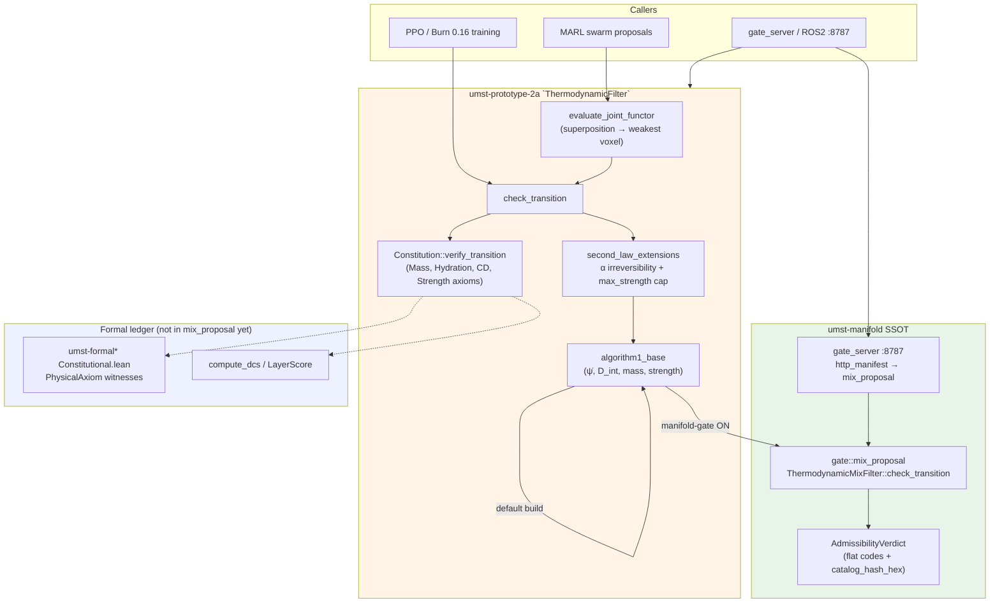

# Prototype 2a host gaps — Constitution, CGS, MARL, `max_strength`

**Status:** 2026-05-21 · manifold SSOT for Algorithm 1; **2a retains** constitutional witnesses, CGS/DCS, MARL joint functor, and topology cap until ports land or callers go HTTP-only.

**Integration status (authoritative lane table):** [`THIN_PROTOTYPE_STATUS.md`](../../umst-prototype/docs/THIN_PROTOTYPE_STATUS.md) — hybrid layout, parity commands, blockers.

**Related:** [`PROTOTYPE_GATE_MAP.md`](PROTOTYPE_GATE_MAP.md) · [`GateUnificationSpec.md`](GateUnificationSpec.md) · [`PENDING_GOD_GRADE_ROADMAP.md`](PENDING_GOD_GRADE_ROADMAP.md) Track B · [`TODO_COMPLETION.md`](TODO_COMPLETION.md) § thin-prototypes

---

## Summary

`umst-prototype-2a` is a **hybrid** gate host: with `manifold-gate`, Clausius–Duhem Algorithm 1 (mass bound, `D_int = −ρ ψ̇`, Powers strength monotonicity) **delegates** to `umst_manifold::gate::mix_proposal`. Everything that needs **proof-carrying axioms**, **CGS/DCS scoring**, **multi-agent superposition**, or a **categorical strength ceiling** still runs in 2a today. Manifold must **absorb** those as typed witnesses on the same `catalog_id` spine (`umst.gate.cd_transition` and extensions) before 2a can mirror the v1 ~226-line shim.

---

## Composition (Mermaid)



**Read order:** joint proposals (if any) → single-transition check → Constitution overlay → CGS assignment. Algorithm 1 is either inline (default 2a) or manifold-delegated (`manifold-gate`).

---

## Absorb vs stay in 2a

| Capability | **Manifold should absorb** (SSOT target) | **Stay in 2a until port** (current) | Rationale |
|------------|------------------------------------------|-------------------------------------|-----------|
| **Algorithm 1 (CD scalar)** | `mix_proposal::ThermodynamicMixFilter` — mass `|Δρ| < 100`, `D_int`, strength monotonicity | Default inline copy when `manifold-gate` off | Already delegated under feature; v1 dual-run **8/8** on shared fixtures |
| **Constitution** | `GateEvaluator` path emitting `PhysicalAxiom` witnesses (or catalog JSON rows) aligned to `Constitutional.lean` / `claims-vs-proofs.md` | `science/constitution.rs` — `Constitution::standard()`, `verify_transition`, formal refs per axiom | Manifold verdict today is flat `AdmissibilityVerdict`; no axiom-level witnesses |
| **CGS / DCS** | `ThermodynamicTransitionOutcome` (or HTTP manifest) fields: `cgs`, optional `dcs` from `score_transition` / `compute_dcs` | Hard-coded CGS `9.5` / `3.0` after Constitution pass + `d_int` tolerance | Needed for ECS / constitutional health metrics in 2a experiments |
| **`hydration_irreversible`** | Explicit flag on transition outcome (catalog-backed) | `second_law_extensions` + Constitution hydration axiom; reason `HYDRATION_IRREVERSIBILITY_VIOLATION` | Manifold only implies via reverse-α negative `D_int`; not a separate witness field |
| **`max_strength`** | `ThermodynamicStateSnapshot::max_strength` + reject when `strength > max_strength` even if CD scalar passes | `ThermodynamicState` + topology tests (LLM strength hallucination guard) | Snapshot has no cap field; categorical bound is 2a-only |
| **MARL** | `evaluate_joint_transition` (or `catalog_id` `umst.gate.joint_superposition`) on manifold snapshots | `evaluate_joint_functor` — density/ψ flux superposition, min strength voxel, then `check_transition` | No joint API in manifold; swarm veto is experiment-critical |
| **Mass tolerance** | Policy flag on `mix_proposal`: fixed 100 kg/m³ vs `0.01·ρ_old` (Constitution-aligned) | Constitution axiom stricter on light transitions | Parity lane must pick one SSOT per fixture set |
| **Clausius in Constitution** | Document dual check: instantaneous `ψ_new − ψ_old` vs `ψ̇` with `dt` | Both retained in 2a intentionally | Not a deletion target — document in gate spec |

---

## Per-capability port notes

### Constitution

| Layer | Manifold today | 2a today |
|-------|----------------|----------|
| Types | `AdmissibilityVerdict`, `ThermodynamicTransitionOutcome` | `AdmissibilityResult` + `InvariantWitness` / `Violation` |
| Axioms | Hand-aligned in [`claims-vs-proofs.md`](claims-vs-proofs.md); no runtime axiom vector | Mass, Hydration, Clausius-Duhem, Strength with `formal_reference()` |
| **Absorb** | Extend `GateEvaluator` / HTTP manifest with witness list or stable violation codes mapped to catalog | **Stay:** training and MARL call `verify_transition` synchronously without HTTP |

**Done when:** `PROTOTYPE_GATE_MAP.md` row for `constitution.rs` points at manifold module; 2a shim calls it under `manifold-gate`.

### CGS / DCS

| Signal | Manifold | 2a |
|--------|----------|-----|
| CGS | Not emitted | `cgs: f64` on every `AdmissibilityResult` |
| DCS | Not computed | `Constitution::score_transition` → `compute_dcs` |

**Absorb:** optional `cgs` / `dcs` on `ThermodynamicTransitionOutcome` and `POST /gate` JSON (no new Lean axioms — presentation only, Track B.1 TCB).

**Stay:** experiment dashboards that already parse 2a `AdmissibilityResult` until HTTP manifest documents the same fields.

### `max_strength`

| Check | Manifold | 2a |
|-------|----------|-----|
| Topology cap | None on snapshot | Rejects when `new.strength > new.max_strength + ε` after Algorithm 1 |
| Tests | N/A in `gate_dual_run_fixtures.json` | `test_max_strength_topology_rejects_hallucinated_jump` |

**Absorb:** add `max_strength: f64` to `ThermodynamicStateSnapshot` and enforce in `ThermodynamicMixFilter::check_transition` (same catalog_id family as R3 constitutive closure).

**Stay:** gel-model calibration that sets `max_strength` from `s_intrinsic` in 2a `ThermodynamicState::from_mix_calibrated` until snapshot carries the field.

### MARL (`evaluate_joint_functor`)

| Step | Owner |
|------|--------|
| Superpose `density`, `free_energy`; take min `strength` across agents | 2a |
| Run `check_transition(old, combined_new, dt)` | 2a → delegates Algorithm 1 to manifold when feature on |

**Absorb:** manifold `evaluate_joint_transition(&old, &[&new], dt)` on `ThermodynamicStateSnapshot` with documented superposition law (match 2a functor semantics).

**Stay:** Burn 0.16 tensor paths and agent-local state until joint API exists; optional HTTP-only migration per Track B.1.

---

## Thinning criteria (linked checklist)

From [`THIN_PROTOTYPE_STATUS.md`](../../umst-prototype/docs/THIN_PROTOTYPE_STATUS.md):

1. Manifold exports Constitution/DCS witnesses (or JSON catalog rows).
2. `max_strength` on snapshots + enforcement in `mix_proposal`.
3. `evaluate_joint_transition` (MARL) with parity tests.
4. **2a** `gate_dual_fixture` lane green on `gate_dual_run_fixtures.json` **plus** MARL/topology cases (Track B.2).

Until then: keep ~480-line hybrid `thermodynamic_filter.rs`; optional `manifold-gate` for Algorithm 1 only.

---

## Verification commands

```bash
# v1 + manifold SSOT (8/8) — does not cover 2a Constitution/CGS/MARL/max_strength
cd umst-manifold && cargo test --test gate_dual_run_parity -- --nocapture

# 2a unit tests (local layers)
cd umst-prototype-2a/prototype/src/rust
cargo test -p umst-core thermodynamic_filter
cargo test -p umst-core --features manifold-gate thermodynamic_filter
```

---

## Roadmap cross-links

| Track | Item | Doc |
|-------|------|-----|
| B.1 | Port Constitution/CGS or HTTP-only | [`PENDING_GOD_GRADE_ROADMAP.md`](PENDING_GOD_GRADE_ROADMAP.md#b1--port-constitutioncgs-witness-to-manifold-or-document-http-only) |
| B.2 | 2a dual-run fixtures | same file § B.2 |
| B.3 | Shim `thermodynamic_filter.rs` | same file § B.3 |
| R1 | CD must not weaken before Landauer | [`GOD_GRADE_WITNESS_LADDER.md`](GOD_GRADE_WITNESS_LADDER.md) |

**Owner split:** manifold lane absorbs types + `mix_proposal` / HTTP; prototype lane deletes 2a body after parity ( [`TODO_COMPLETION.md`](TODO_COMPLETION.md) § thin-prototypes ).
