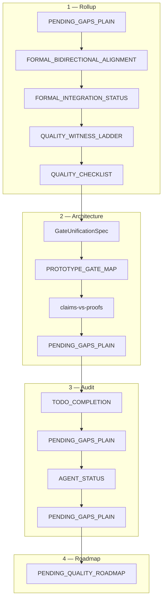

SPDX-FileCopyrightText: 2026 Santosh Prabhu Shenbagamoorthy and Santhosh Shyamsundar
SPDX-License-Identifier: MIT
# UMST manifold documentation index

**Audience:** New contributors joining the Lean→Rust proof-extraction program (`lean-to-rust_proof_extraction_fd8f70b5`).  
**Last aligned:** 2026-05-21 · **Master verify:** `UMST_REQUIRE_FORMAL_EXPORT=1 bash scripts/verify_umst_stack.sh` (see [`VERIFY.md`](VERIFY.md))

---

## True improvement (one paragraph)

The meaningful advance is not higher checklist percentages or more markdown on disk—it is architectural closure of the extraction pipeline: the Lean catalog is treated as a **versioned library** pinned by `artifacts/catalog.lock.json` and enforced by CI drift checks rather than human parity review; **gates are law** on the Rust hot path (CD / second law → Landauer CBF → constitutive → Kleisli) with fixed short-circuit order and **no Lean replay** at inference time; the trusted computing base stays **`physicalSecondLaw` only** in Lean with hand-aligned witnesses and 8/8 prototype dual-run plus adversarial FNR=0 regression proving alignment without adding Rust axioms. Plan infrastructure is **100%** locally (14/14 + unified R0); god-grade production automation (**10/13 ≈ 77%**, **~84%** weighted) remains ops-owned (published cartridge CI, strict manifest default, epistemic v2 traces)—those gaps are **promotion and wiring**, not a redesign of the functor from proofs to admissible transitions.

---

## Reading order for new contributors

Read top-to-bottom once for context; use **Quick verify** before any code change; dip into **Reference** docs as needed.

### 0 — Quick verify (operators)

| Doc | Role |
|-----|------|
| [`VERIFY.md`](VERIFY.md) | Canonical `cargo test` / feature matrix and stack script |
| [`TCB.md`](TCB.md) | Trusted computing base: `physicalSecondLaw`-only policy, CBF, digest witness |
| [`PENDING_GAPS_PLAIN.md`](PENDING_GAPS_PLAIN.md) | Cross-repo Lean catalog merge (coordinator) |
| [`W8_PUBLISH_RUNBOOK.md`](W8_PUBLISH_RUNBOOK.md) | Publish `manifest` for remote cartridge CI |
| [`REPO_LAYOUT_SSOT.md`](REPO_LAYOUT_SSOT.md) | Monorepo layout under `umst-manifold/` (`runtime/`, `gate/`, `manifest/`, `ros/`, `bins/`) |

### 1 — Executive rollup (start here)

| # | Doc | Role |
|---|-----|------|
| 0 | [`PENDING_GAPS_PLAIN.md`](PENDING_GAPS_PLAIN.md) | **What is / is not 100%** — plan 15/15, 119 pin, dual-pin, tests green, W8 human boundary, morphism layers |
| 0a | [`PENDING_GAPS_PLAIN.md`](PENDING_GAPS_PLAIN.md) | **Plain-language open gaps** — W8, G.2/G.3, FFI, 26% vs U_op; gap table by R0–R6; honest blocked % |
| 0a′ | [`PENDING_GAPS_PLAIN.md`](PENDING_GAPS_PLAIN.md) | **Session % deltas** — category/layer before→after tables, three ceilings, verify timestamps |
| 0b | [`PENDING_GAPS_PLAIN.md`](PENDING_GAPS_PLAIN.md) | Stale-doc corrections (69 / preview / ~76% → current SSOT) |
| 1 | [`PENDING_GAPS_PLAIN.md`](PENDING_GAPS_PLAIN.md) | Day-level executive summary, metrics, start-of-day vs now |
| 2 | [`FORMAL_BIDIRECTIONAL_ALIGNMENT.md`](FORMAL_BIDIRECTIONAL_ALIGNMENT.md) | **Pipeline spine:** Lean export → lock → manifold → cartridge → drift |
| 3 | [`FORMAL_INTEGRATION_STATUS.md`](FORMAL_INTEGRATION_STATUS.md) | **119**-module pin; primary-fiber buckets (hot / digest-only / open) |
| 4 | [`RELEASE_WITNESS_LADDER.md`](RELEASE_WITNESS_LADDER.md) | Normative witness order **R0→R1→R2→R3→R4→R5→R6** |
| 5 | [`RELEASE_WITNESS_CHECKLIST.md`](RELEASE_WITNESS_CHECKLIST.md) | Production automation criteria (**10/13 ≈ 77%**) |
| 5b | [`RELEASE_WITNESS_PROGRESS_VERIFIED.md`](RELEASE_WITNESS_PROGRESS_VERIFIED.md) | Verified milestones, checklist %, stack reproduce commands |

### 2 — Architecture & traceability

| # | Doc | Role |
|---|-----|------|
| 6 | [`GateUnificationSpec.md`](GateUnificationSpec.md) | Predicate registry, dual-run strategy, `catalog_id` routing |
| 7 | [`PROTOTYPE_GATE_MAP.md`](PROTOTYPE_GATE_MAP.md) | Prototype inventory → manifold modules + parity fixtures |
| 8 | [`claims-vs-proofs.md`](claims-vs-proofs.md) | Lean theorem family ↔ `catalog_id` ↔ Rust SSOT (42 rows + appendices) |
| 9 | [`PENDING_GAPS_PLAIN.md`](PENDING_GAPS_PLAIN.md) | Layer stack: PPO → gateway → CBF → host gates → orchestrator |
| 10 | [`CATALOG_TRACEABILITY.md`](CATALOG_TRACEABILITY.md) | Partition rules for `catalog_all_ids_registered` |
| 11 | [`CATALOG_COVERAGE_AUDIT.md`](CATALOG_COVERAGE_AUDIT.md) | Semantic coverage classes (runtime-wired, claims-rust, digest-only) |
| 12 | [`CATALOG_ROW_COUNT.md`](CATALOG_ROW_COUNT.md) | Row-count reconciliation vs **119**-module unified export |

### 3 — Audit & evidence (plan todos)

| # | Doc | Role |
|---|-----|------|
| 13 | [`TODO_COMPLETION.md`](TODO_COMPLETION.md) | Per-todo SSOT: requirement, evidence commands, verdict |
| 14 | [`PENDING_GAPS_PLAIN.md`](PENDING_GAPS_PLAIN.md) | Command → exit → files audit trail for the plan YAML |
| 15 | [`AGENT_STATUS.md`](AGENT_STATUS.md) | Parallel lanes W1–W10 + swarm S1–S11 coordinator scan |
| 16 | [`PENDING_GAPS_PLAIN.md`](PENDING_GAPS_PLAIN.md) | Consolidated wave handoffs (W1–W10) |
| 17 | [`PENDING_GAPS_PLAIN.md`](PENDING_GAPS_PLAIN.md) | Full `cargo test` sweep across manifold + cartridges |
| 18 | [`PENDING_GAPS_PLAIN.md`](PENDING_GAPS_PLAIN.md) | Gate/manifest matrix PASS @ 2026-05-21 (M1–M11) |

### 4 — Roadmap (what remains)

| # | Doc | Role |
|---|-----|------|
| 19 | [`PENDING_GAPS_PLAIN.md`](PENDING_GAPS_PLAIN.md) | **God-grade truthful gap audit** — scoped 100% blockers, R0–R6 table, 119≠69 |
| 20 | [`PENDING_RELEASE_WITNESS_ROADMAP.md`](PENDING_RELEASE_WITNESS_ROADMAP.md) | Tracks A–J mapped to witness rungs; ops owners |
| 21 | [`UNFINISHED_FEATURES_AUDIT.md`](UNFINISHED_FEATURES_AUDIT.md) | Plain-language open items: owner + execute vs wait |
| 22 | [`PENDING_GAPS_PLAIN.md`](PENDING_GAPS_PLAIN.md) | Preview artifacts and stubs (not production pin) |

---

## Reference (outside the audit/progress spine)

| Doc | Role |
|-----|------|
| [`Mathematical-Foundations.md`](Mathematical-Foundations.md) | UMST carrier math and conservation framing |
| [`PROOF-STATUS.md`](PROOF-STATUS.md) | Formal verification track status |
| [`Solver-Status.md`](Solver-Status.md) | Continuous solver accuracy roadmap |
| [`Validation.md`](Validation.md) | Validation methodology |
| [`References.bib`](References.bib) | Bibliography |

**Lane artifact (not normative):** [`PENDING_GAPS_PLAIN.txt`](PENDING_GAPS_PLAIN.txt) — W8 manifest-bridge publish snapshot.

---

## Doc families at a glance

---

## Related repositories

- **Formal export:** `umst-formal-double-slit/artifacts/catalog.json` (**119** modules, `cross_repo_merge: true`)
- **Prototype parity:** `umst-prototype/` — dual-run fixtures; see [`../umst-prototype/docs/THIN_PROTOTYPE_STATUS.md`](../umst-prototype/docs/THIN_PROTOTYPE_STATUS.md)
- **Cartridges:** `umst-concrete-cartridge`, `umst-supercap-cartridge` — manifest bridge and `FORMAL_SCALING.md`

Root crate overview: [`../README.md`](../README.md).
