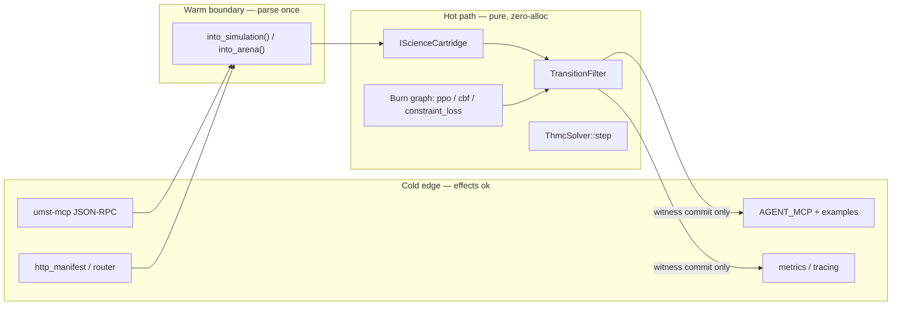

# Runtime topology — Hot / Warm / Cold layering

> Backlog id: `p2-runtime-topology-doc` (Fracture 1). Source of truth for the
> hot/warm/cold boundary referenced by
> [`outputs/.plans/umst-master-reengineering.md`](../../outputs/.plans/umst-master-reengineering.md).
> **Design boundary lands before any binary ABI** (`umst-runtime-arena`).

This document fixes *where computation is allowed to do I/O*. The single
architectural rule of the reengineering is **Fracture 1: no serialization,
JSON, HTTP, MCP, logging, or filesystem access inside the hot path.** Those
effects live only at the **Warm** boundary (once) or the **Cold** edge.

## Tiers

| Tier | What lives here | Effects allowed | Key symbols |
| ---- | --------------- | --------------- | ----------- |
| **Hot** | In-process physics, gates, solvers, Burn graph | Pure math only; zero alloc on the inner loop; `Result` for divergence | [`IScienceCartridge`](../src/core/traits.rs) (`compute_all`, `compute_topology`), [`TransitionFilter`](../src/gate/transition_proposal.rs), [`ThmcSolver::step`](../src/physics/solvers/thmc.rs), [`ai::ppo`](../src/ai/ppo.rs)/[`ai::cbf`](../src/ai/cbf.rs), planned `ai::constraint_loss`, `umst-concrete-ffi` `cdylib` |
| **Warm** | Single deserialization boundary | Rational/`f64` parse **once** per request/batch; no per-step serde | planned `into_simulation()` / `into_arena()` (single conversion `cold bytes → hot view`) |
| **Cold** | Edges, transport, telemetry | serde, JSON-RPC, HTTP, files, `tracing` logs, metrics export | [`umst-mcp`](../../umst-concrete-cartridge/crates/umst-mcp), `umst-cli`, [`gate_server_router`](../src/gate_server_router.rs), [`gate/http_manifest`](../src/gate/http_manifest.rs), `ros`, Docker |

## Boundary rules (enforced by pre-flight + Verifier)

1. **No effects in Hot.** No `serde`, `serde_json`, `reqwest`/HTTP, `std::fs`,
   `std::env`, `println!`, or MCP types inside the Hot symbols above. Logging on
   the Hot path uses nothing; emit `tracing` only after returning to Cold.
2. **Parse once at Warm.** Cold bytes cross into Hot through exactly one
   conversion. The Hot path then operates on **borrowed views** — no repeated
   deserialization inside `ThmcSolver::step` or Burn inner loops.
3. **Dual gate path.** Gates expose a **soft** differentiable penalty (Burn,
   training) *and* a **hard** `f64` witness (`TransitionFilter`, commit). Never
   drop gradient on the rejection boundary; never commit except through witness.
4. **Total functions.** Solver convergence paths return
   `Result<State, PhysicsError>` — no `unwrap`/`expect`/`panic!`.
5. **Commit-only egress.** UCRS stamps, telemetry, and agent-visible JSON are
   written **only** on witnessed commit, never per inner step.

## Agent API surface — what agents use vs internal hot paths

| Audience | Use this | Do **not** reach for |
| -------- | -------- | -------------------- |
| **Agents (MCP)** | `umst_gate_check`, `umst_predict`, `umst_audit`, `contribute*` via [`AGENT_MCP.md`](../../umst-concrete-cartridge/docs/AGENT_MCP.md) (Cold, JSON-RPC) | Raw solver/cartridge structs |
| **Agents (perf-sensitive)** | planned `umst-runtime-arena` (`arena.load(bytes)` once → in-process `predict` loop) — the fast path | Per-step Docker MCP round-trips |
| **Researchers (Rust)** | `IScienceCartridge` trait, `ThmcSolver`, Burn modules as a **library** | — |
| **Internal only** | `http_manifest`, `gate_server_router`, FFI marshalling | exposed as public agent API |

**Migration note (add to AGENT_MCP.md):** *For performance-sensitive or batched
work, prefer the in-process library / arena path over per-call Docker MCP. MCP
remains the stable default; the arena is an opt-in fast path that parses once and
loops in-process (target ≥10× MCP round-trip).*

## Live vs planned (2026-06-24)

| Component | Status |
| --------- | ------ |
| `IScienceCartridge`, `TransitionFilter`, `ThmcSolver::step`, Burn ppo/cbf | **live** (hot) |
| Single Warm `into_simulation()`/`into_arena()` conversion | **planned** (P2) |
| `umst-runtime-arena` zero-copy `UmstArenaView` (`Send + Sync`, zero-alloc) | **planned** (P2) |
| `ai::constraint_loss` soft penalty + `ConstraintExplanation` | **planned** (P4) |
| UCRS witness stamps on arena commit | **doc + guard** (P2-C; stamp wire deferred) |
| `catalog.lock.json` fiber pin `commit_stamp` | **doc + schema** (optional; populated on witnessed commit) |

**Exit witness (P2):** benchmark in-process predict ≥10× an MCP round-trip; no
required CI lane depends on Docker MCP.

## Catalog lock fiber pins — preview vs composed digest

`artifacts/catalog.lock.json` v2 carries per-fiber pins in `fiber_pins[]`.
Primary Lean fibers (`umst-formal`, `umst-formal-double-slit`) contribute to the
composed R0 digest (`composed_catalog_digest_hex` ==
`upstream_catalog_digest_hex`). **Preview / Track F fibers are excluded** from
that composed digest and from `composed_primary_fiber_fingerprint_hex` (T1 digest
guard in `build.rs` and `scripts/catalog_lock_verify.py`).

| `fiber_pins[]` field | Required | Role |
| -------------------- | -------- | ---- |
| `repo` | yes | Sibling repo id (`umst-formal-double-slit`, `umst-formal`, `umst-ucrs`, …) |
| `catalog_digest_hex` | yes | SHA-256 of that fiber's `catalog.json` export |
| `module_count` | yes | Module/entry count for audit |
| `lock_role` | recommended | `lean_catalog_lock` for primary fibers; **`preview`** or **`track_f`** substring marks a tertiary preview pin excluded from composed digest |
| `catalog_path` | recommended | Relative path to the pinned catalog artifact |
| `commit_stamp` | no | **Commit-only egress.** Optional UCRS witness stamp (`UcrsObservedAt` canonical hex or null at pin time). Written when a witnessed arena/MCP commit closes; never on hot-path inner steps. Preview fiber `umst-ucrs` may carry a stamp without merging its catalog into R0. |

**Preview fiber `umst-ucrs`:** `lock_role` must contain `preview` or `track_f`
(build-time guard). Its digest is digest-locked in the lock bundle for audit
(`ucrs_fiber_preview` block) but **must not** appear in the non-preview fingerprint
used for `composed_catalog_digest_hex`.

## Arena ABI (v1 skeleton — `umst-runtime-arena`)

The Warm entry point is [`load_arena`](../umst-runtime-arena/src/load.rs):
cold-owned bytes in, borrowed [`UmstArenaView`](../umst-runtime-arena/src/load.rs)
out. Parsing happens **once**; hot loops read sub-slices only.

| Field | Size | Role |
| ----- | ---- | ---- |
| `magic` | 4 | `0x54534D55` (`"UMST"` LE) |
| `abi_version` | 4 | `1` for this skeleton |
| `header_bytes` | 4 | Fixed `64` for v1 |
| `_reserved` | 4 | Zero; forward growth |
| `catalog_digest` | 32 | SHA-256 of `artifacts/catalog.lock.json` at arena build |
| `state_offset` | 8 | UMST state blob start |
| `state_bytes` | 8 | UMST state blob length |

**Deferred (later ABI revisions):** `proposal_offset` / witness sections,
full `UcrsObservedAt` wire in the arena header (stamps live in lock
`fiber_pins[].commit_stamp` until then). **No `mmap`** in this crate revision.
Hot solvers remain unchanged until a full Warm `into_arena()` wires this view into
`IScienceCartridge`.
